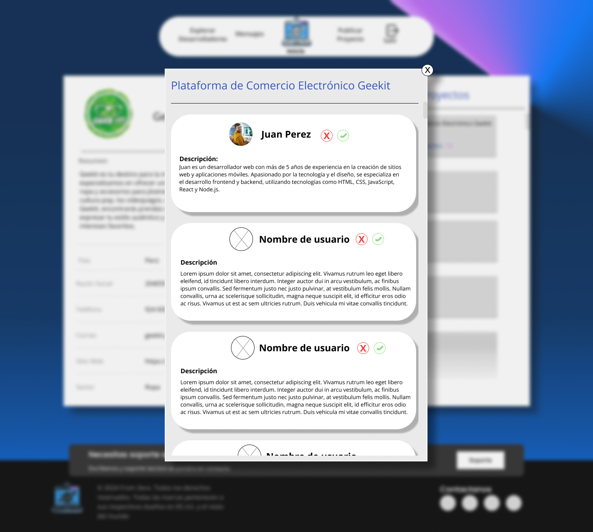
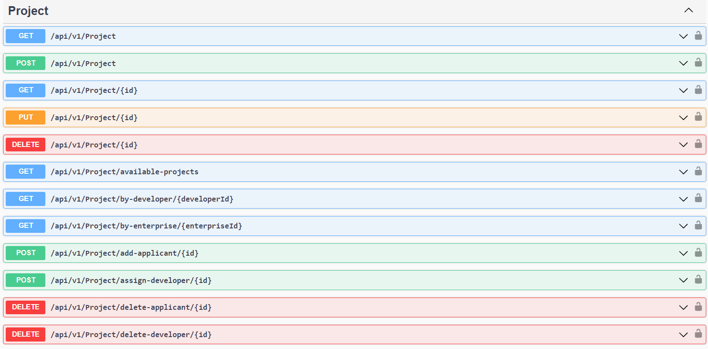
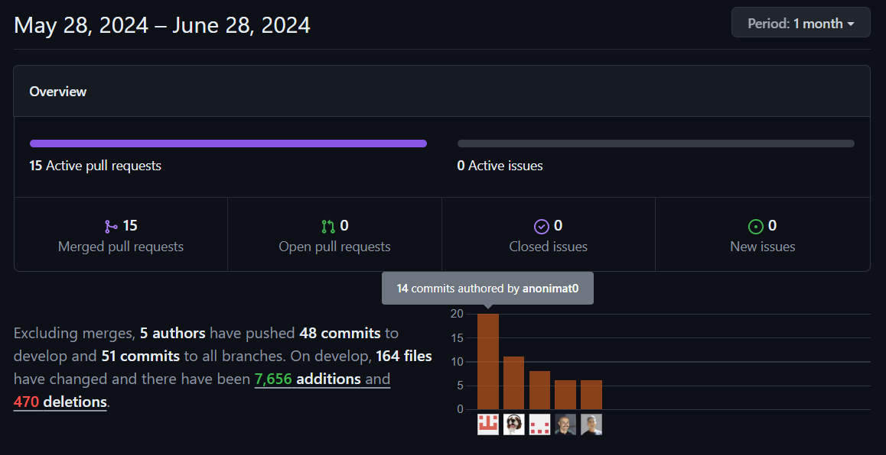

# UPC
# INGENIERÍA DE SISTEMAS DE SOFTWARE
## CURSO: SI730 Aplicaciones Web | SECCIÓN WX54 
 Profesor: Alex Humberto Sánchez Ponce
# Informe de TF
**Nombre del Startup**: "From Zero"
**Nombre del Producto**: "Webmasters"
### Integrantes:
- Jair Velasquez Pizarro (u202218114)
- André Alonso Arroyo Ormeño (u202114714)
- Zaid Valentino Ramirez Contreras (u202218472)
- Samira Jetzabel Alvarez Araguache (u20211A046)
- Joseph Ulysses Llacchua Peralta (u202317002)

19/03/2024

---
# Registro de Versiones del Informe
| Version | Fecha | Autor | Descripcion de Modificacion |
| ----------- | ----------- | ----------- | ----------- |
| 0.0 | 25/03/2024 | Grupo 4 | Se crea el documento |
| 1.0 | 03/04/2024 | Grupo 4 | Se crea la rama correspondiente |
| 1.1 | 08/04/2024 | Grupo 4 | Capitulo 1 |
| 1.1 | 08/04/2024 | Grupo 4 | Capitulo 2 |
| 1.1 | 09/04/2024 | Grupo 4 | Capitulo 3 |
| 1.1 | 11/04/2024 | Grupo 4 | Capitulo 4 |
| 1.1 | 12/04/2024 | Grupo 4 | Capitulo 5 |
| 1.2 | 12/04/2024 | Grupo 4 | Capitulo 5 Sprint 2 |

# Project Report Collaboration Insights
[URL del repositorio](https://github.com/WebMastersUPC/FromZero-LandingPage.git)

# Student Outcome
|Criterio Especifico|Acciones Realizadas|Conclusiones|
|-|-|-|
|Participa en equipos multidisciplinarios con eficacia, eficiencia y objetividad, en el marco de un proyecto en soluciones de ingeniería de software.|<br>**Zaid Ramirez:**<br> **TB1:** Durante la elaboración del proyecto, pude aprender nuevas tecnologías al implementar de manera colaborativa y desplegar con éxito la Landing Page y el diseño de la aplicación web, cumpliendo con los requisitos del backlog y objetivos del sprint. Aplicamos adecuadamente los lenguajes, frameworks y herramientas recomendados, siguiendo las convenciones de programación y buenas prácticas establecidas. Además, buscamos mejorar continuamente al realizar modificaciones basadas en observaciones y recomendaciones, contribuyendo activamente al éxito de esta fase inicial del proyecto. <br>**TP1:** En la entrega parcial del proyecto aprední acerca de vue su consumo de apis y la utilización de componentes. De esta forma pude cumplir mis tareas en este segundo sprint, lo que nos permitio desplegar la pagina funcional y  a tiempo<br> **TB2:** En esta entrega pude aprender acerca de el comportamiento del backend en la aplicación y como se conecta con los requerimientos específicos del cliente. <br> **TF:** En esta útlima entrega se pudo aplicar lo aprendido durante toda la elaboración del proyecto. Tanto la practica como la documentación para poder brindar una solución óptima al problema propuesto <br><br>**André Arroyo:** <br> **TB1:** Durante la elaboración del proyecto, tuve la oportunidad de profundizar en el Mapeo del Escenario Futuro y el Mapeo de Impacto, aprendiendo cómo estas metodologías pueden alinear efectivamente los objetivos del proyecto con las expectativas de los stakeholders. Esto fue crucial para establecer una base sólida y claridad en los requisitos del proyecto desde el inicio.En la fase de Especificación de Requisitos, aplicamos las técnicas de redacción colaborativa para desarrollar Historias de Usuario y crear un Product Backlog bien definido. Esta etapa fue esencial para garantizar que cada requisito se documentara con precisión y reflejara las necesidades del usuario final. Mediante revisiones iterativas del backlog y objetivos claros en cada sprint, nos aseguramos de que cada funcionalidad propuesta estuviera alineada con los objetivos del proyecto.<br> **TP1:** Durante la elaboracion del proyecto, apoye en la documentacion y desarrollo del web application, realizando las respectivas correciones que me hacian saber mis compañeros de equipo <br>**TB2:** Para esta entrega participe en el desarrollo del backendo lo cual me permitio aprender el Net.Core y el lenguaje C#. Asimismo participe en la implemtacion de la internacializacion(i18n) lo cual mejora la usabilidad del web app <br>**TF:** Para esta entrega se empleo todo lo aprendido para conectar el backend con el frontend, gracias a la buena comunicacion en equipo pude cumplir con mis tareas de forma exitosa <br> <br> **Samira Alvarez:**<br> **TB1:** Para esta entrega, el trabajo se llevó a cabo de manera cooperativa, involucrando a todos los integrantes en el desarrollo de las tareas del proyecto. Para la realización de las entrevistas fue parte fundamental la participación de cada miembro en la recolección de información clave para definir las funcionalidades de nuestra solución. Asímismo, el uso de Gitflow facilitó un flujo de trabajo eficiente, permitiendo a cada miembro contribuir al desarrollo de la landing page de manera coordinada y fluida. De igual forma, el enfoque de metodologías ágiles Scrum nos permitió documentar de manera precisa el trabajo realizado para esta entrega. <br> **TP:** Para este avance del trabajo donde se desarrollo de la parte frontend de nuestra aplicación web, hemos seguido un flujo de trabajo definido utilizando Gitflow para gestionar nuestras ramas de código. Esto nos permitió trabajar de manera coordinada en las diferentes partes del proyecto. Además, hemos utilizado un tablero en Trello para mantener un seguimiento del progreso de nuestras tareas, lo que facilitó la colaboración y la comunicación entre el equipo. <br> **TB2:** Para esta entrega se hizo la distirbución de los distintos métodos relaconados con la API de la aplicación, según los requerimientos del usuario definidos en avances anteriores. Para la gestión del progreso de este sprint fue clave el uso de la herramienta Trello. De esta manera, faclitó el seguimiento y el estado de cada tarea a lo largo del sprint, lo que facilitó la colaboración y comunicación entre miembros del equipo.<br> **TF:** Para esta entrega final, cada integrante ha terminado satisfactoriamente las tareas restantes de la API, así como se ha colaborado para la correcta documentación del Backend de la aplicación. De igual forma, fueron repartidos los puntos finales respecto al reporte. <br><br>**Joseph Llacchua:** <br> **TB1:** Participé en el proyecto como parte de un equipo multidisciplinario con eficacia, eficiencia y objetividad. Durante mi contribución, destacé en la implementación colaborativa y el despliegue exitoso de la Landing Page y el diseño de la aplicación web, cumpliendo con los requisitos del backlog y los objetivos del sprint. Además, demostré habilidad al aplicar los lenguajes, frameworks y herramientas recomendados, siguiendo las convenciones de programación y buenas prácticas establecidas.En la fase inicial del proyecto, demostré mi capacidad para aprender nuevas tecnologías y adaptarme a ellas, contribuyendo activamente al éxito de esta etapa. Mi enfoque metódico y colaborativo fue evidente al realizar modificaciones basadas en observaciones y recomendaciones, buscando constantemente mejorar el producto. <br>**TP:** Tuve la oportunidad de trabajar en el campo de la investigación y diseño de productos tecnológicos. Durante mi participación en el proyecto, me enfoqué en la fase inicial de investigación, realizando entrevistas y análisis de las mismas para comprender las necesidades y deseos de los usuarios. Además, contribuí al desarrollo de la página de inicio (landing page), asegurándome de que fuera responsive para adaptarse a diferentes dispositivos. También realicé correcciones de componentes para mejorar la usabilidad y la experiencia del usuario. Mi trabajo ayudó a establecer una base sólida para el desarrollo de soluciones centradas en el usuario.<br>**TB2:** En esta entrega del proyecto pude aprender y a participar a manejar Net.Core y el lenguaje C# para las apis de mensajeria para facilitar la comunicacion ente usaurios y soporte para facilitar los problenos que se les dificulted al usuario.<br><br>**Jair Velasquez:**<br> **TB1:** Durante el desarrollo del TB1, mi principal aporte fue en la elaboración de diagramas (Diagrama de clases y C4 model) aunque de realizo el planteamiento de estas de forma colaborativa para que hayan multiples ideas en la creación de estas. De igual forma, colabore en el desarrolló del landing page, asi como en secciones de la unidad 5 como el Source Code Management y la configuración del Deploy del landing. De igual forma buscamos constantemente mejoras al momento de realizadas modificaciones de acuerdo a observaciones. <br> **TP1:** Durante la elaboracion de esta entrega, apoye tanto en la documentacion como el desarrollo de la aplicacion web tanto de forma visual como el apartado logico.<br> **TB2:** Durante esta entrega, apoye tanto en la documentación como el desarrollo del back end principalmente en el bounded context de Authentication y Seguridad de usuarios. |<br>En este proyecto no solo enriqueció mis habilidades técnicas, sino que también mejoró mi comprensión de metodologías clave como el Mapeo del Escenario Futuro y el Mapeo de Impacto, esenciales para alinear los objetivos del proyecto con las expectativas de los stakeholders. La fase de Especificación de Requisitos fue crucial, permitiéndonos documentar y precisar cada requisito a través de Historias de Usuario y un Product Backlog bien estructurado. Este enfoque colaborativo y metódico no solo garantizó la coherencia entre las funcionalidades y los objetivos del proyecto, sino que también destacó la importancia de la adaptabilidad y el trabajo en equipo en el desarrollo de software. <br> **TB2:** Durante esta entrega si aplico lo aprendido en todo el curso, principalmente en la implementación del API rest al front mediante el uso de los endpoints. |
|Conoce al menos un sector empresarial o dominio de aplicación de soluciones de software.|<br>**Zaid Ramirez:**<br> **TB1:**  Durante la elaboración del proyecto, pude identificar problemáticas y aplicar un proceso de UX Design basado en Lean UX. Realizando investigación de UX Research para establecer User Personas, Task Matrix y Journey Maps, integrándolos en el diseño del Landing Page y las Web Apps. Ademas de utilizar las User Stories y principios de diseño para crear propuestas visuales coherentes con nuestros style guideline.<br>**TP1:** Para la entrega utilizamos vue para elaborar la app, me encargue de la logica del login con la api y la pagina principal para la vista de empresas con su consumo a la api<br> **TB2:** En este entregable pude aprender la elaboración del backend y la creación de una API. Pudiendo complacer los requerimientos de datos en el front <br> **TF:** En esta útlima entrega se realizó la conexón y comunicación del back-end con el front-end para que se pueda aplicar la lógica de negocio y mostrar los datos a los usuarios para que puedan interactuar con este. <br><br>**André Arroyo:**<br> **TB1:** En nuestro proyecto, utilizamos métodos avanzados de especificación de requisitos para garantizar que el software se ajustara a las necesidades de los usuarios. Empleamos técnicas como el Mapeo del Escenario Futuro, Historias de Usuario y Mapeo de Impacto para definir y priorizar requerimientos esenciales. Asimismo, elaboramos un Product Backlog detallado y configuramos un entorno de desarrollo óptimo, reforzado con convenciones de código rigurosas, para asegurar la calidad y eficacia del software final, cumpliendo con las expectativas y regulaciones del sector.<br> **TP1:** En esta entrega realice la pantalla de postulacion de proyecto de los freelancers, asimismo desarrolle el toolbar para los empresarios y freelancers, asi como el respectivo footer. Por ultimo apoye en la realizacion de la documentacion del sprint 2.<br>**TB2:** En esta entrega participe en la elaboracion del backend respecto al bounded context de Project. Aprendiendo asi la creacion de una API y sus endpoints y la implementacion del CRUD completo <br>**TF:** Para esta entrega continue con el desarrollo del bounded context Project, al comprender mejor la logica de negocio de la app, tuve que realizar las respectivas modificaciones asi como nuevas funcionalidades, la comunicacion en equipo fue vital para el desarrollo de la aplicacion <br> <br>**Samira Alvarez:**<br> **TB1:** En este avance del trabajo se pudo determinar el estado actual del mercado de plataformas de contratación freelance e identificar las fortalezas y debilidades frente a nuestros competidores, así como las estrategias para destacarnos frente a ellos. De igual forma, se analizó el comportamiento, necesidades y preferencias de los segmentos desarrollador freelance y empresario mediante las entrevistas realizadas. Dicha información fue clave para desarrollar el needfinding de nuestros clientes, donde se usó distintas herramientas de mapeo y la creación de user personas de la aplicación web. <br> **TP:** Durante este avance del trabajo, hemos desarrollado los componentes que conforman el frontend de nuestra aplicación web, los cuales permiten a los usuarios ingresar a la aplicación, así como observar la cantidad de entregables por proyecto o agregar y editar su información. <br>**TB2:** En esta entregase ha desarrollado el backend de nuestra aplicación, tomando en cuenta las necesidades de los segmentos objetivos en cuanto al manejo de datos y al flujo del usuario. Esto fue implementado en el Frontend para realizar pruebas que validen la correcta integración entre ambos sistemas. <br>**TF:** En este último avance del proyecto, se ha terminado con el desarrollo y la aplicación de la lógica de negocio de los endpoints de la app. De igual manera, se finalizó la conexión con el frontend, pudiendo realizar solicitudes CRUD desde la interfaz de la aplicación para interactuar con la base de datos, haciendo que la aplicación sea dinámica y lista para su uso. <br><br>**Joseph Llacchua:**<br> **TB1:** He tenido la oportunidad de trabajar en el sector empresarial de soluciones de software, donde he destacado en áreas como el diseño de experiencia de usuario (UX) y la especificación de requisitos. Durante mi participación en el proyecto, pude identificar problemáticas y aplicar un proceso de UX Design basado en Lean UX. Realicé investigaciones de UX Research para establecer User Personas, Task Matrix y Journey Maps, integrándolos en el diseño del Landing Page y las Web Apps. Además, utilicé las User Stories y principios de diseño para crear propuestas visuales coherentes con nuestros style guidelines. <br>**TP:** Tuve la oportunidad de trabajar en el campo de la investigación y diseño de productos tecnológicos. Durante mi participación en el proyecto, me enfoqué en la fase inicial de investigación, realizando entrevistas y análisis de las mismas para comprender las necesidades y deseos de los usuarios. Además, contribuí al desarrollo de la página de inicio (landing page), asegurándome de que fuera responsive para adaptarse a diferentes dispositivos. También realicé correcciones de componentes para mejorar la usabilidad y la experiencia del usuario. Mi trabajo ayudó a establecer una base sólida para el desarrollo de soluciones centradas en el usuario.<br>**TB2:** Para este avance, se hizo la distribución del contenido del contexto para la planificación del sprint. De esta manera, se facilita el trabajo colaborativo al asegurar que todo el equipo tenga acceso a la misma información y pueda coordinar sus esfuerzos más eficientemente.<br><br>**Jair Velasquez:**<br> **TB1:** En el sector empresarial de soluciones de software, he participado en el diseño de experiencia de usuario (UX) y la especificación de requisitos, concentrándome en la creación de diagramas de clases y modelado de C4 con herramientas como Lucidchart. Además, he contribuido en la creación de prototipos para el landing page y la aplicación web utilizando Figma, integrando estos elementos en propuestas visuales coherentes con nuestros lineamientos de estilo. <br> **TP1:** En esta entrega realice la pantalla de buscar desarrollador, tambien la revision de entregables, agregado a esto trabaje en la logica de ingresar al perfil de un desarrollador. <br> **TB2:** En esta entrega realice los endpoints del bounded countext de Authenticacion y apartado de seguridad de los usuarios. |<br>La combinación de Mapeo del Escenario Futuro, Historias de Usuario, y Mapeo de Impacto nos permitió crear una base sólida que alineó el desarrollo del software con las necesidades y expectativas de los usuarios. El desarrollo de un Product Backlog estructurado, la configuración de un entorno de desarrollo optimizado y la implementación de convenciones de código estrictas aseguraron la calidad y eficiencia del software <br> **TB2:** Se aplico el uso de los endpoint en nuestra app-web creada con anterioridad aunque de igual forma se hicieron mejoras en este apartado.|
# Capítulo I: Introducción
## 1.1. Startup Profile
### 1.1.1. Descripción de la Startup

Somos una startup conocida como From Zero, la cual se estableció en 2024 y está compuesta por cinco jóvenes universitarios de la Universidad Peruana de Ciencias Aplicadas. La fundación de esta startup surge de la creciente demanda de las empresas por contar con soluciones digitales de calidad y la necesidad de los desarrolladores freelance en busca de proyectos para desarrollar y generar ingresos.
Nuestro enfoque se centra en proporcionar una plataforma web intuitiva y fácil de usar que permita a las empresas publicar proyectos de software y a los desarrolladores freelance postularse para trabajar en ellos. Buscamos satisfacer las necesidades tanto de las empresas, que requieren soluciones digitales a medida, como de los desarrolladores freelance, que buscan oportunidades para aplicar sus conocimientos y obtener ingresos.

<ins>**Misión:**</ins>

Nuestra misión es facilitar la conexión entre empresas en busca de soluciones digitales y desarrolladores freelance en busca de oportunidades de trabajo. Nos comprometemos a proporcionar una plataforma transparente y eficiente que promueva la colaboración, la calidad y la innovación en cada proyecto. Estamos dedicados a contribuir al crecimiento y éxito tanto de nuestros usuarios como de nuestra propia empresa.

<ins>**Visión:**</ins>

 Nuestra visión es convertirnos en el principal recurso para empresas que buscan soluciones digitales y desarrolladores freelance en busca de oportunidades de trabajo en el campo del desarrollo de software. Nos esforzamos por ser reconocidos como líderes en innovación, calidad y eficiencia, siendo la primera opción tanto para empresas en búsqueda de soluciones digitales como para desarrolladores en busca de proyectos emocionantes y lucrativos. 
#### 1.1.2. Perfiles de integrantes del equipo
|Miembros del equipo | Codigo Estudiante | Carrera | Conocimientos / Habilidades |
|-|-|-|-|
| Ramirez Contreras, Zaid Valentino  | U202218472   |Ingeniería de software| C++, python, HTML5, CSS3, Javascript, SQL, persistente y amigable  |
| Velasquez Pizarro, Jair  | U202218114   |Ingeniería de software| C++, Java, HTML5, CSS3, Tailwind CSS Javascript, SQL. Detallista y proactivo.  |
| Alvarez Araguache, Samira Jetzabel  | U20211A046   |Ingeniería de software| C++, HTML5, CSS3, Javascript, SQL. Comunicativa y dinámica  |
|Llacchua Peralta, Joseph  | U202317002   |Ingeniería de software| C++, Pyhon, CSS , Html ,Javascript, SQL. Sociable y perseverante  |
|Arroyo Ormeño, André Alonso  | U202114714   |Ingeniería de software| C++, Pyhon, CSS , Html ,Javascript, SQL, Vue.js. Responsable y perseverante  |

### 1.2.1 Antecedentes y problemática

Para entender completamente la solución propuesta, es fundamental analizar a fondo la naturaleza del problema que se va a abordar. Esto implica detallar los aspectos esenciales que nuestra solución debe cubrir y establecer metas y restricciones que nos guíen en su definición. Para facilitar este proceso, empleamos herramientas reconocidas como "Las 5W y 2H" y el "Proceso Lean UX". Estas herramientas nos ayudan a realizar un análisis detallado y a enfocarnos en los aspectos clave para desarrollar una solución efectiva y centrada en el usuario.

**What/Qué:** El contexto que enfrentan las microempresas peruanas después del COVID-19 fue determinante, llevando a muchas de ellas a iniciar un proceso de transformación digital. Según una investigación de Microsoft (2023), el 95% de las Pymes peruanas aceleraron este proceso. Sin embargo, según Movistar Empresas (2023), el 73% de las Pymes señala enfrentar dificultades en la digitalización de sus negocios.

**Why/Por qué:** Existen varios factores que contribuyen a estas dificultades en la digitalización de los negocios, principalmente el desconocimiento de las herramientas digitales necesarias.

**Who/Quién:** Esta problemática afecta a cualquier microempresario o emprendedor independiente mayor de 18 años, especialmente a aquellos con poco conocimiento de las herramientas digitales necesarias para tener una página web propia y virtualizar su empresa. Además, también impacta a los desarrolladores freelance que buscan oportunidades de trabajo en proyectos de software variados y emocionantes.

**When/Cuándo:** Esta problemática afecta a los microempresarios todos los días, ya que al ser un negocio, no pueden detener su producción, lo que podría aumentar sus deudas. Además, considerando el 95% de aceleración en el proceso de transformación digital para las empresas.

**Where/Dónde:** El problema está presente en cualquier lugar, ya que en la actualidad estamos rodeados de tecnología. Esto afecta a las Mypes que no están involucradas en el alcance que se puede lograr con herramientas digitales y el retraso que esto puede causar al no darles uso.

**How/Cómo:** El problema se presenta en la búsqueda de los microempresarios de formas para mejorar sus ventas recurriendo a herramientas digitales. Respecto a las oportunidades que están brindan, se menciona que el 43% de líderes mencionan que la tecnología lleva a aperturar a nuevos mercados y clientes (Microsoft, 2023).

**How much/Cuánto:** Es importante considerar que el 74.4% del total de empresas en el Perú son microempresas (CIEN, 2023), y que más del 90% de estas empresas consideran que la transformación digital impacta positivamente en su negocio. En cuanto a la inversión en esta transformación, se estima que el 50% de estas empresas asignan menos del 5% de su presupuesto para gastos tecnológicos (EY, 2021).

### 1.2.2 Lean UX Process.
#### 1.2.2.1. Lean UX Problem Statements.
#### Segmento objetivo: Microempresas y emprendimientos

Hemos observado que muchas microempresas y emprendimientos en Perú enfrentan dificultades para establecer una presencia en línea debido a la falta de conocimientos técnicos para desarrollar un sitio web. Esta carencia se agrava por las deficiencias en la educación digital en el país.

**Problema:**
¿Cómo podríamos crear una alternativa accesible y profesional para el desarrollo de páginas web dirigidas a propietarios de microempresas y emprendimientos que están en medio de un proceso de crecimiento desafiante?

#### Segmento objetivo: Desarrolladores freelance

Hemos observado que existe una comunidad activa de desarrolladores freelance en Perú que buscan constantemente oportunidades de trabajo en proyectos de desarrollo web. Estos desarrolladores valoran la flexibilidad y la variedad de proyectos que pueden abordar como freelancers, pero a menudo enfrentan desafíos para encontrar oportunidades que se ajusten a sus habilidades y preferencias.

**Problema:**
¿Cómo podríamos crear una opción de empleo para desarrolladores web en nuestra aplicación, dirigida específicamente a desarrolladores freelance con el conocimiento necesario?

#### 1.2.2.2. Lean UX Assumptions.
### ASSUMPTIONS WORKSHEET

#### ¿Quién es el usuario?
- Desarrolladores freelance.
- Microempresas y emprendimientos.

#### ¿Dónde encaja nuestro producto en su trabajo o vida?
La plataforma impacta positivamente tanto en el trabajo como en la vida de las microempresas y emprendimientos:
   - Simplifica el proceso de búsqueda y contratación de servicios digitales, lo que ahorra tiempo y recursos.
   - Facilita la conexión con una amplia red de talentosos desarrolladores freelance, permitiendo una selección basada en sus necesidades específicas.
   - Proporciona transparencia al permitir comparar precios, servicios y reseñas de otros clientes, facilitando la toma de decisiones informadas.
   - Mejora su presencia en línea y les permite llegar a una audiencia más amplia, lo que puede impulsar el crecimiento y las ventas.

Para los desarrolladores freelance, la plataforma también ofrece beneficios significativos:
   - Facilita la búsqueda de oportunidades laborales, lo que les permite encontrar proyectos adecuados de manera más eficiente.
   - Amplía su alcance al conectarlos con empresas de todo el país, brindándoles acceso a una variedad de proyectos interesantes.
   - Les proporciona una plataforma para desarrollar y mejorar sus habilidades, así como para establecer relaciones profesionales con otros desarrolladores en la comunidad.

#### ¿Qué problemas tiene nuestro producto y cómo se pueden resolver?
Problema 1: Falta de certeza acerca de la fiabilidad y calidad de los desarrolladores contratados.
   - Solución: Implementar un sistema de evaluación y calificación en nuestra plataforma. Permitir que tanto las empresas como los desarrolladores se califiquen mutuamente proyecto por proyecto proporcionará comentarios valiosos y construirá confianza en la comunidad.

Problema 2: Dificultad para encontrar coincidencias adecuadas.
   - Solución: Mejorar la funcionalidad de búsqueda y el algoritmo de emparejamiento. Esto podría incluir opciones para filtrar por habilidades específicas, experiencia previa y ubicación geográfica, asegurando así que las empresas encuentren desarrolladores que se ajusten a sus necesidades.

Problema 3: Retos en la comunicación y la colaboración.
   - Solución: Integrar herramientas de comunicación directa en la plataforma para facilitar las interacciones entre empresas y desarrolladores. Además, proporciona funciones como seguimiento de proyectos y gestión de tareas para mejorar la colaboración en línea.

#### ¿Cuándo y cómo es usado nuestro producto?
Nuestra plataforma será utilizada por empresas y desarrolladores freelance en cualquier momento y lugar. Las empresas pueden emplearla para encontrar desarrolladores freelance cuando requieran crear o mejorar sus sitios web. Del mismo modo, los desarrolladores freelance pueden emplearla para buscar oportunidades laborales y colaborar con empresas.

#### ¿Qué características son importantes?
Las características más importantes de nuestra aplicación serán las siguientes:
   - Facilidad de uso: La aplicación será fácil de usar para microempresas, emprendimientos y desarrolladores freelance de todos los niveles de experiencia.
   - Accesibilidad: La aplicación será accesible para microempresas, emprendimientos y desarrolladores freelance de todo el mundo.
   - Seguridad: La aplicación protegerá la privacidad y la seguridad de los datos de los usuarios.

#### ¿Cómo debe verse nuestro producto y cómo comportarse?
Nuestra aplicación debe tener un diseño claro, sencillo y fácil de entender y utilizar. Debe ser visualmente atractiva y fácil de navegar. Además, debería funcionar de manera eficiente y fluida, brindando una experiencia de usuario fluida y placentera.

#### ASSUMPTIONS
1. Creo que mis usuarios necesitan una plataforma intuitiva y fácil de usar que les permita a las microempresas publicar proyectos de desarrollo web y a los desarrolladores freelance postularse para trabajar en ellos de manera eficiente y transparente.
2. Estas necesidades se pueden resolver proporcionando una plataforma tecnológica robusta y segura que facilite la conexión entre empresas y desarrolladores freelance, ofreciendo herramientas de búsqueda y selección efectivas, así como sistemas de comunicación y colaboración integrados.
3. Mis clientes iniciales son microempresas y emprendimientos peruanos que buscan soluciones digitales para mejorar su presencia en línea, así como desarrolladores freelance que desean encontrar oportunidades de trabajo en proyectos de desarrollo web.
4. El valor #1 que un cliente requiere de mi servicio es la eficiencia en la búsqueda y contratación de tecnologías que sea funcional para el desarrollo de su página web, asegurando que puedan encontrar rápidamente soluciones a medida para sus necesidades, lo que les permitirá ahorrar tiempo y recursos.
5. Obtendremos la mayoría de nuestros clientes a través de campañas de marketing digital dirigidas a microempresas y emprendimientos en el mercado peruano, así como mediante la participación en eventos y ferias comerciales relevantes para el sector de desarrollo web.
6. Haremos dinero a través de membresías premium para empresas y desarrolladores freelance que les brinden acceso ilimitado a características avanzadas de la plataforma, como herramientas de búsqueda más detalladas, soporte prioritario y la capacidad de publicar y aplicar a un número ilimitado de proyectos.
7. Mi competencia principal será otras plataformas similares que conectan a empresas con desarrolladores freelance, así como agencias de desarrollo web establecidas que ofrecen servicios similares en el mercado.
8. Los venceremos a través de una experiencia de usuario superior, con una plataforma más fácil de usar y transparente, así como proporcionando un amplio pool de talentosos desarrolladores freelance y garantizando la calidad y eficiencia en cada proyecto.
9. Mi mayor riesgo del producto es la falta de adopción por parte de los usuarios debido a la competencia existente en el mercado y la necesidad de construir una base de usuarios sólida desde el principio.
10. Resolveremos esto a través de estrategias de marketing efectivas, atención al cliente excepcional y constantes mejoras en la plataforma basadas en retroalimentación de usuarios y análisis de datos para asegurar su relevancia y competitividad en el mercado.

#### 1.2.2.3. Lean UX Hypothesis Statements.
## Hypothesis Statement 1

Creemos que al permitir que los desarrolladores creen perfiles y muestren sus trabajos anteriores, los usuarios interesados en obtener una página web podrán tener una visión más clara de sus necesidades. Sabremos que esto es cierto, cuando más del 50% de los usuarios que utilizan la aplicación finalizan proyectos o se ponen en contacto con un desarrollador.

## Hypothesis Statement 2

Creemos que nuestra aplicación potenciará las estrategias de marketing digital de diversos emprendimientos. Sabremos que tuvimos éxito, cuando más del 20% de usuarios nuevos conozcan la aplicación por medio de recomendación de otros usuarios.

## Hypothesis Statement 3

Creemos que al conectar desarrolladores web con emprendimientos, facilitaremos el proceso de creación de nuevos sitios web o la mejora de sitios web existentes, satisfaciendo sus necesidades específicas. Sabremos que hemos tenido éxito cuando más del 80% de los emprendimientos que se pusieron en contacto con un desarrollador hayan lanzado el nuevo sitio web desarrollado.


#### 1.2.2.4. Lean UX Canvas.


## 1.3. Segmentos objetivo.

Nuestro segmento objetivo está compuesto por dos tipos de usuarios:

### Microempresas y Emprendimientos
Este segmento incluye a pequeñas empresas, startups y emprendedores independientes en el mercado peruano que buscan soluciones digitales centradas en el desarrollo web. Estas empresas necesitan mejorar su presencia en línea a través de la creación de sitios web y otras aplicaciones web personalizadas. Reconocen la importancia de la transformación digital para el éxito de sus negocios, pero carecen de los recursos o conocimientos técnicos para desarrollar estas soluciones internamente.

### Desarrolladores Freelance
Este segmento abarca a profesionales independientes especializados en el desarrollo web y otras tecnologías relacionadas. Estos desarrolladores están buscando oportunidades de trabajo específicamente en proyectos de desarrollo web. Valoran la flexibilidad laboral y la posibilidad de trabajar en proyectos desafiantes que les permitan aplicar y mejorar sus habilidades en este campo.


# Capítulo II: Requirements Elicitation & Analysis
## 2.1. Competidores
Después de examinar las principales plataformas dedicadas a conectar a empresas con desarrolladores freelance para el desarrollo de soluciones de software, hemos identificado a los principales competidores a los que se enfrenta nuestra startup en este sector. Estos son los siguientes:

1. **Freelancer:**
Plataforma en línea donde que conecta a profesionales independientes con proyectos de trabajo remoto propuestos por pequeñas y grandes empresas. Los usuarios pueden buscar y postular a trabajos freelance en áreas de desarrollo de software, diseño gráfico, consultoría, etc. donde pueden establecer su propio horario y tarifas. La plataforma también proporciona a las empresas acceso a una gran base de talento global para contratrar según las necesidades del proyecto.

<div align="center">
                
</div>

2. **Upwork:**
Plataforma de contratación online que brinda un espacio de comunicación entre empresas y freelancers para colaborar en una variedad de trabajos. De igual forma ofrece una gama de herramientas para la comunicación, gestión y seguridad en los pagos. Además, proporciona servicios de compra de proyectos, asesoramiento empresarial y recursos educativos de diversas áreas.

<div align="center">
                
</div>

3. **Codementor:**
Plataforma en línea especializada en el aprendizaje y la tutoría dentro del cmapo de la programación. Ofrece diversos recursos educativos para mejorar las habilidades técnicas de sus usuarios. Esto incluye, tutoriales, cursos, libros, etc. También permite a los usuarios conectarse con mentores calificados para sesiones de tutoría personalizadas.  Además, facilita la búsqueda y contratación de otros programadores para llevar a cabo proyectos de desarrollo de software.
 
<div align="center">
                
</div>

### 2.1.1. Análisis competitivo
<table>
  <tr>
    <th colspan="7" valign="top"><b>Competitive Analysis Landscape</b></th>
  </tr>
  <tr>
    <td colspan="2" rowspan="2">¿Por qué llevar a cabo este análisis?</td>
    <td colspan="5">Escriba en el recuadro la pregunta que busca responder o el objetivo de este análisis.</td>
  </tr>
  <tr>
    <td colspan="5">Este análisis se realizó para identificar a nuestros competidores y desarrollar estrategias para sobresalir sobre ellos.</td>
  </tr>
  <tr>
    <td colspan="3"></td>
    <td colspan="1" valign="top" style="font-weight: bold;">
        WebMaster
        <br>
        <div style="text-align: center; margin-top: 10px;">
                
        </div>
    <td colspan="1" valign="top" style="font-weight: bold;">
    Freelancer
    <div style="text-align: center; margin-top: 60px;">
                
        </div>
    </td>
    <td colspan="1" valign="top" style="font-weight: bold;">
      Upwork
      <div style="text-align: center; margin-top: 10px;">
                
            </div>
      </td>
    <td colspan="1" valign="top" style="font-weight: bold;" >
      Codementor
      <div style="text-align: center; margin-top: 10px;">
                
            </div>
    </td>
  </tr>
  <tr>
    <td colspan="1" rowspan="2"><p>Perfil</p></td>
    <td colspan="2">Overview</td>
    <td colspan="1" valign="top">Plataforma que facilita la conexión entre desarrolladores independientes y pequeñas y medianas empresas que buscan una solución de software.</td>
    <td colspan="1" valign="top">Plataforma online donde freelancers de distintos rubros ofrecen sus servicios para desarrollar proyectos propuestos por pequeñas y grandes empresas.</td>
    <td colspan="1" valign="top">Plataforma de contratación online que funciona como un medio de comunicación entre empresas y freelancers para facilitar la contratación para proyectos, así como la compra de trabajos y asesoramiento.</td>
    <td colspan="1" valign="top">Plataforma en línea que permite conectar desarrolladores con mentorías personalizadas y oportunidades de trabajo freelance. También ofrece recursos educativos para mejorar las habilidades técnicas de sus usuarios.</td>
  </tr>
  <tr>
    <td colspan="2">Ventaja competitiva</td>
    <td colspan="1" valign="top">Brinda herramientas para seguimiento del progreso de los proyectos, así como la oportunidad de verificar los conocimientos de los freelancers mediante evaluaciones como manera de garantizar un servicio de calidad en la plataforma.</td>
    <td colspan="1" valign="top">Funciona como un escrow (cuenta de retención), donde el pago por el proyecto es liberado cuando ambas partes se encuentran satisfechas al finalizar el trabajo. Tiene un sistema de evaluaciones para garantizar la calidad y conocimientos de los freelancers</td>
    <td colspan="1" valign="top">Ofrece oportunidades laborales en distintas industrias y rubros, por lo que tiene una oferta laboral diversificada. Además, proporciona servicios de consultoría con expertos. Tiene herramientas que facilita la comunicación, gestión y seguimiento de proyectos.</td>
    <td colspan="1" valign="top">Se especializa en el ámbito del desarrollo de software, por lo que sus servicios son más especializados en esta industria. Ofrece sesiones de mentoría personalizadas.</td>
  </tr>
  <tr>
    <td colspan="1" rowspan="2"><p>Perfil de Marketing</p></td>
    <td colspan="2">Mercado objetivo</td>
    <td colspan="1" valign="top">PYMEs y emprendimientos que buscan subcontratar a un desarrollador para trabajar en una solución de software y freelancers en busca de una oportunidad de trabajo.</td>
    <td colspan="1" valign="top">Pequeñas, medianas y grandes empresas que quieran contratar a freelancers para desarrollar sus proyectos. Trabajadores independientes que buscan una oportunidad de trabajo.</td>
    <td colspan="1" valign="top">Empresas de todos los tamaños que buscan contratar trabajadores independientes para desarrollar proyectos de distintas áreas. Freelancers en busca de una oportunidad de trabajo.</td>
    <td colspan="1" valign="top">PYMEs y emprendimientos que requieran una solución de software. Desarrolladores en busca de un mentor o una oportunidad de trabajo.</td>
  </tr>
  <tr>
    <td colspan="2">Estrategias de marketing</td>
    <td colspan="1" valign="top">Publicidad en línea, eventos y asociaciones con organizaciones y empresas de la industria tecnológica.</td>
    <td colspan="1" valign="top">Testimonios de freelancers y artículos en línea.</td>
    <td colspan="1" valign="top">Testimonios de usuarios y reseñas. Recursos gratuitos. Patrocinio de eventos.</td>
    <td colspan="1" valign="top">Contenido educativo gratuito y colaboración con influencers.</td>
  </tr>
  <tr>
    <td colspan="1" rowspan="3"><p>Perfil de Producto</p></td>
    <td colspan="2">Productos & Servicios</td>
    <td colspan="1" valign="top">Plataforma de trabajo.</td>
    <td colspan="1" valign="top">Plataforma de trabajo. Inteligencia artificial.</td>
    <td colspan="1" valign="top">Plataforma de trabajo freelance. Consultoría. </td>
    <td colspan="1" valign="top">Servicio de mentoría. Recursos educativos. Plataforma de trabajo.</td>
  </tr>
  <tr>
    <td colspan="2">Precios & Costos</td>
    <td colspan="1" valign="top">Membresías para freelancers de S/15 ($4 dólares). Membresía para empresas de S/50 ($14 dólares). Tarifa del 15% a los desarrolladores freelance por proyecto.</td>
    <td colspan="1" valign="top">Membresías para los freelancers de $4.99 dólares por el plan básico, $8.95 dólares por el Plus, $49.00 dólares por el Profesional y $99.00 dólares por el Premium mensualmente. Tarifa del 3% o $3.00 dólares por proyectos por precio fijo para los empleadores. 3% para proyectos por hora. Tarifa del 10% o $5.00 dólares por proyectos por precio fijo para los freelancers. 10% para proyectos por hora.</td>
    <td colspan="1" valign="top">$20 dólares mensuales por una membresía para freelancers. Tarifa del 5% de los pagos realizados a los trabajadores independientes. $0,15 dólares por cada “connect” que permite publicitar y dar  más visibilidad a los trabajos de los freelancers.</td>
    <td colspan="1" valign="top">Tarifa variante dependiendo de ciertos factores.</td>
  </tr>
  <tr>
    <td colspan="2">Canales de distribución (Web y/o Móvil)</td>
    <td colspan="1" valign="top">Página web.</td>
    <td colspan="1" valign="top">Página web y aplicación móvil.</td>
    <td colspan="1" valign="top">Página web y aplicación móvil.</td>
    <td colspan="1" valign="top">Página web y aplicación móvil.</td>
  </tr>
  <tr>
    <td colspan="1" rowspan="5"><p>Análisis SWOT</p></td>
    <td colspan="6">Realice esto para su startup y sus competidores. Sus fortalezas deberían apoyar sus oportunidades y contribuir a lo que ustedes definen como su posible ventaja competitiva.</td>
  </tr>
  <tr>
    <td colspan="2">Fortalezas</td>
    <td colspan="1" valign="top">Sistemas de supervisión y evaluación para garantizar la finalización y calidad de los proyectos.</td>
    <td colspan="1" valign="top">Amplia reputación en el sector freelance. API propia.</td>
    <td colspan="1" valign="top">Distintas formas de contratación dependiendo de las necesidades de los empleadores. Proyectos relacionados a distintos campos.</td>
    <td colspan="1" valign="top">Gran comunidad activa. Enfoque en proyectos de desarrollo de software.</td>
  </tr>
  <tr>
    <td colspan="2">Debilidades</td>
    <td colspan="1" valign="top">Bajo número de usuarios por ser una startup emergente.</td>
    <td colspan="1" valign="top">Tarifas altas para los trabajadores independientes </td>
    <td colspan="1" valign="top">Dependencia de las calificaciones para los freelancers.</td>
    <td colspan="1" valign="top">Opciones de servicios limitadas.</td>
  </tr>
  <tr>
    <td colspan="2">Oportunidades</td>
    <td colspan="1" valign="top">Introducción de servicios para nichos de mercado como desarrollo de soluciones móviles, IoT, etc.</td>
    <td colspan="1" valign="top">Ampliar el uso de la inteligencia artificial (IA).</td>
    <td colspan="1" valign="top">Desarrollo de un programa de afiliación para los trabajadores independientes.</td>
    <td colspan="1" valign="top">Diversificación de servicios en más áreas del desarrollo de software.</td>
  </tr>
  <tr>
    <td colspan="2">Amenazas</td>
    <td colspan="1" valign="top">Alta competencia en el sector. Sin posicionamiento en el mercado.</td>
    <td colspan="1" valign="top">Incremento de nuevas plataformas en el mercado. Alta competencia en el sector.</td>
    <td colspan="1" valign="top">Alta competencia en el sector. Problemas relacionados a la ciberseguridad y estafas en la plataforma.</td>
    <td colspan="1" valign="top">Alta competencia en el sector. Disminución de la calidad del servicio.</td>
  </tr>
</table>

### 2.1.2. Estrategias y tácticas frente a competidores
Nuestro enfoque principal como startup se basa en las siguientes estrategias y tácticas clave:

<table>
  <tr>
    <td colspan="1" valign="top">Competidores</td>
    <td colspan="1" valign="top">¿Qué se puede hacer para ganarle a la competencia?</td>
  </tr>

  <tr>
    <td colspan="1" valign="top">Competidor 1: Freelancer</td>
    <td colspan="1" valign="top">Frente a Freelancer, se ofrecen precios de suscripción más accesibles a los desarrolladores, así como tarifas flexibles tanto para las empresas como para los trabajadores independientes, para una mayor accesibilidad y atraer nuevos usuarios a la plataforma.</td>
  </tr>

  <tr>
    <td colspan="1" valign="top">Competidor 2: Upwork</td>
    <td colspan="1" valign="top">Comparado con Upwork, se adopta un enfoque exclusivo en proyectos de desarrollo de software para tener una oferta más orientada a la industria tecnológica, implicando la inclusión de desarrolladores con conocimientos más especializados y técnicos que atraigan empresas en busca de una solución más compleja y técnica.</td>
  </tr>

  <tr>
    <td colspan="1" valign="top">Competidor 3: Codementor</td>
    <td colspan="1" valign="top">Con Codementor, se enfatiza la importancia de las distintas herramientas de seguimiento y supervisión disponibles en la plataforma para garantizar el cumplimiento de los contratos y mejorar la satisfacción de nuestros clientes.</td>
  </tr>

</table>

## 2.2. Entrevistas.
### 2.2.1. Diseño de entrevistas.

**Segmento objetivo: Empresarios o emprendedores**

Buen día, soy [Nombre del entrevistador]. En esta ocasión llevaré a cabo una entrevista para la Startup From Zero con el objetivo de recopilar la información necesaria para el desarrollo de nuestra plataforma.

Webmasters  es una plataforma diseñada para ayudar a las empresas y emprendimientos que requieran de una solución de software. Conectamos a estos emprendimientos y empresas con desarrolladores freelancers capaces de satisfacer sus necesidades de manera eficaz.

  **Preguntas generales:**
  1. ¿Cuál es su nombre? 
  2. ¿Cuántos años tienes? 
  3. ¿Dónde resides actualmente? 
  4. ¿Cuál es el nombre de tu empresa o emprendimiento? 

  **Preguntas de indagación:**
  1. ¿Actualmente su empresa/emprendimiento cuenta con presencia digital? 
  2. ¿Considera que a día de hoy es importante que su empresa/emprendimiento tenga presencia en internet? ¿Por qué?
  3. ¿De qué manera mejorarías la presencial digital de tu negocio?
  4. ¿Alguna vez su empresa/emprendimiento ha requerido de una solución de software? Si es así, ¿de qué tipo?
  5. ¿Ha considerado realizar un proyecto de software para mejorar su empresa/emprendimiento? ¿Por qué?
  6. ¿Qué tan familiarizado está con las plataformas de contratación de desarrolladores freelance?

  **Preguntas de validación:**
  1. ¿Estaría dispuesto a trabajar con un desarrollador de software para desarrollar una solución de software para su empresa/emprendimiento? 
  2. ¿Considerarías utilizar una plataforma que te conecte con desarrolladores freelance calificados? ¿Por qué?
  3. ¿Cuáles serían las características más importantes que debería tener la plataforma?
  4. ¿Qué beneficios esperas de utilizar una plataforma?
  5. ¿Qué preocupaciones tendrías al utilizar la plataforma para trabajar con desarrolladores freelance?
  6. ¿Estarías dispuesto a usar o pagar por una plataforma que te ayude a encontrar a un desarrollador adecuado para tu proyecto?

<br>

**Segmento objetivo: Desarrolladores freelance**

Buen día, soy [Nombre del entrevistador]. En esta ocasión llevaré a cabo una entrevista para la Startup From Zero con el objetivo de recopilar la información necesaria para el desarrollo de nuestra plataforma.
Webmasters  es una plataforma diseñada para ayudar a las empresas y emprendimientos que requieran de una solución de software. Conectamos a estos emprendimientos y empresas con desarrolladores freelancers capaces de satisfacer sus necesidades de manera eficaz.

  **Preguntas generales:**
  1. ¿Cuál es su nombre? 
  2. ¿Cuántos años tienes? 
  3. ¿Dónde resides actualmente? 
  4. ¿Cuál es tu área de especialidad en el desarrollo de software (móvil, escritorio, web, ciberseguridad, etc.)? 

  **Preguntas de indagación:**
  1. ¿Con qué tecnologías sueles realizar tus proyectos?
  2. ¿Has tenido experiencia trabajando en proyectos de desarrollo de software? 
  3. ¿Qué tipos de proyectos has realizado?
  4. ¿Cuáles son los principales problemas con los que te has enfrentado como desarrollador freelance?
  5. ¿Qué consideras en un proyecto para trabajar en él?
  6. ¿De qué manera manejas la comunicación con tus clientes a lo largo del desarrollo del trabajo?
  7. ¿Qué tan familiarizado está con las plataformas de contratación de desarrolladores freelance?


  **Preguntas de validación:**
  1. ¿Cuáles son las características que consideras importantes dentro de este tipo de plataformas?
  2. ¿Qué otras características te gustaría ver en dichas plataformas?
  3. ¿Qué te haría elegir una plataforma de contratación de desarrolladores freelance frente a otras en el mercado?
  4. ¿Qué beneficios esperas de utilizar una plataforma?
  5. ¿Cuáles serían tus preocupaciones al momento de trabajar en una plataforma?
  6. ¿Estarías dispuesto a usar o pagar por una plataforma que te conecte con empresas que buscan desarrolladores freelance?
### 2.2.2. Registro de entrevistas.

**Segmento empresarios o emprendedores**  

**Entrevista 1**

  - Entrevistador: Zaid Valentino Ramirez Contreras
  - Entrevistado: Maverick Mendoza
  - Edad:
  - Residencia: Lima - San Miguel
  - Enlace del video: [https://upcedupe-my.sharepoint.com](https://upcedupe-my.sharepoint.com/:v:/g/personal/u202218472_upc_edu_pe/EZ6MFAwyeatGnXEs5o7rN-8BH9oREGQs-aek24_WSUpdxw?e=JDVm7r&nav=eyJyZWZlcnJhbEluZm8iOnsicmVmZXJyYWxBcHAiOiJTdHJlYW1XZWJBcHAiLCJyZWZlcnJhbFZpZXciOiJTaGFyZURpYWxvZy1MaW5rIiwicmVmZXJyYWxBcHBQbGF0Zm9ybSI6IldlYiIsInJlZmVycmFsTW9kZSI6InZpZXcifX0%3D)


	
Resumen: 
El entrevistado, Maverick Mendoza, es un estudiante de Ingenieria en Sistemas y dueño del emprendimiento EnchiTacos. Menciona que actualmente la empresa solo maneja Facebook e Instagram con anuncios, por lo que cree que la adquisición de una página web mejoraría la rentabilidad del negocio. También menciona que la parte más importante al implementar una página web es la parte del diseño y la arquitectura. Menciona que le sería conveniente el tener a disposición una plataforma que le facilite el contacto con desarrolladores freelancer para la creación de su página web. Además dice que estaría dispuesto a pagar por el uso de la plataforma si esto significa que podrá elegir al desarrollador que mejor le convenga. 

**Entrevista 2**

  - Entrevistador: Jair Velasquez Pizarro
  - Entrevistado: Alexandra Ñañez
  - Edad: 21
  - Residencia: Lima - Comas
  - Enlace del video: [https://upcedupe-my.sharepoint.com](https://upcedupe-my.sharepoint.com/:v:/g/personal/u202218114_upc_edu_pe/ERCqSU_2GapEunt22M-Mkd8BcsWU3E48f1Yi64nZnEtWqA?e=KUw5GE&nav=eyJyZWZlcnJhbEluZm8iOnsicmVmZXJyYWxBcHAiOiJTdHJlYW1XZWJBcHAiLCJyZWZlcnJhbFZpZXciOiJTaGFyZURpYWxvZy1MaW5rIiwicmVmZXJyYWxBcHBQbGF0Zm9ybSI6IldlYiIsInJlZmVycmFsTW9kZSI6InZpZXcifX0%3D)


	
Resumen: 
Mi entrevistada, Alexandra Ñañez, es estudiante de la carrera de Administración y Marketing, y es asesora de Marketing en un negocio que brinda el servicio de juegos infantiles, estimulación temprana y alquiler de local para fiestas infantiles. Menciona que actualmente la empresa solo maneja Facebook e Instagram con anuncios, por lo que cree que la adquisición de una página web mejoraría la rentabilidad del negocio. También menciona que la parte más importante al implementar una página web es la parte del diseño y la arquitectura. También recalca que lo principal al momento de contratar un programador para un producto de software es la seguridad, comunicación y pruebas de trabajos anteriores para comprender si su forma de diseño se asemeja a la empresa.

**Entrevista 3**

  - Entrevistador: Joseph Ulysses Llacchua Peralta
  - Entrevistado: Mathias Leonardo Vasquez Requejo
  - Edad: 20
  - Residencia: Lima - San Isidro
  - Enlace del video: [https://upcedupe-my.sharepoint.com](https://upcedupe-my.sharepoint.com/:v:/g/personal/u20211a046_upc_edu_pe/Eetr9ewHf85HqMa4X9g8o40B5Dyr6Ou6Mmm0dJMRdkMWWw?e=nK5z6r&nav=eyJyZWZlcnJhbEluZm8iOnsicmVmZXJyYWxBcHAiOiJTdHJlYW1XZWJBcHAiLCJyZWZlcnJhbFZpZXciOiJTaGFyZURpYWxvZy1MaW5rIiwicmVmZXJyYWxBcHBQbGF0Zm9ybSI6IldlYiIsInJlZmVycmFsTW9kZSI6InZpZXcifX0%3D)


	
Resumen: 
Matías Vázquez, de 20 años, residente en Lima, Perú, es el fundador de "FashionWave", un emprendimiento de moda con presencia digital en redes sociales como Instagram y Facebook. Reconoce la importancia de tener presencia en internet para llegar a un público amplio y mantenerse actualizado. Considera desarrollar un sitio web propio para mejorar la experiencia de compra. Está dispuesto a trabajar con desarrolladores freelance y consideraría usar una plataforma para encontrar talento especializado. Sus preocupaciones incluyen la calidad del trabajo y la seguridad de la información. Estaría dispuesto a pagar por una plataforma que cumpla con sus necesidades.

**Segmento desarrolladores freelance**  

**Entrevista 1** 

  - Entrevistador: Samira Jetzabel Alvarez Araguache 
  - Entrevistado: Alessandro Medina Agnini
  - Edad: 20 años
  - Residencia: Lima - San Miguel
  - Enlace del video: [https://upcedupe-my.sharepoint.com](https://upcedupe-my.sharepoint.com/:v:/g/personal/u20211a046_upc_edu_pe/EWWgW2c4bpBAv8OynwXt7U0BkvrPYFU33fi4NdxbqDtjng?e=En0xjC&nav=eyJyZWZlcnJhbEluZm8iOnsicmVmZXJyYWxBcHAiOiJTdHJlYW1XZWJBcHAiLCJyZWZlcnJhbFZpZXciOiJTaGFyZURpYWxvZy1MaW5rIiwicmVmZXJyYWxBcHBQbGF0Zm9ybSI6IldlYiIsInJlZmVycmFsTW9kZSI6InZpZXcifX0%3D)


	
Resumen: 
<br>
Se entrevistó a Alessandro Medina, un joven de 20 años estudiante de Ciencias de la Computación quien se dedica al trabajo freelance. Alessandro se especializa en el desarrollo web como Front-End, con el uso de HTML5, CSS3, JS, React y Angular. utilizando tecnologías como HTML5, CSS3, JS, React y Angular. Él ha participado en diversos proyectos, principalmente en la creación de landing pages para emprendedores y pequeñas empresas.

Inicialmente,enfrentó dificultades para encontrar proyectos debido a la falta de un portafolio que respaldara sus habilidades y profesionalismo. Asímismo, antes de elegir un proyecto investiga al cliente para evaluar su reputación y toma en cuenta plazo de entrega del trabajo. Una vez aceptado un proyecto, Alessandro comenta que suele  mantener una comunicación activa con el empleador a través de reuniones periódicas para recibir retroalimentación. 

Menciona que está familiarizado con las plataformas de contratación de desarrolladores freelance y destaca la importancia de personalizar su perfil para resaltar sus habilidades y tener un portafolio asociado. Además, espera encontrar sistemas de pago seguros en estas plataformas. Alessandro menciona que selecciona las plataformas basándose en su reputación y en la facilidad para encontrar proyectos e los que trabajar. Mientras tanto, espera que una plataforma  le brinde la oportunidad de conectarse con un público más amplio. Por otro lado, sus preocupaciones a esto gira entorno a la competencia con freelancers establecidos.

Finalmente, consideraría usar una plataforma conecte con empresas que buscan desarrolladores freelance según el modelo de cobro, ya sea por suscripción o por comisiones.

**Entrevista 2** 

  - Entrevistador: André Alonso Arroyo Ormeño 
  - Entrevistado: William Ramos Vicente
  - Edad: 20 años
  - Residencia: Lima - San Isidro
  - Enlace del video: [https://upcedupe-my.sharepoint.com](https://upcedupe-my.sharepoint.com/:v:/g/personal/u202114714_upc_edu_pe/EQEUCRg-1QtPi0p3GgF9F7EB7FETZEYSkWp8kdK47ed_NA?e=6qraXg&nav=eyJyZWZlcnJhbEluZm8iOnsicmVmZXJyYWxBcHAiOiJTdHJlYW1XZWJBcHAiLCJyZWZlcnJhbFZpZXciOiJTaGFyZURpYWxvZy1MaW5rIiwicmVmZXJyYWxBcHBQbGF0Zm9ybSI6IldlYiIsInJlZmVycmFsTW9kZSI6InZpZXcifX0%3D)


<br>Resumen:<br>
Mi entrevistado es William Ramos Vicente, es desarrollador backend de las plataformas web y  ha tenido experiencia desarrollando proyectos tanto para empresas como personales. En caso de usar plataformas que le ayuden a conseguir proyectos remunerados, le gustaría que los proyectos se dividan en especialidades como: frontend, backend, móviles, ciberseguridad entre otros. Asimismo también le gustaría que los proyectos se clasificaran de acuerdo a la cantidad de experiencia, rubros (salud, política, estados, bancos, etc), todo esto acompañado de una sección en el cual se permite ingresar de forma adecuada los datos personales para poder conseguir dicho proyectos. Lo que haría elegir una plataforma que ayude a conseguir proyectos sobre otras, sería la eficacia, la rapidez y la gran cantidad de empresas en la plataforma de tal forma que se logre una gran variedad de proyectos. Lo que espera de la plataforma sería que facilite el proceso de conseguir los proyectos remunerados así como también proyectos que brinden contratación para periodos cortos como largos. Su principal preocupación en estas plataformas sería la ineficacia de conseguir los proyectos, la falta de comunicación en cuanto al rechazo de la solicitud y la falta de feedback en el desarrollo del proyecto. Para finalizar si estaría dispuesto a pagar por este tipo de plataformas siempre y cuando cumplan con las características que menciono anteriormente.

**Entrevistado 3**
  - Entrevistador: André Alonso Arroyo Ormeño 
  - Entrevistado: Rodriguez Peres de la fuente
  - Edad: 25 años
  - Residencia: Lima - San Isidro
  - Enlace del video: [https://upcedupe-my.sharepoint.com](https://www.youtube.com/watch?v=M46C6zZlmWA)

  

  <br>Resumen<br>
  Mi entrevistado es Rodrigo Perez de la fuente, es desarrollador web y desarrollador móvil y ha tenido experiencia en empresas SAAS, las cuales usan cloud server y ha participado en el desarrollo de de un taller de automotriz para grandes concesionarias. En el caso de usar plataformas que le ayuden a conseguir proyectos, le gustaría que los proyectos tuvieran información importante como puede ser los lenguajes o frameworks necesario para desarrollar el proyecto, por ejemplo. Adicionalmente, le gustaría que los proyectos se dividan de acuerdo al sueldo, así como también que haya comunicación directa con el empresario a cargo del proyecto, pues durante su experiencia laboral ha tenido que usar varios correos o aplicaciones para dicha comunicación. Los aspectos relevantes son que la web app sea segura, sencilla de usar y que tenga mucha eficacia en cuanto a la obtención de proyectos. Su principal preocupación es que no pueda conseguir proyectos y no se le informe de ello, asimismo, comenta que le gustaría que se le notifique proyectos de su interés. Por último, él si estaría dispuesto a pagar por este tipo de plataformas, siempre y cuando cumpla con los requisitos anteriormente mencionado y que los benéficos que recibe al pagar le faciliten la obtención de proyectos.


### 2.2.3. Análisis de entrevistas.
**Segmento empresarios o emprendedores:**<br>
Se destaca una convergencia de ideas y necesidades comunes entre los emprendedores. Todos reconocen la importancia de ampliar la presencia en línea de sus negocios más allá de las redes sociales, considerando la adquisición de una página web como un paso fundamental para mejorar la rentabilidad y llegar a un público más amplio.<br>

Un punto clave resaltado por cada uno de ellos es la importancia del diseño y la arquitectura de la página web. Esto sugiere que no solo valoran la apariencia visual, sino también la funcionalidad y la experiencia del usuario como componentes esenciales para el éxito en línea. Además, todos muestran disposición para trabajar con desarrolladores freelance, indicando una preferencia por la flexibilidad y la especialización que estos profesionales ofrecen.<br>

Otro aspecto compartido entre los entrevistados es su preocupación por la calidad del trabajo y la seguridad de la información al contratar desarrolladores freelance o utilizar plataformas para encontrar talento. Esta cautela refleja una mentalidad empresarial prudente y enfocada en asegurar resultados satisfactorios y proteger la integridad de sus negocios.<br>

Finalmente, es notable que todos están dispuestos a invertir en soluciones que satisfagan sus necesidades específicas, ya sea en el desarrollo de un sitio web de calidad o en la selección de talento especializado a través de plataformas pagas. Esta disposición a pagar por servicios adecuados demuestra un enfoque estratégico y comprometido hacia el crecimiento y la mejora continua de sus emprendimientos en el entorno digital.<br>
<br><br>

**Segmento desarrolladores freelance:**<br>
En las entrevistas con Alessandro Medina y William Ramos Vicente, se destaca la importancia crucial de contar con un sólido portafolio y una buena reputación para atraer proyectos de calidad como desarrolladores freelance. Ambos enfatizan la necesidad de mantener una comunicación activa y recibir retroalimentación constante de los empleadores durante los proyectos.

Además, ambos desarrolladores valoran el uso de plataformas de contratación freelance para acceder a una variedad más amplia de oportunidades laborales. William específicamente busca plataformas eficaces que clasifiquen proyectos según especialidades y niveles de experiencia, mientras que Alessandro prefiere plataformas que le permitan conectarse con un público más amplio y que ofrezcan sistemas de pago seguros.

Sus principales preocupaciones incluyen la eficiencia en la selección de proyectos, la comunicación transparente durante todo el proceso y la retroalimentación sobre el progreso del trabajo. En conjunto, estas entrevistas reflejan la importancia de estrategias efectivas de presentación, comunicación clara y selección inteligente de plataformas para maximizar las oportunidades y la satisfacción como desarrolladores freelance.
## 2.3. Needfinding.
### 2.3.1. User Personas.
**Segmento empresarios y emprendedores**  


<br>

**Segmento desarrolladores freelance**


### 2.3.2. User Task Matrix.
A continuación se pueden apreciar los User Task Matrix de los segmentos objetivos.

<table align="center" border="1" width="90%" style="text-align:center;">
    <tr>
        <td rowspan>Matriz de tareas</td>
        <td colspan=4>
            <b>User Persona</b>
        </td>
    </tr>
    <tr>
        <td></td>
        <td colspan=2>
            <b>Empresario y emprendedor Promedio</b> </br>Segmento Objetivo: Empresarios y emprendedores entre 18 años a más
        </td>
        <td colspan=2>
            <b>Desarrollador freelance Promedio</b> </br>Segmento Objetivo: Desarrolladores freelance entre 18 años a más
        </td>
    </tr>
    <tr>
        <td>
            <b>Task</b>
        </td>
        <td>
            <b>Frequency</b>
        </td>
        <td>
            <b>Importance</b>
        </td>
        <td>
            <b>Frequency</b>
        </td>
        <td>
            <b>Importance</b>
        </td>
    </tr>
    <tr>
        <td>
            Gestionar su tiempo de manera eficiente
        </td>
        <td>
            High
        </td>
        <td>
            High
        </td>
        <td>
            High
        </td>
        <td>
            High
        </td>
    </tr>
    <tr>
        <td>
            Mantenerse al día con las últimas tendencias y estilos
        </td>
        <td>
            High
        </td>
        <td>
            High
        </td>
        <td>
            Medium
        </td>
        <td>
            High
        </td>
    </tr>
    <tr>
        <td>
            Gestionar pedidos, ventas y envíos
        </td>
        <td>
            High
        </td>
        <td>
            High
        </td>
        <td>
            Low
        </td>
        <td>
            Low
        </td>
    </tr>
    <tr>
        <td>
            Optimizar el sitio web para mejorar la experiencia de usuario	
        </td>
        <td>
            Low
        </td>
        <td>
            Medium
        </td>
        <td>
            High
        </td>
        <td>
            High
        </td>
    </tr>
    <tr>
        <td>
            Buscar proyectos de desarrollo de software
        </td>
        <td>
            Low
        </td>
        <td>
            Low
        </td>
        <td>
            High
        </td>
        <td>
            High
        </td>
    </tr>
    <tr>
        <td>
            Resolver problemas técnicos y encontrar soluciones creativas
        </td>
        <td>
            Medium
        </td>
        <td>
            High
        </td>
        <td>
            High
        </td>
        <td>
            High
        </td>
    </tr>
    <tr>
        <td>
            Desarrollar soluciones de software
        </td>
        <td>
            Low
        </td>
        <td>
            Low
        </td>
        <td>
            High
        </td>
        <td>
            High
        </td>
    </tr>
</table>

### 2.3.3. User Journey Mapping.
A continuación se pueden observar los User Journey Mapping de los segmentos objetivos.

**Segmento empresario y emprendedor:**


**Segmento desarrollador freelance:**


### 2.3.4. Empathy Mapping.
A continuación se muestra los Empathy Mapping de los segmentos objetivos.

**Segmento empresario y emprendedor:**


<br>

**Segmento desarrollador freelance:**


### 2.3.5. As-is Scenario Mapping.
A continuación se precentan los As-Is Scenario de los segmentos objetivos.

**Segmento empresario y emprendedor:**


**Segmento desarrollador freelance:**


Enlace de Miro: https://miro.com/app/board/uXjVKWrUG98=/?share_link_id=990115567422

## 2.4. Ubiquitous Language.
Connection Platform (Plataforma de Conexión): Una plataforma digital que conecta a desarrolladores freelance y a empresas/emprendimientos.

User (Usuario): Persona que utilice la plataforma, ya sea un desarrollador freelance o un empresario/emprendedor.

User Profile (Perfil de Usuario): Un espacio personalizado en la plataforma donde se exponen la experiencia, habilidades y proyectos anteriores.

Project Catalog (Catálogo de Proyectos): Una lista de proyectos de software propuestos por empresas o emprendimientos para ser desarrollados por los freelancers.

Rating System (Sistema de valoración): Un sistema de clasificación donde los usuarios de la plataforma pueden calificar la calidad, profesionalidad y satisfacción del proyecto realizado por un desarrollador freelance.

Work Contract (Contrato de trabajo): Un acuerdo formal entre el desarrollador freelance y la empresa donde se establecen los plazos y la remuneración del proyecto, así como otros términos y condiciones.

Project Management (Gestión de Proyectos): Funcionalidad que permite a los usuarios hacer gestión y seguimiento del progreso del proyecto.

Subscription Model (Modelo de Suscripción): Un plan de pago ofrecido a los desarrolladores freelance y empresas para acceder a las funciones premium a cambio de una tarifa recurrente.

Commission System (Sistema de Comisión): Una estructura de tarifas donde se cobra un porcentaje del valor del proyecto a los desarrolladores freelance.

Registration and Verification (Registro y Verificación): Un proceso de verificación de la autenticidad de la identidad de los usuarios de la plataforma.

Customer Support (Soporte al Cliente): Asistencia técnica y atención al cliente para resolver problemas y responder preguntas relacionadas con la plataforma.

# Capítulo III: Requirements Specification
## 3.1. To-Be Scenario Mapping.

**Segmento 1: Empresarios**<br>
Escenario principal: Adquirir freelancers para el desarrollo de proyecto de software <br>
Fases: Búsqueda y selección de freelancers, Negociación y acuerdo, Colaboración y seguimiento, Evaluación y cierre.

Link: <https://miro.com/app/board/uXjVKdVpEPw=/?share_link_id=435283866563> <br>
**Segmento 2: Freelancers**<br>
Escenario Principal: Adquirir un proyecto cuyo desarrollo sea remunerado<br>
Fases: Búsqueda de proyectos de software en la plataforma, Elección del proyecto y contacto con el jefe del proyecto, Desarrollo del proyecto, Entrega final del proyecto y pago del trabajo.

Link: <https://miro.com/app/board/uXjVKdVpEPw=/?share_link_id=435283866563> <br>

## 3.2. User Stories.
|Epic / Story ID|Título|Descripción|Criterio de aceptación|Relacionado con (Epic ID)|
| :- | :- | :- | :- | :- |
|**Epic 1: Landing page**<br>**Como** empresario o freelancer<br>**Quiero** visualizar una página<br>**Para** saber acerca de la aplicación e ingresar a la aplicación|||||
|E1-US101|<p>Barra de navegación en landing page</p><p> </p>|**Como** usuario **quiero** una barra de navegación de landing page **para** tener accesos directos a la información de la aplicación |<p>**Escenario 1: El usuario quiere saber cómo funciona la aplicación**</p><p>**Dado que** el usuario se encuentra en el landing page</p><p>**Y** se dirige en la barra de navegación<br>**Cuando** presiona la opción “Cómo funciona”</p><p>**Entonces** es dirigido a la sección de cómo funciona el producto.</p><p>**Escenario 2: El usuario quiere saber los testimonios de usuario que utilizaron la aplicación**</p><p>**Dado que** el usuario se encuentra en el landing page</p><p>**Y** se dirige en la barra de navegación<br>**Cuando** presiona la opción “Testimonios”</p><p>**Entonces** es dirigido a la sección de Testimonios</p><p>**Escenario 3: El usuario quiere hacer preguntas frecuentes de la aplicación**</p><p>**Dado que** el usuario se encuentra en el landing page</p><p>**Y** se dirige en la barra de navegación<br>**Cuando** presiona la opción “Preguntas Frecuentes”</p><p>**Entonces** es dirigido a la sección de Preguntas Frecuentes.</p>|1|
|E1-US102|Sección hero de landing page	|**Como** usuario **quiero** visualizar una sección hero en el landing page **para** tener una idea sobre lo que ofrece la aplicación|<p>**Escenario 1: El usuario se encuentra en la sección de hero**</p><p>**Dado que** el reclutador o postulante se encuentra en el landing page</p><p>**Cuando** se encuentra en la sección de hero</p><p>**Entonces** visualiza una presentación de la aplicación.</p>|1|
|E1-US103|Sección de producto de landing page|<p>**Como** usuario **quiero** visualizar características de la aplicación en el landing page **para** saber sobre las características que ofrece la aplicación|<p>**Escenario 1: El usuario se encuentra en la sección de características del producto**</p><p>**Dado que** el usuario se encuentra en el landing page</p><p>**Cuando** se encuentra en la sección del producto</p><p>**Entonces** visualiza características de la aplicación.</p><p></p>|1|
|E1-US104|Sección de testimonios en landing page|**Como** usuario **quiero** visualizar testimonios de usuarios que utilizaron la aplicación **para** saber sobre experiencias reales de usuarios|<p>**Escenario 1: El usuario se encuentra en la sección de testimonios**</p><p>**Dado que** el usuario se encuentra en el landing page</p><p>**Cuando** se encuentra en la sección de testimonios</p><p>**Entonces** visualiza testimonios de usuario que utilizaron la aplicación.</p><p></p>|1|
|E1-US105|Sección de planes en landing page|**Como** usuario **quiero** visualizar los planes que ofrece la aplicación **para** considerar adquirir la membresía|<p>**Escenario 1: El usuario se encuentra en la sección de planes**</p><p>**Dado que** el usuario se encuentra en el landing page</p><p>**Cuando** se encuentra en la sección de planes</p><p>**Entonces** visualiza los planes que la aplicación ofrece para funciones premium.</p><p></p>|1|
|E1-US106|Sección de footer a la aplicación en landing page|**Como** usuario **quiero** visualizar la sección de footer **para** acceder a links de la página|<p>**Escenario 1: El usuario se encuentra en la sección de footer en landing page**</p><p>**Dado que** el usuario se encuentra en el landing page</p><p>**Cuando** se encuentra en la sección de footer</p><p>**Entonces** visualiza links de navegación.</p><p></p>|1|
|E1-US107|Sección para conocer al equipo de trabajo|**Como** posible cliente, **quiero** conocer más sobre el equipo que desarrolla la aplicación **para** adquirir confianza de dicho equipo de trabajo.|<p>**Escenario 1:Visualización correcta**</p><p>**Dado que** el usuario se encuentra en el landing page</p><p>**Cuando** seleccione la sección “Sobre Nosotros” en la barra de navegación</p><p>**Entonces** se muestra la sección para conocer más sobre el equipo de trabajo.</p>|1|
|E1-US108|Atención al cliente|**Como** usuario **quiero** el servicio de atención al cliente **para** poder reportar fallas en el aplicativo o incumplimiento entre empresario y freelancer|<p>**Escenario 1: Reporte de falla del aplicativo**</p><p>**Dado que** el usuario experimenta una falla en el aplicativo</p><p>**Cuando** acceda a la opción “Atención al cliente” y escoja la opción “Falla del aplicativo”<br>**Entonces** deberá mostrar enviar evidencia de ello y presionar el botón enviar para que el equipo de desarrolla atienda su solicitud</p><p>**Escenario 2: Reporte de incumplimiento del freelancer o empresario**</p><p>**Dado que** el usuario experimenta un incumplimiento del freelancer o empresario</p><p>**Cuando** acceda a la opción “Atención al cliente” y escoja la opción “Incumplimiento”<br>**Entonces** deberá mostrar evidencias de ello y el equipo respectivo atenderá la solicitud.</p>|1|
|**Epic 2: Autenticación y perfil del usuario**<br>**Como** empresario o freelancer<br>**Quiero** autenticar y configurar mi perfil del usuario<br>**Para** ingresar a la aplicación|||||
|E2-US101|Registro e inicio de sesión|**Como** usuario **quiero** tener en la app un apartado de inicio de sesión **para** que se guarde mi información|<p>**Escenario 1: Usuario ingresa a la aplicación y se encuentra con el inicio de sesión**</p><p>**Dado que** el usuario ya está en el inicio de sesión </p><p>**Cuando** el usuario haga click en registrarse </p><p>**Entonces** el sistema le mostrará un apartado donde podrá llenar su información</p><p>**Escenario 2: Usuario se registra**</p><p>**Dado que** el usuario ya se encuentra en el apartado de registro </p><p>**Cuando** el usuario complete todo el formulario de registro</p><p>**Entonces** el sistema guardará todos sus datos</p>|2|
|E2-US102|Formulario de login|**Como** usuario de la página web, **quiero** ingresar con mi cuenta con la cual me registre **para** usar las herramientas a mi disposición.|<p>**Escenario 1: Iniciar sesión**</p><p>**Dado que** el usuario se encuentra en el formulario “Login”</p><p>**Cuando** ingrese el correo electrónico y contraseña</p><p>**Entonces** puede ingresar a la app de manera exitosa</p>|2|
|E2-US103|Recuperación de contraseñas |**Como** usuario **quiero** que la aplicación tenga un apartado que me permita recuperar mi contraseña en caso me olvide  **para** ingresar a mi cuenta de usuario|<p>**Escenario 1: Usuario recupera su contraseña**</p><p>**Dado que** el usuario está en la parte de incio en el log in </p><p>**Cuando** coloque una contraseña errónea más de 4 veces </p><p>**Entonces** la aplicación mostrará un aviso de recuperación de contraseña con el correo brindado anteriormente </p><p>**Escenario 2: Usuario olvidó su contraseña y no puede entrar a su cuenta**</p><p>**Dado que** el usuario olvida su contraseña y no puede entrar a su cuenta</p><p>**Cuando** el usuario entre a su correo y no logre cambiar su contraseña </p><p>**Entonces** la aplicación mostrará un mensaje para que se contacte con soporte técnico  </p>|2|
|**Epic 3: Funcionalidades del empresario**<br>**Como** empresario<br>**Quiero** funcionalidades que me facilite encontrar freelancer <br>**Para** poder desarrollar mi proyecto de software|||||
|E3-US101|Pantalla de inicio empresario|**Como** empresario **quiero** visualizar todos los proyectos publicados **para** poder ver fácilmente el progreso de los mismos|<p>**Escenario 1:** Visualización de proyectos en la pantalla de inicio</p><p>**Dado que** soy empresario **Y** he iniciado sesion en la aplicación</p><p>**Cuando** esté en la pantalla de inicio<br>**Entonces** podré ver todos los proyectos que he publicado</p>|3|
|E3-US102|Publicar una solicitud de proyecto de desarrollo web|**Como** empresario que necesita una página web, **quiero** utilizar la aplicación para publicar una solicitud de proyecto de desarrollo web **para** que los freelancer  interesados puedan contactarnos.|<p>**Escenario 1: Publicar mi solicitud de proyecto web**</p><p>**Dado** **que** soy un empresario y he iniciado sesión en la aplicación, </p><p>**Cuando** acceda a mi panel de control, debería ver la opción para "Publicar un Proyecto" y seleccione "Publicar un Proyecto", debería completar un formulario que incluye detalles del proyecto, presupuesto, fecha límite y requisitos específicos.</p><p>**Y**  después de haber  completado el formulario y confirmado la publicación, el proyecto debe aparecer en la lista de proyectos disponibles para los desarrolladores web independientes.</p><p>**Entonces**, los desarrolladores web interesados en el proyecto deben poder verlo y contactarnos a través de la aplicación.</p>|3|
|E3-US103|Sistema de postulación|**Como** empresario **quiero** un sistema de postulación **para** poder rechazar o aceptar a los  freelancer|<p>**Escenario 1: Empresario acepta la solicitud**</p><p>**Dado que** soy un empresario y he recibido una solicitud de postulación<br>**Cuando** confirme la solicitud</p><p>**Entonces** en el proyecto aparecerá el nombre del freelancer aceptado</p><p>**Escenario 2: Empresario rechaza la solicitud**</p><p>**Dado que** soy un empresario y he recibo una solicitud de postulación</p><p>**Cuando** rechace la solicitud</p><p>**Entonces** se le notificará al freelancer el rechazo de su solicitud</p><p>**Escenario 3: Obtención de solicitud de postulaciones ilimitados**</p><p>**Dado que** soy empresario</p><p>**Cuando** haya pagado la suscripción premium</p><p>**Entonces** mis proyectos publicados o por publicar tendrán solicitud de postulaciones ilimitadas</p>|3|
|E3-US104|Sistema de calificacion de desarrolladores|**Como** empresario **quiero** un sistema de calificación **para** conocer la fiabilidad de los desarrolladores web.|<p>**Escenario 1: Visualización de calificaciones**</p><p>**Dado** **que** soy un empresario</p><p>**Y** he iniciado sesion en la aplicación</p><p>**Cuando** esté visualizando la lista de desarrolladores que postularon para mi proyecto debería poder visualizar la calificación promedio que tienen los desarrolladores</p><p>**Entonces**, podré conocer la fiabilidad de los desarrolladores</p><p></p><p>**Escenario 2: Dar una calificación**</p><p>**Dado** **que** soy un empresario premium</p><p>**Y** he iniciado sesion en la aplicación</p><p>**Y** he desarrollado un proyecto con ayuda de un desarrollador web</p><p>**Cuando** finalice el proyecto, la pagina me brindara la opción de dar una calificación</p><p>**Entonces**, calificare al desarrollador. </p>|3|
|E3-US105|Visualizar repositorio de un desarrollador |**Como** empresario premium **quiero** visualizar una lista con los trabajos realizados por un desarrollador **para** poder tener una mayor confianza al momento de necesitar contactar con alguno|<p>**Escenario 1: Visualizar repositorio de un desarrollador**</p><p>**Dado que** soy un empresario premium y he iniciado sesion en la aplicación</p><p>**Cuando** busque los trabajos desarrollados por los programadores</p><p>**Entonces** el usuario ingresará al apartado de desarrollador para visualizar sus trabajos realizados</p>|3|
|E3-US106|Sistema de entregables|**Como** empresario **quiero** un sistema de entregables **para** establecer una fecha límite a la creación de mi proyecto|<p>**Escenario 1: Crear entregables**</p><p>**Dado que** soy un empresario</p><p>**Cuando** elija la opción “ + ” </p><p>**Entonces** podré crear un entregable con descripción y fecha límite</p>|3|
|E3-US107|Sistema de reclutamiento de freelancers|**Como** empresario **quiero** un sistema de reclutamiento **para** poder enviar solicitud de desarrollo de mi proyecto a los freelancer|<p>**Escenario 1: Aceptar solicitud de desarrollo**</p><p>**Dado que** soy un empresario y he enviado una solicitud de desarrollo</p><p>**Cuando** el freelancer haya aceptado mi solicitud</p><p>**Entonces** su nombre aparecerá en el proyecto</p><p>**Escenario 2: Rechazar solicitud de desarrollo**</p><p>**Dado que** soy un empresario y he enviado una solicitud de desarrollo</p><p>**Cuando** el freelancer haya rechazado mi solicitud</p><p>**Entonces** se me notificará el rechazo</p>|3|
|E3-US108|Visualizar lista de desarrolladores por calificación|<p>**Como** empresario **quiero** visualizar una lista con los desarrolladores mejor calificados **para** ahorrar tiempo de contacto y contratación|<p>**Escenario 1: Busco desarrolladores en el apartado de “Lista de desarrolladores”**</p><p>**Dado que** se encuentra en la pestaña principal de la aplicación </p><p>**Cuando** el usuario ingresa al apartado ”Lista de desarrolladores”</p><p>**Entonces** el usuario visualizará la lista de desarrolladores mejor calificados para ser contratados</p>|3|
|E3-US109|Mayor visibilidad de proyecto|**Como** empresario premium **quiero** mayor visibilidad en mis proyectos **para** conseguir más rápido freelancers al proyecto|<p>**Escenario 1: Empresario paga suscripción**</p><p>**Dado que** soy un empresario que ha pagado suscripción premium</p><p>**Cuando** publique un proyecto o ya he publicado un proyecto</p><p>**Entonces** mis proyectos tendrán mayor visibilidad</p>|3|
|E3-US110|Sistema de verificado para el empresario|**Como** empresario premium **quiero** el sistema de verificado **para** dar mayor fiabilidad y confianza a los freelancer|<p>**Escenario 1: Obtención del verificado**</p><p>**Dado que** soy un empresario</p><p>**Cuando** haya pagado la suscripción premium</p><p>**Entonces** obtendre el verificado en mi cuenta</p>|3|
|E3-US111|Sistema de navegación del empresario|**Como** empresario **quiero** un sistema de navegación **para** tener accesos directo a la aplicación|<p>**Escenario 1: El empresario accede a la pantalla de Explorar Desarrolladores**</p><p>**Dado que** soy un empresario</p><p>**Cuando** presione el botón “Explorar Desarrolladores”</p><p>**Entonces** es dirigido a la pantalla de explorar desarrolladores</p><p>**Escenario 2: El empresario accede a la pantalla de Mensajes**</p><p>**Dado que** soy un empresario</p><p>**Cuando** presiono el botón “Mensajes”</p><p>**Entonces** es dirigido a la pantalla de mensajes</p><p>**Escenario 3; El empresario accede a la pantalla de inicio**</p><p>**Dado que** soy un empresario</p><p>**Cuando** presione el botón “Inicio”</p><p>**Entonces** es dirigido a la pantalla de inicio</p><p>**Escenario 4: El empresario accede a la pantalla publicar proyecto**</p><p>**Dado que** soy un empresario</p><p>**Cuando** presione el botón “publicar del proyecto”</p><p>**Entonces** es dirigido a la pantalla de publicar proyecto</p><p>**Escenario 5: El empresario sale de su cuenta a través de la barra de navegación**</p><p>**Dado que** soy un empresario</p><p>**Cuando** presione el botón “salir”</p><p>**Entonces** el usuario saldrá de su cuenta</p>|3|
|**Epic 4: Funcionalidades del freelancer**<br>**Como** freelancer<br>**Quiero** funcionalidades que me ayuden a encontrar proyectos de software<br>**Para** recibir una remuneración por el desarrollo|||||
|E4-US101|Pantalla de inicio del freelancer|**Como** freelancer **quiero** visualizar todos los proyectos que debo de desarrollar **para** poder tener facilidades en el  envío de los avances|<p>**Escenario 1: Visualización de proyectos en la pantalla de inicio**</p><p>**Dado que** soy freelancer **Y** he iniciado sesion en la aplicación</p><p>**Cuando** esté en la pantalla de inicio</p><p>**Entonces** podré ver todos los proyectos que debo de desarrollar</p>|4|
|E4-US102|Postularse para Proyectos de Desarrollo Web|**Como** freelancer, **quiero** utilizar la aplicación **para** buscar proyectos de desarrollo web publicados por empresas y postularse a aquellos que se ajusten a mis habilidades y disponibilidad.|<p>**Escenario 1: Selección de proyecto web**</p><p>**Dado que** soy un freelancer y he iniciado sesión en la aplicación</p><p>**Cuando** seleccione un proyecto que me interesa y me postule</p><p>**Entonces** la empresa que publicó el proyecto debe recibir mi solicitud y revisar mi perfil y experiencia.</p><p>**Escenario 2: Obtener postulaciones ilimitadas**</p><p>**Dado que** soy freelancer</p><p>**Cuando** haya pagado la suscripción premium</p><p>**Entonces** obtendré postulaciones ilimitadas en los proyectos</p>|4|
|E4-US103|Sistema de calificación de pago de los proyectos|**Como** freelancer **quiero** que la aplicación organice los proyecto en función del más pagado **para** escoger más rápido el proyecto de software|<p>**Escenario 1: El freelancer organiza los proyectos en función del más pagado**</p><p>**Dado que** el freelancer desea organizar los proyectos de software en función del más pagado,</p><p>**Cuando** seleccione la opción “Más pagados”</p><p>**Entonces** los proyectos se organizaron del más pagado al menos pagado</p>|4|
|E4-US104|Sistema de notificaciones para la entrega de avance de la página web|**Como** freelancer **quiero** que la aplicación me notifique las fechas de entrega de los avances  **para** poder cumplir el proyecto en las fechas establecidas |<p>**Escenario 1: El freelancer organiza la fecha de los entregables del proyecto.**</p><p>**Dado que** el freelancer desea organizar sus fechas de entrega en los avances de la página web</p><p>**Cuando** asigne una fecha establecida para un entregable dentro de la aplicación</p><p>**Entonces** la aplicación notificará al freelancer con 3 días de anticipación para presentar un avance del proyecto.</p><p>**Escenario 2:** El freelancer registra fechas en una aplicación distinta para presentar el proyecto.</p><p>**Dado que** el freelancer desea organizar sus fechas de entrega en los avances de la página web</p><p>**Cuando** ingrese a una aplicación que no es la nuestra</p><p>**Entonces** no será seguro que el desarrollador reciba notificaciones con anticipación para la entrega de sus avances.</p>|4|
|E4-US105|Sistema de postulación de empresarios|**Como** freelancer **quiero** un sistema de reclutamiento **para** poder aceptar o rechazar las invitaciones de desarrollo de los empresarios|<p>**Escenario 1: Aceptar la solicitud de desarrollo del proyecto**</p><p>**Dado que** soy un freelancer y he recibido una solicitud de desarrollo</p><p>**Cuando** confirme la solicitud</p><p>**Entonces** mi nombre aparecerá en el proyecto del empresario</p><p>**Escenario 2: Rechazar la solicitud de desarrollo**</p><p>**Dado que** soy un freelancer y he recibido una solicitud de desarrollo</p><p>**Cuando** rechace la solicitud</p><p>**Entonces** se le notificará al empresario el rechazo de su solicitud</p>||
|E4-US106|Sistema de notificaciones de proyectos recomendados|**Como** freelancer premium **quiero** que la aplicación me notifique proyectos de acuerdo a mis habilidades **para** obtener más rápido un proyecto a desarrollar|<p>**Escenario 1: Sistema de recomendación de proyectos** .</p><p>**Dado que** el freelancer desea tener recomendaciones de proyectos de acuerdo a sus habilidades</p><p>**Cuando** en la información de su cuenta rellene la sección de especialidades</p><p>**Entonces** la aplicación le notificará proyectos en base a su especialización.</p><p></p>|4|
|E4-US107|Mayor visibilidad en postulación de proyectos|**Como** freelancer premium **quiero** tener prioridad en la lista de postulación **para** tener mayor probabilidad de ser aceptado en el desarrollo del proyecto|<p>**Escenario 1: Sistema de prioridad en las postulaciones**</p><p>**Dado que** el freelancer desea tener prioridad en la lista de postulación</p><p>**Cuando** pague su suscripción premium</p><p>**Entonces** tendrá prioridad en la lista de postulación de desarrollo del proyecto</p>|4|
|E4-US108|Sistema de verificado para los freelancer|**Como** freelancer premium **quiero** el sistema de verificado **para** generar mayor fiabilidad a los empresarios|<p>**Escenario 1: Obtención del verificado**</p><p>**Dado que** soy un freelancer</p><p>**Cuando** haya pagado la suscripción premium</p><p>**Entonces** obtendre el verificado en mi cuenta</p>|4|
|E4-US109|Sistema de navegación del freelancer|**Como** freelancer **quiero** una barra de navegación **para** tener accesos directos dentro de la aplicación|<p>**Escenario 1: El freelancer accede a la pantalla de inicio**</p><p>**Dado que** soy un freelancer</p><p>**Cuando** presione el botón “Inicio”</p><p>**Entonces** me llevara a la pantalla de inicio</p><p>**Escenario 2:  El freelancer accede a la pantalla de mensajes**</p><p>**Dado que** soy un freelance</p><p>**Cuando** presione el botón “Mensajes”</p><p>**Entonces** me llevara a la pantalla de mensajes</p><p>**Escenario 3: El freelancer accede a la pantalla de explorar proyecto**</p><p>**Dado que** soy freelancer</p><p>**Cuando** presione el botón “Explorar Proyectos”</p><p>**Entonces** me llevará a la página de Explorar Proyectos</p><p>**Escenario 4: El freelance cierra sesión a partir de la barra de navegación**</p><p>**Dado que** soy freelancer</p><p>**Cuando** presione el botón “Salir”</p><p>**Entonces** el freelancer cierra sesión|4|
|**Epic 5: Preferencias en la aplicación**<br>**Como** empresa o freelancer<br>**Quiero** configurar preferencias en la aplicación<br>**Para** tener una mejor experiencia en la aplicación según mis preferencias|||||
|E5-<br>US100|Preferencia de idioma|**Como** empresario o freelance **quiero** configurar preferencias de idioma **para** utilizar la aplicación según mi preferencia de idioma|<p>**Escenario 1: Modo predeterminado de preferencia de idioma**</p><p>**Dado que** el empresario o freelance no haya realizado cambios de preferencias de idioma a la aplicación</p><p>**Cuando** ingrese a la aplicación </p><p>**Entonces** el idioma predeterminado es inglés</p><p>**Escenario 2: Cambio de preferencias de idioma en la aplicación**</p><p>**Dado que** el empresario o postulante se encuentra en la sección de configuraciones de idioma</p><p>**Cuando** selecciona un idioma </p><p>**Entonces** el idioma de la aplicación se cambia al idioma seleccionado.</p>|5|
|E5-US101|Página no encontrada|**Como** empresario o freelance **quiero** ser informado de una página no encontrada en la aplicación **para** darme cuenta que estoy en una pagina errónea y volver al inicio. |<p>**Escenario 1: Error 404**</p><p>**Dado que** el empresario o freelance se encuentre en la aplicación</p><p>**Cuando** ingrese a una ruta que no existe</p><p>**Entonces** aparece una página que informa al usuario que la página no ha sido encontrada</p><p>**Y** aparece una opción para ser redirigido a la página principal.</p>|5|
|**Epic 6: Backend API**<br>**Como** desarrollador<br>**Quiero** utilizar un backend api<br>**Para** que los usuarios puedan interactuar con la aplicación |||||
|E6-US100|Autenticación de usuario|**Como** desarrollador **quiero** autenticación de datos a través del backend API **para** que los usuarios puedan autenticarse en la aplicación|<p>**Escenario 1: Solicitud GET**</p><p>**Dado que** desarrollador utilice el endpoint</p><p>**Cuando** utilice el método GET a los usuarios</p><p>**Entonces** consigue los datos de los usuarios</p><p>**Escenario 2: Solicitud POST**</p><p>**Dado que** desarrollador utilice el endpoint</p><p>**Cuando** utilice el método POST a los usuarios</p><p>**Y** los datos son validados<br>**Entonces** se crea un nuevo usuario</p><p>**Escenario 3: Solicitud PUT**</p><p>**Dado que** desarrollador utilice el endpoint</p><p>**Cuando** utilice el método PUT con el ID del usuario a editar</p><p>**Y** los datos son validados</p><p>**Entonces** se cambia el elemento seleccionado</p>|6|
|E6-US101|Información de proyectos |**Como** desarrollador **quiero** funciones de información de proyectos **para** que los usuarios puedan manipular la información de los proyectos|<p>**Escenario 1: Solicitud GET**</p><p>**Dado que** desarrollador utilice el endpoint</p><p>**Cuando** utilice el método GET</p><p>**Entonces** consigue los datos de los proyectos</p><p>**Escenario 2: Solicitud POST**</p><p>**Dado que** desarrollador utilice el endpoint</p><p>**Cuando** utilice el método POST</p><p>**Y** los datos son validados</p><p>**Entonces** se crea un nuevo proyecto</p><p>**Escenario 3: Solicitud DELETE**</p><p>**Dado que** desarrollador utilice el endpoint</p><p>**Cuando** utilice el método DELETE con el ID del proyecto</p><p>**Y** los datos son validados</p><p>**Entonces** se eliminará el proyecto seleccionado</p>|6|
|E6-US102|Información de entregables de proyectos|**Como** desarrollador **quiero** funciones de información de los entregables de proyectos **para** que los usuarios puedan manipular la información de los entregables de proyectos|<p>**Escenario 1: Solicitud GET**</p><p>**Dado que** desarrollador utilice el endpoint</p><p>**Cuando** utilice el método GET</p><p>**Entonces** consigue los datos de los entregables del proyecto</p><p></p><p>**Escenario 2: Solicitud POST**</p><p>**Dado que** desarrollador utilice el endpoint</p><p>**Cuando** utilice el método POST</p><p>**Y** los datos son validados</p><p>**Entonces** se crea un nuevo entregable</p><p>**Escenario 3: Solicitud DELETE**</p><p>**Dado que** desarrollador utilice el endpoint</p><p>**Cuando** utilice el método DELETE con el ID del entregable</p><p>**Y** los datos son validados</p><p>**Entonces** se eliminará el entregable seleccionado</p>|6|
|E6-US103|Información del perfil del usuario|**Como** usuario **quiero** funciones de información del perfil **para** que pueda manipular la información de mi perfil de usuario|<p>**Escenario 1: Solicitud GET**</p><p>**Dado que** el** usuario utilice el endpoint</p><p>**Cuando** utilice el método GET</p><p>**Entonces** consigue los datos del perfil</p><p>**Escenario 2: Solicitud PUT**</p><p>**Dado que** desarrollador utilice el endpoint</p><p>**Cuando** utilice el método PUT</p><p>**Y** los datos son validados</p><p>**Entonces** se editará la información del perfil</p>|6|
|E6-US104|Información de mensajes|**Como** usuario **quiero** funciones de comunicación mediante mensajes **para** poder comunicarme con el developer o empresario|<p>**Escenario 1: Solicitud GET**</p><p>**Dado que** el usuario utilice el endpoint</p><p>**Cuando** utilice el método GET</p><p>**Entonces** consigue los datos del mensaje</p>**Escenario 2: Solicitud POST**</p><p>**Dado que** el usuario utilice el endpoint</p><p>**Cuando** utilice el método POST</p><p>**Entonces** se creará un nuevo mensaje</p><p>**Escenario 3: Solicitud PUT**</p><p>**Dado que** el usuario utilice el endpoint</p><p>**Cuando** utilice el método PUT con el ID del mensaje a editar</p><p>**Y** los datos son validados<br>**Entonces** se editará la información del mensaje</p><p></p><p>**Escenario 4: Solicitud DELETE**</p><p>**Dado que** el usuario utilice el endpoint</p><p>**Cuando** utilice el método DELETE con el ID del mensaje a editar</p><p>**Y** los datos son válidos</p><p>**Entonces** se eliminará el mensaje seleccionado</p>|6|
|E6-US105|Información de tickets a soporte|**Como** usuario **quiero** funciones de comunicación mediante la creacion de tickets a soporte **para** poder comunicarme con el equipo de soporte sobre problemas en la pagina web|<p>**Escenario 1: Solicitud GET**</p><p>**Dado que** el equipo de soporte utilice el endpoint</p><p>**Cuando** utilice el método GET</p><p>**Entonces** consigue los datos de todos los tickets de soporte recibidos</p>**Escenario 2: Solicitud POST**</p><p>**Dado que** el usuario utilice el endpoint</p><p>**Cuando** utilice el método POST</p><p>**Entonces** se creará un nuevo ticket de soporte</p><p>|6|

## 3.3. Impact Mapping.
**Empresarios**

**Freelancers**

## 3.4. Product Backlog.

**Link de Trello: [https://trello.com/b/CUnuKXxm/webmasters](https://trello.com/b/CUnuKXxm/webmasters)**
|# Orden|User story ID|Título|Descripción|Story Points (1 / 2 / 3 / 5 / 8)|
| :- | :- | :- | :- | :- |
|1|E1-US101|Barra de navegación en landing page|**Como** usuario **quiero** una barra de navegación de landing page **para** tener accesos directos a la información de la aplicación |1|
|2|E1-US102|Sección hero de landing page|**Como** usuario **quiero** visualizar una sección hero en el landing page **para** tener una idea sobre lo que ofrece la aplicación|2|
|3|E1-US103|Sección de producto de landing page|**Como** usuario **quiero** visualizar características de la aplicación en el landing page **para** saber sobre las características que ofrece la aplicación|2|
|4|E1-US104|Sección de testimonios en landing page|**Como** usuario **quiero** visualizar testimonios de usuarios que utilizaron la aplicación **para** saber sobre experiencias reales de usuarios|2|
|5|E1-US105|Sección de planes en landing page|**Como** usuario **quiero** visualizar los planes que ofrece la aplicación **para** considerar adquirir la membresía|2|
|6|E1-US106|Sección de footer a la aplicación en landing page|**Como** usuario **quiero** visualizar la sección de footer **para** acceder a links de la página|2|
|7|E1-US107|Sección para conocer al equipo de trabajo|**Como** posible cliente, **quiero** conocer más sobre el equipo que desarrolla la aplicación **para** adquirir confianza de dicho equipo de trabajo.|2|
|8|E1-US108|Atención al cliente|**Como** usuario **quiero** el servicio de atención al cliente **para** poder reportar fallas en el aplicativo o incumplimiento entre empresario y freelancer|3|
|9|E2-US101|Registro e inicio de sesión|**Como** usuario **quiero** tener en la app un apartado de inicio de sesión **para** que se guarde mi información|3|
|10|E2-US102|Formulario de login|**Como** usuario de la página web, **quiero** ingresar con mi cuenta con la cual me registre **para** usar las herramientas a mi disposición.|3|
|11|E2-US103|Recuperación de contraseñas|**Como** usuario **quiero** que la aplicación tenga un apartado que me permita recuperar mi contraseña en caso me olvide  **para** ingresar a mi cuenta de usuario|3|
|12|E3-US101|Pantalla de inicio del empresario|**Como** empresario **quiero** visualizar todos los proyectos publicados **para** poder ver fácilmente el progreso de los mismos|3|
|13|E4-US101|Pantalla de inicio del freelancer|**Como** freelancer **quiero** visualizar todos los proyectos que debo de desarrollar  **para** poder tener facilidades en el  envío de los avances |3|
|14|E3-US111|Sistema de navegación del empresario|**Como** empresario **quiero** un sistema de navegación **para** tener accesos directo a la aplicación.|3|
|15|E4-US109|Sistema de navegación del freelancer|**Como** freelancer **quiero** una barra de navegación **para** tener accesos directos dentro de la aplicación|3|
|16|E3-US102|Publicar una solicitud de proyecto de desarrollo web|**Como** empresario que necesita una página web, **quiero** utilizar la aplicación para publicar una solicitud de proyecto de desarrollo web **para** que los freelancer  interesados puedan contactarnos.|3|
|17|E4-US102|Postularse para Proyectos de Desarrollo Web|**Como** freelancer, **quiero** utilizar la aplicación **para** buscar proyectos de desarrollo web publicados por empresas y postularse a aquellos que se ajusten a mis habilidades y disponibilidad.|3|
|18|E3-US103|Sistema de postulación|**Como** empresario **quiero** un sistema de postulación **para** poder rechazar o aceptar a los  freelancer|5|
|19|E3-US104|Sistema de calificacion de desarrolladores|**Como** empresario **quiero** un sistema de calificación **para** conocer la fiabilidad de los desarrolladores web.|5|
|20|E3-US105|Visualizar repositorio de un desarrollador |**Como** empresario premium **quiero** visualizar una lista con los trabajos realizados por un desarrollador **para** poder tener una mayor confianza al momento de necesitar contactar con alguno|3|
|21|E4-US103|Sistema de calificación de pago de los proyectos|**Como** freelancer **quiero** que la aplicación organice los proyecto en función del más pagado **para** escoger más rápido el proyecto de software|2|
|22|E3-US106|Sistema de entregables|**Como** empresario **quiero** un sistema de entregables **para** establecer una fecha límite a la creación de mi proyecto|5|
|23|E4-US104|Sistema de notificaciones para la entrega de avance de la página web|**Como** freelancer **quiero** que la aplicación me notifique las fechas de entrega de los avances  **para** poder cumplir el proyecto en las fechas establecidas |5|
|24|E3-US107|Sistema de reclutamiento de freelancers|**Como** empresario **quiero** un sistema de reclutamiento **para** poder enviar solicitud de desarrollo de mi proyecto a los freelancer|5|
|25|E4-US105|Sistema de postulación de empresarios|**Como** freelancer **quiero** un sistema de reclutamiento **para** poder aceptar o rechazar las invitaciones de desarrollo de los empresarios|3|
|26|E3-US108|Visualizar lista de desarrolladores por calificación|<p>**Como** empresario **quiero** visualizar una lista con los desarrolladores mejor calificados **para** ahorrar tiempo de contacto y contratación</p>|3|
|27|E4-US106|Sistema de notificaciones de proyectos recomendados|**Como** freelancer premium **quiero** que la aplicación me notifique proyectos de acuerdo a mis habilidades **para** obtener más rápido un proyecto a desarrollar|5|
|28|E3-US109|Mayor visibilidad de proyecto|**Como** empresario premium **quiero** mayor visibilidad en mis proyectos **para** conseguir más rápido freelancers al proyecto|3|
|29|E4-US107|Mayor visibilidad en postulación de proyectos|**Como** freelancer premium **quiero** tener prioridad en la lista de postulación **para** tener mayor probabilidad de ser aceptado en el desarrollo del proyecto|3|
|30|E3-US110|Sistema de verificado para el empresario|**Como** empresario premium **quiero** el sistema de verificado **para** dar mayor fiabilidad y confianza a los freelancer|3|
|31|E4-US108|Sistema de verificado para los freelancer|**Como** freelancer premium **quiero** el sistema de verificado **para** generar mayor fiabilidad a los empresarios|3|
|32|E5-US100|Preferencia de idioma|**Como** empresario o freelance **quiero** configurar preferencias de idioma **para** utilizar la aplicación según mi preferencia de idioma|2|
|33|E5-US101|Página no encontrada|**Como** empresario o freelance **quiero** ser informado de una página no encontrada en la aplicación **para** darme cuenta que estoy en una página errónea y volver al inicio. |1|
|34|E6-US100|Autenticación de usuario|**Como** desarrollador **quiero** autenticación de datos a través del backend API **para** que los usuarios puedan autenticarse en la aplicación|5|
|35|E6-US101|Información de proyectos |**Como** desarrollador **quiero** funciones de información de proyectos **para** que los usuarios puedan manipular la información de los proyectos|5|
|36|E6-US102|Información de entregables de proyectos|**Como** desarrollador **quiero** funciones de información de los entregables de proyectos **para** que los usuarios puedan manipular la información de los entregables de proyectos|8|
|37|E6-US103|Información del perfil del usuario|**Como** usuario **quiero** funciones de información del perfil **para** que pueda manipular la información de mi perfil de usuario|5|
|38|E6-US104|Información de mensajes|**Como** usuario **quiero** funciones de comunicación mediante mensajes **para** poder comunicarme con el developer o empresario|5|
|39|E6-US105|Información de tickets a soporte|**Como** usuario **quiero** funciones de comunicación por problemas en la app web mediante tickets de soporte **para** poder comunicarme con el equipo de soporte|3|


# Capítulo IV: Product Design
## 4.1. Style Guidelines.
### 4.1.1. General Style Guidelines.
**Branding**

Nuestra marca debe reflejar la esencia de nuestra plataforma, que es la conexión entre desarrolladores web independientes y empresas. Asimismo, la marca debe transmitir confianza, colaboración y creatividad. También, utilizaremos un enfoque moderno y limpio en nuestro diseño, incorporando elementos relacionados con el desarrollo web, como líneas limpias y símbolos de conexión, para representar nuestra especialización. De igual forma, la marca debe evocar la idea de una comunidad unida de profesionales, por lo que los elementos de diseño pueden incluir personas trabajando juntas o elementos que sugieran colaboración.


**Typography**

La tipografía de nuestra marca debe ser legible. Por lo tanto, utilizaremos Lato como nuestra fuente principal, ya que combina un aspecto profesional con una sensación amigable. Asimismo, es adecuada para una amplia gama de aplicaciones y transmite confianza.  

 

Además, se utilizará Open Sans para resaltar detalles y elementos secundarios, aportando variedad visual sin sacrificar la coherencia. 

 

**Colors**

Nuestra paleta de colores principales, compuesta por Azul (#0072FF), Gris Claro (#F5F7FA) y Morado Claro (#b864f3). La combinación de estos tres colores en la paleta logra un equilibrio entre un aspecto profesional, la claridad necesaria y un toque de dinamismo. Asimismo, el azul continúa siendo el color primordial que genera una sensación de confianza, mientras que el gris claro y el morado se emplean para garantizar legibilidad y resaltar los elementos importantes.

<div style="flex: 1; margin-right: 10px;">
        
    </div>

Por otro lado, los colores secundarios Naranja Suave (#FFA500), Gris Oscuro (#333333) y Fucsia (#FF00FF) se utilizarán con moderación para resaltar elementos importantes en el aplicativo.

<div style="flex: 1; margin-left: 10px;">
        
    </div>

**Spacing**

El espaciado en nuestra interfaz de usuario es esencial para una experiencia ordenada. Estableceremos márgenes y rellenos coherentes para mantener una disposición organizada. Los elementos interactivos, como botones y enlaces, tendrán suficiente espacio para evitar toques accidentales en dispositivos móviles.

### 4.1.2. Web Style Guidelines.
**Encabezado**

En la parte superior izquierda de la portada de WebMaster, encontramos un encabezado limpio y elegante con nuestro logotipo, reflejando la conexión entre desarrolladores web y empresarios. A la derecha del logotipo, se encuentra un menú desplegable que representa las diferentes secciones de la aplicación, lo que permite a los usuarios navegar fácilmente por la plataforma.

<div style="flex: 1; margin-right: 10px;">
        
    </div>

<div style="flex: 1; margin-right: 10px;">
        
    </div>

**Sección de Opiniones de Clientes**

Destacamos las opiniones de los clientes en un espacio bien diseñado. Cada testimonio se presenta en un recuadro individual con la foto del cliente (si está disponible) y su nombre. 
Estos testimonios se organizan en un formato de carrusel o galería deslizante para facilitar su visualización. 
Además de las fotos y nombres de los clientes, cada testimonio incluye un breve título que describe su experiencia, seguido de un párrafo detallado sobre su historia en la plataforma.

<div style="flex: 1; margin-right: 10px;">
        
    </div>

**Special Features**

La sección "Special Features" se encuentra al final de la página de inicio, justo antes del pie de página. Aunque se encuentra en la parte inferior, su posición permite a los visitantes explorar las características distintivas después de haber tenido una visión general de la plataforma.

<div style="flex: 1; margin-right: 10px;">
        
    </div>

**Sección de Contacto**

La sección de "Contacto" suele estar en la parte inferior de la página, en el pie de página o en un área visible pero discreta. Esto facilita que los visitantes accedan a información de contacto en cualquier momento, especialmente si desean comunicarse con nosotros.

<div style="flex: 1; margin-right: 10px;">
        
    </div>

## 4.2. Information Architecture.
### 4.2.1. Organization Systems.

Respecto al inicio de sesión, jerarquía visual de la aplicación,  la forma de navegar, y las opciones de la página, se presenta el siguiente diagrama que muestra la organización del sistema.


### 4.2.2. Labeling Systems.

El sistema de etiquetado consistirá en imágenes acompañadas de descripciones cortas, utilizando una o dos palabras simples y fáciles de entender. Se seguirán prácticas comunes para desarrollar un sistema intuitivo.

<div style="flex: 1; margin-right: 10px;">
        
    </div>
### 4.2.3. SEO Tags and Meta Tags

**Meta & SEO (Search Engine Optimization) Tags:**  sirven para que la pagina web sea encontrada facilmente es lo que sale al encontrar la pagina en el buscador (se ponen en el <"head">)
* Titulo: ```<title>WebMaster - Conectando Empresas y Desarrolladores Freelance</title>```
* Descripcion: ```<meta name="description" content="WebMaster es la plataforma que conecta a empresas en búsqueda de soluciones de software con desarrolladores freelance dispuestos a trabajar en proyectos."> ```
* Palabras Clave: ```<meta name="keywords" content="plataforma de contratación, desarrolladores freelance, software a medida, proyectos de desarrollo, conectar empresas con desarrolladores"> ```
* Autores: ```<meta name="author" content="Equipo de Desarrollo de WebMaster">```

### 4.2.4. Searching Systems.
Los sistemas de búsqueda son herramientas informáticas que ayudan al usuario a encontrar información específica de un conjunto de datos. Siendo esto un aspecto fundamental para la experiencia de usuario. Para esto se contarán con 2 sistemas de búsqueda:

- **Búsqueda Inicial**: Disponible para todos los usuarios, se ofrece una experiencia de búsqueda intuitiva a través de menús desplegables y un navbar accesible. Esto para facilitar encontrar la información deseada sin esfuerzo.
- **Búsqueda de empresas o desarrolladores**: Según corresponda el segmento. Se contará con un filtrado de búsqueda para que se puedan buscar empresas con proyectos disponibles o revisar perfiles de desarrolladores.

### 4.2.5. Navigation Systems.
En el landing page, se ubicará una barra de navegación en la parte superior. Y un botón de inicio de sesión para ingresar a la aplicación. Una vez ingresado a la aplicación el usuario tendrá atajos para navegar por la aplicación en la parte superior de la pantalla.
## 4.3. Landing Page UI Design.
### 4.3.1. Landing Page Wireframe.


### 4.3.2. Landing Page Mock-up.


## 4.4. Web Applications UX/UI Design.
### 4.4.1. Web Applications Wireframes.
**Inicio de Sesión**<br>


##### Vista de empresas
**Inicio**<br>


**Añadir Proyecto**<br>


**Cronograma de Entregables**<br>


**Ver Entregable**<br>


**Explorar Desarrolladores**<br>


**Mensajes**<br>


##### Vista de Desarrolladores
**Inicio**<br>


**Explorar Proyectos**<br>


**Postular a Proyecto**<br>


**Trabajar en Proyecto**<br>


**Entregables**<br>


**Mensajes**<br>


### 4.4.2. Web Applications Wireflow Diagrams.
Wireflow es como se va a navegar por la pagina

[Wireflow Diagrams URL](https://miro.com/app/board/uXjVKan87nU=/?share_link_id=445049586231)

### 4.4.2. Web Applications Mock-ups.
**Inicio de Sesión**<br>


**Registro**<br>


##### Empresas
**HomePage**<br>





**ProjectsPage**<br>


**Deliverables Timeline**<br>


**Explore Devs**


**Messages**<br>


##### Desarrolladores
**HomePage**<br>


**Browse Projects**<br>


**Apply for Job**<br>


**Deliverables Timeline**<br>


**Messages**<br>


**Support**<br>


### 4.4.3. Web Applications User Flow Diagrams.
un flow diagram de como el usuario utilizara la pagina

[User Flow Diagrams URL](https://miro.com/app/board/uXjVKamKkbg=/?share_link_id=930804003541)

## 4.5. Web Applications Prototyping.


[URL del Prototipo (Hecho en figma)](https://www.figma.com/proto/5iojd3qBJ11W0yVLzEvabk/Mockup-Webmaster?type=design&node-id=1202-2&t=NFKzpbUoKtnoQftu-1&scaling=scale-down&page-id=2%3A325&starting-point-node-id=1202%3A2&show-proto-sidebar=1&mode=design)

[URL de video de flujos de interaccion](https://upcedupe-my.sharepoint.com/personal/u20211a046_upc_edu_pe/_layouts/15/stream.aspx?id=%2Fpersonal%2Fu20211a046_upc_edu_pe%2FDocuments%2FWEB%20-%20TB1%20-%20VIDEOS%2FPrototyping%2Emp4&referrer=StreamWebApp%2EWeb&referrerScenario=AddressBarCopied%2Eview)

## 4.6. Domain-Driven Software Architecture.
### 4.6.1. Software Architecture Context Diagram.


### 4.6.2. Software Architecture Container Diagrams.


### 4.6.3. Software Architecture Components Diagrams.

#### Login and Registration Bounded Context


#### Developer Profile Bounded Context


#### Enterprise Profile Bounded Context


#### Project Proposal and Hire a Developer Bounded Context


#### Apply for Projects Bounded Context


#### Project Development Bounded Context


#### Tech Support Bounded Context


## 4.7. Software Object-Oriented Design.
### 4.7.1. Class Diagrams.
Respecto a las necesidades del producto, se decidió plantear las clases en el siguiente diagrama:

Las clases serán explicadas en el siguiente apartado de forma más específica.

### 4.7.2. Class Dictionary.
|**User**||
| - | :- |
|La clase User es la clase donde el usuario brinda su información personal para poder tener acceso a una cuenta en la plataforma||
|**Atributo**|**Descripción**|
|\_name: string|es el nombre real del usuario|
|\_lastname: string|es el apellido completo del usuario|
|\_role: string|es el rol del usuario el cual puede ser freelancer o empresario|
|**Métodos**|**Descripción**|
|CreateUser()|Con este método se crea un usuario |

|**Cuenta**||
| - | :- |
|La clase Cuenta es la clase que representa la cuenta del usuario en la plataforma||
|**Atributo**|**Descripción**|
|\_email: string|es el correo electrónico, el cual es necesario para iniciar sesión |
|\_password: string|es la contraseña, el cual es necesario para iniciar sesion y brinda seguridad a la cuenta|
|\_createdBy:User|Nos permite identificar a nuestros 2 tipos de usuario (empresario o freelancer)|
|\_profilePicture: string|Permite a los usuario tener una foto de perfil|
|**Métodos**|**Descripción**|
|CloseAccount()|Con este método el usuario podrá cerrar la cuenta |
|ChangePassword()|Con este metodo el usuario podrá cambiar su contraseña|
|ViewInformation()|Con este método el usuario podrá visualizar su información en la aplicación  |

|**Desarrollador** ||
| - | :- |
|La clase Desarrollador representa la cuenta de usuario del desarrollador||
|**Atributo**|**Descripción**|
|\_country: string|es el país de origen del desarrollador|
|\_cellphone: number|es el numero de celular de contacto del desarrollador|
|\_email: string|es el email de contacto del desarrollador|
|\_projectQuantity: number|es la cantidad de proyectos realizados en la plataforma Webmaster|
|\_specialities|Son las tecnologías y lenguajes que domina el desarrollador|
|**Métodos**|**Descripción**|
|ApplyProject()|Con este método el freelancer podrá mandar su solicitud de desarrollo en el proyecto |
|SubmitProjects()|Con este método el freelancer podrá enviar los distintos avances de los proyectos |
|DeliverableChange()|Con este método el usuario podrá visualizar su información en la aplicación  |

|**Empresario**||
| - | :- |
|La clase Empresario representa la cuenta de usuario del empresario||
|**Atributo**|**Descripción**|
|\_country: string|es el país de origen del desarrollador|
|\_businessName: number|es el número de identificación de la empresa|
|\_cellphone: number|es el número de celular de contacto del desarrollador|
|\_email: string|es el email de contacto del desarrollador|
|\_website: string|es el website de la empresa |
|\_section: string|es el sector de la empresa|
|**Métodos**|**Descripción**|
|PublishProject()|Con este método los empresarios podrán publicar sus proyectos que requieren una solución de software|
|RequestPostChanges()|Con este método los empresarios podrán cambiar la descripción del proyecto hasta que acepten a un freelancer|
|DeletePost()|Con este método los empresarios podrán borrar sus publicaciones|

|**Proyecto**||
| - | :- |
|La clase proyecto representa los proyectos que estarán presentes en la plataforma.||
|**Atributo**|**Descripción**|
|\_businessmanName: string|es el nombre del empresario quien ha creado el proyecto|
|\_freelancerName:string|es el nombre del freelancer a cargo del desarrollo del proyecto|
|\_description: string|es la descripción del proyecto|
|\_projectPayment: number|es la cantidad de dinero que va a recibir el freelancer al finalizar el proyecto|
|**Métodos**|**Descripción**|
|UpdateState()|Con este método el proyecto actualizará su estado de acuerdo al avance del desarrollo del proyecto|
|ViewInformation()|Con este metodo se verá la información del proyecto|
|ViewListofDeliverables()|Con este método se verá la lista de entregables enviados y pendientes por desarrollar|

|**Plan**||
| - | :- |
|La clase plan es la que se encarga de administrar los diversos planes ||
|**Atributo**|**Descripción**|
|\_startedAt: DateTime|fecha de inicio del plan|
|\_finishedAt:DateTime|fecha de finalización del plan|
|**Métodos**|**Descripción**|
|ChangePlan()|Con este método se podrá cambiar de plan|
|RenewPlan()|Con este método podrá renovar el plan|
|CancelPlan()|Con este método podrá cancelar el plan|


## 4.8. Database Design.
### 4.8.1. Database Diagram.
<div style="display:flex; justify-content:center; flex-direction:column;">
   <p>A continuación, se muestra el modelo físico de la base de datos de la solución.</p>
   
</div>
<br>

# Capítulo V: Product Implementation, Validation & Deployment
## 5.1. Software Configuration Management.
### 5.1.1. Software Development Environment Configuration.
A continuación, daremos a conocer los productos de software que hemos utilizado para el desarrollo de nuestro proyecto.<br>
**Project Management**				

- **Whatsapp: [https://web.whatsapp.com/](https://web.whatsapp.com/)**<br>
  La plataforma de Whatsapp se empleó para realizar la organización de tareas para el equipo, así como también para poder ayudarnos entre nosotros ante cualquier duda que se tuviera en el trabajo.
- **Discord: [https://discord.com/](https://discord.com/)**<br>
  La plataforma Discord se empleó para poder realizar las reuniones de forma virtual, en dichas reuniones dábamos un reporte sobre el avance de las tareas que se nos habían asignado así como también se usó para la elaboración de idea de negocio.

**Product UX/UI Design**

- **Miro: [https://www.miro.com](https://www.miro.com)**<br>
  La plataforma Miro se empleó para el desarrollo del Lean ux canvas, Análisis de competidores,  As-is Scenario mapping, To-be Scenery mapping
- **Uxpresia: [https://uxpressia.com/](https://uxpressia.com/)**<br>
  La plataforma Uxpresia se empleó para la elaboración del User Persona, Empathy maps, Journey Maps e Impact maps.
- **Figma: [https://www.figma.com/](https://www.figma.com/)**<br>
  La plataforma figma se empleó para el desarrollo wireframes y mock up del landing page, y para los wireframes, mock up y prototyping del web applications 

**Software Development**

- **Landing Page**<br>
  Para el desarrollo de nuestro landing page se usará  HTML5, CSS y Javascript.
- **Frontend Web Application**<br>
  Se ha utilizado a Vue como framework de Javascript. En adición, para la implementación de componentes reutilizables y accesibles se usó PrimeVue como biblioteca de componentes UI. 

**Software Testing**<br>
Para la realización de pruebas de testeo de software  que se ha utilizado para el landing page y  la aplicación web hemos empleado las herramientas de desarrollador de los siguientes navegadores web: Google Chrome (<https://www.google.com/chrome/>), Microsoft Edge (<https://www.microsoft.com/en-us/edge>) y Mozilla Firefox (<https://www.mozilla.org/en-US/firefox/browsers/>). Asimismo, dichos navegadores cuentan con aplicaciones desktop y móviles las cuales son totalmente gratuitas y por consiguientes accesible para todas las personas.

**IDE's de desarrollo**

- **Webstorm: [https://www.jetbrains.com/webstorm/](https://www.jetbrains.com/webstorm/)**<br>
  Webstorm es un IDE enfocado al desarrollo de frontend y posee una gran cantidad de herramientas que pueden agilizar el proceso de desarrollo. Para poder usar Webstorm es necesario tener una licencia

**Software Deployment**

- **Netlify: [https://www.netlify.com/](https://www.netlify.com/)**<br>
  La plataforma Netlify se empleó para el deployment del landing page, para ello fue necesario vincular el repositorio de github con Netlify. De esta manera, Netlify se encargará automáticamente del deploy de la página.

**Software Documentation**

- **Google Drive: [https://www.google.com/intl/es-419_pe/drive/](https://www.google.com/intl/es-419_pe/drive/)**<br>
   La plataforma Google Drive se empleó para la creación de archivos de documento (Google Docs)  y presentación. Se optó por esta plataforma ya que permite el desarrollo colaborativo.
- **Github: https: [https://github.com/](https://github.com/)**<br>
    La plataforma Github se empleó para la creación de documentación de nuestro proyecto así como del landing page. Se optó por esta plataforma porque permite el desarrollo colaborativo entre desarrolladores. La evidencia de commits demuestra la participación que ha tenido cada uno de los integrantes en el desarrollo del proyecto.
- **Structurizr: [https://structurizr.com/](https://structurizr.com/)**<br>
    La plataforma Structurizr se empleó para la creación de los diagramas C4 de nuestro proyecto, para la elaboración de los diagramas se necesita emplear una sintaxis similar a un lenguaje de programación.
- **Vertabelo: [https://vertabelo.com/](https://vertabelo.com/)**<br>
    La plataforma Vertabelo es una aplicación web colaborativa la cual ha sido empleada para la elaboración del diseño de base de datos.
### 5.1.2. Source Code Management.
- Repositorios:
    - Url del repositorio de GitHub para el Landing Page:
    [URL del Landing Page](https://github.com/WebMastersUPC/FromZero-LandingPage)
    - URL del repositorio de GitHub para los Acceptance Tests:
    [URL de los Acceptance Tests](https://github.com/WebMastersUPC/acceptance-test)
- Git Flow:
    
    Se aplicará GitFlow utilizando el artículo de Vincent Driessen, “A successful Git branching model”.
    A continuación se dará una explicación de cada Branch que se utiliza en el modelo GitFlow.
    - **MASTER**: Se utilizara esta rama como la versión estable y lista para producción. Todos los cambios que se fusionan aquí ya se consideran seguros y listos para implementar.
    - **DEVELOP**: Esta rama es donde se trabajarán nuevas características y correcciones de errores. Es la rama principal de desarrollo.
    - **FEATURE BRANCHES**: Son ramas de características para trabajar en nuevas funciones. Cada característica tendrá su propia rama, para que se trabaje de manera aislada, luego se fusiona con la rama DEVELOP.
    - **RELEASE BRANCHES**: Son las ramas de lanzamiento que sirven para preparar una nueva versión del software. Se corrigen errores, pruebas finales y se prepara para fusionarse con MASTER y DEVELOP.
    - **HOTFIX BRANCHES**: Son esenciales cuando ocurren errores en la producción. Se crean directamente desde MASTER, se solucionan los problemas y se fusionan los cambios en las ramas de MASTER y DEVELOP.
- Commit Conventions    
Para el formato de los COMMITS se aplicará lo siguiente:
    ```<type>:<description>```
Donde:

    - TYPE: Solo pueden ser 3 tipos, sea BREAKING que se relaciona con X, luego FEAT que se relaciona con Y y por último FIX que se relaciona con Z.


### 5.1.3. Source Code Style Guide & Conventions.

**HTML**: https://www.w3schools.com/html/html5_syntax.asp
           
**Index.html**

Es la página por defecto dentro de los directorios de los servidores de cualquier sitio web que se carga siempre que se solicita un dominio y no se especifica el nombre de un archivo en específico. Y en la mayoría de los casos el propio servidor web es el que se encarga de buscar el archivo index.

**Convenciones de HTML**:

- Se debe declarar el tipo de documento en la primera línea: `<!DOCTYPE html>`
- Se recomienda usar minúsculas en las etiquetas y estructuras: `<body>` `<p>`
- Se recomienda cerrar todas las etiquetas y estructuras: `<p>This is a paragraph.</p>`
- Se recomienda usar minúsculas en los atributos: `<a href="https://www.google.com/html/">`
- Se recomienda usar comillas en los valores de atributo: `<table class="striped">`
- Se debe especificar el alt, ancho y alto de las imágenes: ``
- Se recomienda no usar espacios a la hora de usar el signo “=”: `<link rel="stylesheet" href="styles.css">`
- Solo se debe usar líneas en blaco para facilitar la lectura de bloques de códigos grandes o lógicos.
- No se debe omitir el elemento `<title>` ya que es vital para el motor de búsqueda, así como también se recomienda que el contenido de los `<title>` sea preciso y significativo: `<title>HTML Style Guide and Coding Conventions</title>`
- No se recomienda omitir las etiquetas `<html>` y `<body>` ya que puede producir errores en navegadores antiguos y puede bloquear el software DOM y XML.
- Se debe usar el atributo lang para declarar el idioma de la página web: `<html lang="en-us">`
- Se debe utilizar el atributo meta para una interpretación adecuada e indexación correcta en los motores de búsqueda: `<meta charset="UTF-8">`

**CSS**: https://google.github.io/styleguide/htmlcssguide.html
           
**Style.css**

El estilo de cascada (CSS) se puede usar para estilos de texto, por ejemplo, cambiar de color y el tamaño de los encabezados, enlaces, entre otras cosas.

**Convenciones de CSS**:

- Utilizar el protocolo HTTPS para imágenes y otros archivos multimedia: `@import 'https://fonts.googleapis.com/css?family=Open+Sans'` ; Todo el código debe estar en minúsculas como nombres de elementos HTML, atributos, valores de atributo, entre otros: `color : #e5e5e5;`
- El nombre de una clase debe transmitir lo que hace de la forma más breve posible ya que de esta manera se apoya la comprensibilidad y eficiencia del código: navegación {} . autor {} Se debe separar los nombres de las clases con un guión (“-”): navegación {} . autor {}
- Se recomienda usar propiedades abreviadas cuando sea posible: `border - top : 0 ;`
- Se recomienda usar la notación hexadecimal de 3 caracteres en colores que lo permitan: `color : #ebc;`
- Se recomienda ordenar las declaraciones de propiedades y características en orden alfabético
- Se debe usar un “;” después de cada declaración: `pantalla : bloque ;`
- Se debe usar un espacio después de los “:” de cada nombre de la propiedad: `font - weight : bold ;`
- Se debe usar un espacio entre el último sector y la llave “{ “ que comienza el bloque de declaración:. vídeo {.....}
- Se debe usar las comillas simples (‘ ‘) para los atributos y valores de propiedad: `familia de fuentes : ' open sans' , arial , sans - serif ;`

**Gherkin**: https://cucumber.io/docs/gherkin/reference/

**`<usertStoryID>`.featrue** :

En este archivo de formato feature estarán las historias de usuario como características de la aplicación. Asimismo se pueden encontrar los criterios de aceptación para las diversas situaciones.

**Convenciones de Gherkin**:

- Se utiliza la palabra Feature para introducir una descripción de alto nivel de una función de software y agruparlos en escenarios relacionados
- Example o Scenario sirven para plantear una situación
- Se utiliza Given para describir el contexto inicial, When para describir un evento y Then para describir un resultado esperado y And para adicionar información. Given,When,Then y And se usan para describir un escenario
- El carácter “|” sirve para formar una tabla datos, las cuales son útiles para pasar una lista de valores a una definición de paso.

**JavaScript**: https://google.github.io/styleguide/jsguide.html. 

**Convenciones de JavaScript**:

- Se debe usar Camelcase para los nombres de variables y funciones.
- Se debe usar Pascalcase para los nombres de constructores o clases.
- Se debe usar mayúsculas y guiones bajos para los nombres de la constantes, por ejemplo UPPER_CASE_WITH_UNDERSCORES..
- Se debe usar let y const para definir las variables, var debe evitarse.
- Para los comentarios de una sola línea debe usar “ // ” y para bloques de comentario se debe usar  “ /* */ ”.
Se debe incluir un punto y coma al final de cada instrucción.

**C#**: https://learn.microsoft.com/en-us/dotnet/csharp/fundamentals/coding-style/coding-conventions

**Convenciones de C#**:

- Se debe usar PascalCase para los nombres de clases, tipos y métodos. Por ejemplo: MiClase, MiTipo, MiMetodo().
- Se debe usar CamelCase  para los nombres de variables locales y parámetros.Por ejemplo:miVariable, miParametro.
- Se debe usar mayúsculas para los nombres de variables constantes, por ejemplo: MI_CONSTANTE.
- Para los comentarios de una sola línea debe usar “ // ” y para bloques de comentario se debe usar  “ /* */ ”.
- Se debe especificar el modo acceso para las clases, métodos y propiedades como lo son:  public y  private
- Se debe usar “_” para nombres de instancias privadas, por ejemplo: private int _miCampoPrivado.

**ASP.NET Core** : https://github.com/dotnet/aspnetcore/wiki/Engineering-guidelines#coding-guidelines

**Convenciones de ASP.NET Core**:

- Se debe usar PascalCase para los nombres de clases  y métodos. Por ejemplo: MiClase, MiMetodo().
- Se debe definir los atributos de ruta para definir las rutas del controlador. Por ejemplo: [Route("api/[controller]")].
- Se debe usar verbos HTTP como prefijos en los métodos de acción, así como también se debe especificar el nombre de la acción, por ejemplo:GetUsuario(), PostUsuario().
- Se debe emplear espaciado después de usar comas y operadores .

**Vue.js** : https://v2.vuejs.org/v2/style-guide/?redirect=true

**Convenciones de Vue.js**:

- Se debe usar Pascalcase para los nombres de los componentes, por ejemplo: MiComponente.
- Se debe usar kebab-case para los nombres de archivos y eventos personalizados en los componentes, por ejemplo: mi-componente.vue, mi-evento.
- Se debe usar el prefijo “ v- “al usar directivas en las plantillas como: v-if, v-for .
- Se debe usar camelCase para los nombres de método y propiedades en los componentes: miPropiedad, miMetodo.
- Se debe evitar combinar v-if con v-for en un mismo scope.
- Se recomienda usar prefijos para evitar conflictos con los nombres de clases de estilos


### 5.1.4. Software Deployment Configuration.
En esta sección abordaremos el despliegue de nuestro Landing Page mediante el servicio de Netlify, a continuación se describirán los pasos a seguir

- Nos situamos en el apartado principal como organización
Como organización contamos con un repositorio del landing page, es la cual se estuvo desarrollando la implementación del código. Y este repositorio será el que se vincula a Netlify.
    
- Luego procedemos a iniciar sesión (o crear una cuenta) en https://www.netlify.com. Una vez ingresemos, buscaremos la sección de sitios y le daremos a la opcion de: “Add new site” y luego a “Import from Git”
    
- Una vez estemos seleccionando el proveedor de Git, escogeremos Github
    
- Una vez realizado esto, nos pedirá seleccionar la organización y luego el repositorio donde se realizará el deploy.
    
- Por último, seleccionaremos el repositorio e indicaremos cual es la branch donde se realizará el deploy y le damos al botón de Deploy.
    
    

## 5.2. Landing Page, Services & Applications Implementation.
### 5.2.1. Sprint 1
#### 5.2.1.1. Sprint Planning 1.


<table>
     <tr> 
        <th>  Sprint #  </th>
        <th> Sprint 1 </th>
     </tr>
     <tr> 
        <td style="font-weight: bold;" colspan="7"> Sprint Planing Background</td>
     </tr>
     <tr>
       <td style="font-weight: bold;"> Date </td>
       <td> 7/3/2024 </td>
     </tr>
     <tr>
       <td style="font-weight: bold;"> Time </td>
       <td> 19:00 horas (GMT-5) </td>
     </tr>
     <tr>
       <td style="font-weight: bold;"> Location </td>
       <td> Modalidad remota a través de la plataforma Discord <td>
     </tr>
      <tr>
        <td style="font-weight: bold;"> Prepared By </td>
        <td> From Zero <td>
     </tr>
        <tr>
        <td style="font-weight: bold;"> Attendees (to planning meeting) </td>
        <td> Alvarez Araguache, Samira Jetzabel
        <br>
          Arroyo Ormeño, André Alonso
           <br>
         Ramirez Contreras, Zaid Valentino
          <br>
           Llacchua Peralta Joseph Ulysses
          <br>
	 Velasquez Pizarro, Jair
         <td>
     </tr>
     <tr>
        <td style="font-weight: bold;"> Sprint 0 Review Summary </td>
        <td> Dado que se trata del primer sprint, no hay un review summary de un sprint anterior.<td>
     </tr>
     <tr>
        <td style="font-weight: bold;"> Sprint 1 Retrospective Summary </td>
        <td> Dado a que nos encontramos en nuestro primer sprint, aun no identifcamos planes de mejora.<td>
     </tr>
     <tr> 
        <td style="font-weight: bold;" colspan="7"> Sprint Goal & User Stories</td>
     </tr>
       <tr>
          <td style="font-weight: bold;"> Sprint 1 Goal</td>
          <td> En este sprint se espera implementar la landing page de la aplicación web y la startup. Al finalizar este sprint, la landing page debe estar desplegada en Netlifly y cualquier usuario debería poder acceder y visualizar la página a través de un link. <td>
      </tr>
       <tr>
          <td style="font-weight: bold;"> Sprint 1 Velocity </td>
          <td> 8 <td>
      </tr>
      <tr>
          <td style="font-weight: bold;"> Sum of Story Points </td>
          <td> 8 <td>
      </tr>


  </table>
  

#### 5.2.1.2. Sprint Backlog 1.

<table><tr><th colspan="2" valign="top"><a name="_6cxtvwxzjfs6"></a><b>SPRINT</b></th><th colspan="6" valign="top"><b>SPRINT 1</b></th></tr>
<tr><td colspan="2" valign="top"></td><td colspan="6" valign="top"><b>Work-Item / Task</b></td></tr>
<tr><td valign="top"><b>User Story ID</b></td><td valign="top"><b>Title</b></td><td valign="top"><b>id</b></td><td valign="top"><b>Title</b></td><td valign="top"><b>Description</b></td><td valign="top"><b>Tiempo (horas)</b></td><td valign="top"><b>Assigned to</b> </td><td valign="top"><b>Status (to-do/ in process/ To review/ done</b></td></tr>
<tr><td rowspan="2" valign="top">E1-US101</td><td rowspan="2" valign="top">Barra de navegación del Landing Page</td><td valign="top">T1</td><td valign="top">Navbar section</td><td valign="top">Implementación del navbar con botón de ingreso a la aplicación WebMasters.</td><td valign="top">2</td><td valign="top"><p>Joseph</p><p>Llacchua</p></td><td valign="top">Done</td></tr>
<tr><td valign="top">T2</td><td valign="top">Responsive design navbar section</td><td valign="top">Añadir el diseño responsive para la barra de navegación</td><td valign="top">2</td><td valign="top"><p>Joseph</p><p>Llacchua</p></td><td valign="top">Done</td></tr>
<tr><td rowspan="2" valign="top">E1-US102</td><td rowspan="2" valign="top">Sección hero de landing page</td><td valign="top">T3</td><td valign="top">Hero section</td><td valign="top">Implementación del apartado hero section</td><td valign="top">3</td><td valign="top">Andre Arroyo</td><td valign="top">Done</td></tr>
<tr><td valign="top">T4</td><td valign="top">Responsive design hero section</td><td valign="top">Añadir el diseño responsive para la hero section</td><td valign="top">4</td><td valign="top">Andre Arroyo</td><td valign="top">Done</td></tr>
<tr><td rowspan="2" valign="top">E1-US103</td><td rowspan="2" valign="top">Sección de producto de landing page</td><td valign="top">T5</td><td valign="top">Features section</td><td valign="top">Implementar sección de características de la aplicación.</td><td valign="top">3</td><td valign="top">Jair Velasquez</td><td valign="top">Done</td></tr>
<tr><td valign="top">T6</td><td valign="top">Responsive design features section</td><td valign="top">Añadir el diseño responsive para la features section</td><td valign="top">1</td><td valign="top">Jair Velasquez</td><td valign="top">Done</td></tr>
<tr><td rowspan="2" valign="top">E1-US104</td><td rowspan="2" valign="top">Sección de testimonios en landing page</td><td valign="top">T7</td><td valign="top">Testimonials section</td><td valign="top">Implementar las tarjetas con los testimonios de los usuarios.</td><td valign="top">3</td><td valign="top">Samira Alvarez</td><td valign="top">Done</td></tr>
<tr><td valign="top">T8</td><td valign="top">Responsive design  testimonials section</td><td valign="top">Añadir el diseño responsive para la sección de testimonios</td><td valign="top">0\.5 </td><td valign="top">Samira Alvarez</td><td valign="top">Done</td></tr>
<tr><td rowspan="2" valign="top">E1-US105</td><td rowspan="2" valign="top">Sección de planes en landing page</td><td valign="top">T19</td><td valign="top">Pricing section</td><td valign="top">Implementar sección de membresía de acuerdo al segmento.</td><td valign="top">3</td><td valign="top">Andre Arroyo</td><td valign="top">Done</td></tr>
<tr><td valign="top">T10</td><td valign="top">Responsive design  pricing section</td><td valign="top">Añadir el diseño responsive para la sección</td><td valign="top">4</td><td valign="top">Andre Arroyo</td><td valign="top">Done</td></tr>
<tr><td rowspan="2" valign="top">E1-US106</td><td rowspan="2" valign="top">Sección de footer a la aplicación en landing page</td><td valign="top">T11</td><td valign="top">Footer section</td><td valign="top">Implementación del footer</td><td valign="top">2</td><td valign="top"><p>Joseph</p><p>Llacchua</p></td><td valign="top">To-Do</td></tr>
<tr><td valign="top">T12</td><td valign="top">Responsive design  footer section</td><td valign="top">Añadir el diseño responsive para la sección</td><td valign="top">2</td><td valign="top"><p>Joseph</p><p>Llacchua</p></td><td valign="top">To-Do</td></tr>
<tr><td rowspan="2" valign="top">E1-US107</td><td rowspan="2" valign="top">Sección para conocer al equipo de trabajo</td><td valign="top">T1</td><td valign="top">Team presentation section</td><td valign="top">Implementar sección con contactos del equipo de trabajo</td><td valign="top">3</td><td valign="top">Zaid Ramirez</td><td valign="top">Done</td></tr>
<tr><td valign="top">T2</td><td valign="top">Responsive design  team presentation section</td><td valign="top">Añadir el diseño responsive para la sección</td><td valign="top">1</td><td valign="top">Zaid Ramirez</td><td valign="top">Done</td></tr>
</table>

#### 5.2.1.3. Development Evidence for Sprint Review.
A continuación, se presentan los commits realizados en el repositorio de la landing page en el Github.
Link del repositorio en Github: https://github.com/WebMastersUPC/FromZero-LandingPage
|Repository|Branch|Commit Id|Commit Message|Commit Message Body| Commited on (Date) |
| :- | :- | :- | :- | :- | :- |
|FromZero-LandingPage|develop|dc133ed763dbb340689d71fdba623d2bd6db3556|Initial commit||07/04/2024|
||develop|b4f78db787a4cb34cbf152d7ad84c34f1344eccb|feat: add package name and index basic structure||07/04/2024|
||develop|b45381f55888acc7ae0c8c0c69851721d909b543|feat: add src folder and move files into it||07/04/2024|
||develop|2f88ac8a71f517bcc669871847b41ee282652a58|navar y footer||07/04/2024|
||develop|47c103e6bc8d84c609c8802dc35a2a09fd6dc4a3|Merge pull request #1 from WebMastersUPC/feature/navbar-footer|feat: adding navbar and footer|09/04/2024|
||develop|e515fffff4f432852c7255a021ff39df95304000|feat: add feature and highlighproject html and css||09/04/2024|
||develop|7dab03e081b4876a84d2b606c6329e75983289e3|Merge pull request #2 from WebMastersUPC/feature/feature-highlightedprojects|feat: add feature and highlighproject html, css and images|09/04/2024|
||develop|bdcf22eed2f5e7b219ec090a7aba46100e56663c|feat: adding about us page||09/04/2024|
||develop|4894bf138e8efb67588caf3572d1a210e1683e0e|fix: fixing images src||09/04/2024|
||develop|60dd220d7b8968ca21ec72a3a2d9c80817088237|fix: fixing src url||09/04/2024|
||develop|008752f6159c6af2562de4ec7aa9e6fb7480601c|feat: added boostrap to landing page||12/04/2024|
||develop|23a41a6b53f2ce03e53c81c6726c4ddefd532d65|fix: fixing seccion hero||12/04/2024|
||develop|6c66345e930d52135ffdca0d0d7d5ae209964bd5|feat: added seccion membresia to landing page||12/04/2024|
||develop|a235d884b2b64a483e390159a32574ee786e4448|feat: add 'preguntas frecuentes' section||13/04/2024|
||develop|609e9ac7f6f807293e59e78cb2a284f4fe2ee7d8|feat: add 'testimonios' section||13/04/2024|
||develop|3ffe307cff0333002a89ac2ee16ddb75c7c4642b|Merge pull request #3 from WebMastersUPC/feature/testimonios|feat: add 'testimonios' section|13/04/2024|
||develop|912dc2b83004739df8ffe537ca411a092710cd8a|Merge branch 'develop' into feature/preguntas-frecuentes||13/04/2024|
||develop|14f5651b351b10db8deb03a25afe809dfbfb1291|Merge pull request #5 from WebMastersUPC/feature/preguntas-frecuentes|feat: add 'preguntas frecuentes'section|13/04/2024|
||develop|501ccdc92076717da4a75dfc71391dbf008011cd|feat: fixing the about page and index.html||13/04/2024|
||develop|a3a165bffebef413d66f556286592d7ed246c9b5|feat: replace image||13/04/2024|
#### 5.2.1.4. Testing Suite Evidence for Sprint Review.

|Repository|Branch|Commit Id|Commit Message|Commit Message Body| Commited on (Date) |
| :- | :- | :- | :- | :- | :- |
|FromZero-LandingPage|develop|d7ff750fcaa03a18c295698428e1416c17dd2775|Merge pull request #6 from WebMastersUPC/develop|Develop|13/04/2024|

#### 5.2.1.5. Execution Evidence for Sprint Review.
Para esta entrega, el equipo From Zero logró la implementación del landing page, en donde se encontratan secciones con información especifica para conocer mejor a la organización, planeas de pago y proyectos realizados en la página.

Link a la página del landing page: https://main--sitewebmasters.netlify.app


#### 5.2.1.6. Services Documentation Evidence for Sprint Review.

En este sprint los miembros de From Zero completaron de forma satisfactoria las tareas propuestas. El sprint estuvo netamente enfocado con el diseño y desarrollo de la Landing Page, que con el lanzamiento de la página web se confirma que se termino de forma efectiva el Sprint.

#### 5.2.1.7. Software Deployment Evidence for Sprint Review.

Par el actual sprint, se ha desarrollado el landing page. Par su desplique se ha utilizado las siguientes herramientas:

- Git: Sistema de control de versiones que nos ayudó a trabajar en equipo durante todo el desarrollo del landing page.
- GitFlow: Flujo de trabajo que nos ayudó a controlar el avance de cada integrante del equipo en el desarrollo del landing page.
- GitHub: Plataforma que nos ayudó al desarrollo colaborativo del equipo para almacenar las versiones del proyecto.
- Netlify: Plataforma que automatiza webs estáticas que nos permitió alojar y desplegar el landing page.

Evidencias del despliegue en Netlify:
Repositorio vinculado al deploy e la pagina web:

Prueba de lanzamiento en Netlify:

Prueba del landing en un navegador:


#### 5.2.1.8. Team Collaboration Insights during Sprint.

El equipo de desarrollo del landing utilizo las ramas para desarrollar cada sección, mejorarlo y actualizarlo, la ventaja de usar estas ramas es que permiten actualizar y luego corroborar que no haya algún error al unirla con la rama master(develop). Ahora se presentará el insight del equipo a través de GitHub:


### 5.2.2. Sprint 2
#### 5.2.2.1. Sprint Planning 2
En el siguiente apartado, se presentará el sprint planning 2, donde se mostrará la planificación e implementación del web application. Asimismo, se mostrarán los avances del proyecto e insights de colaboración a través de Github.

|Sprint #|Sprint 2|
| :- | :- |
|Sprint Planning Background||
|Date|22 de abril del 2024|
|Time|X horas (GMT -5)|
|Location|Modalidad remota por Discord|
|Prepared By|From Zero|
|Attendees (to planning meeting)|Todos los miembros del grupo From Zero|
|Sprint n – 1 Review Summary|Se logró implementar el landing page y se desplegó en Netlify|
|Sprint n – 2 Retrospective Summary|En este sprint se planea desarrollar el web application con el framework Vue.js, herramienta la cual ha sido usada y enseñada a lo largo del curso. Además, se conversó sobre la distribución de pantallas del web application que desarrolla cada uno de acuerdo al diseño que se ha implementado anteriormente a través de Figma. Al finalizar este sprint, el web application debe estar desplegado en Netlify y cualquier usuario debería poder acceder y visualizar la página a través del link.|
|Sprint Goal & User Stories||
|Sprint 2 Velocity|5|
|Sum of Story Points|50|

#### 5.2.2.2. Sprint Backlog 2
En esta sección se muestran los tasks que se realizaron en el presente sprint y se adjunta una captura del tablero y el link en Trello.

Link de Trello: [https://trello.com/b/SG4K7mXW/webmsaters-sprint-2](https://trello.com/b/SG4K7mXW/webmsaters-sprint-2)
<table><tr><th colspan="1" valign="top">Sprint #</th><th colspan="7" valign="top">Sprint 2</th></tr>
<tr><td colspan="2" valign="top">USer Story</td><td colspan="6" valign="top">Work-item / Task</td></tr>
<tr><td colspan="1" valign="top">Id</td><td colspan="1" valign="top">Title</td><td colspan="1" valign="top">Id</td><td colspan="1" valign="top">Title</td><td colspan="1" valign="top">Description</td><td colspan="1" valign="top">Estimation (Hours)</td><td colspan="1" valign="top">Assigned To</td><td colspan="1" valign="top">Status (To-do / in Process / To - Review / (Done)</td></tr>
<tr><td colspan="1" rowspan="2" valign="top"><p></p><p>E2-US101</p></td><td colspan="1" rowspan="2" valign="top">Registro e inicio de sesión</td><td colspan="1" valign="top">T1</td><td colspan="1" valign="top">Interfaz de usuario del inicio de registro de cuentas</td><td colspan="1" valign="top">Implementar interfaz de los formularios para registro de cuentas tanto para empresario y freelancer.</td><td colspan="1" valign="top">4</td><td colspan="1" valign="top">Samira Alvarez</td><td colspan="1" valign="top">Done</td></tr>
<tr><td colspan="1" valign="top">T2</td><td colspan="1" valign="top">Lógica de inicio de sesión con el api</td><td colspan="1" valign="top">Implementar la lógica para que el usuario pueda ingresar los datos de un usuario existente que le permitirá entrar a la aplicación</td><td colspan="1" valign="top">4</td><td colspan="1" valign="top">Zaid Ramirez</td><td colspan="1" valign="top">Done</td></tr>
<tr><td colspan="1" valign="top">E2-US102</td><td colspan="1" valign="top">Formulario de login</td><td colspan="1" valign="top">T3</td><td colspan="1" valign="top">Interfaz de usuario del inicio de sesión de cuentas</td><td colspan="1" valign="top">Implementar interfaz de los formularios para inicio de sesión tanto para empresario y freelancer.</td><td colspan="1" valign="top">2</td><td colspan="1" valign="top">Samira Alvarez</td><td colspan="1" valign="top">Done</td></tr>
<tr><td colspan="1" rowspan="2" valign="top">E2-US103</td><td colspan="1" rowspan="2" valign="top">Recuperación de contraseñas </td><td colspan="1" valign="top">T4</td><td colspan="1" valign="top">Formulario de recuperación de contraseña</td><td colspan="1" valign="top">Implementar interfaz estática para realizar petición de recuperación de contraseña.</td><td colspan="1" valign="top"></td><td colspan="1" valign="top">Samira</td><td colspan="1" valign="top">ToDo</td></tr>
<tr><td colspan="1" valign="top">T5</td><td colspan="1" valign="top">Formulario de cambio de contraseña</td><td colspan="1" valign="top">Implementar interfaz estática  para realizar el cambio de contraseña</td><td colspan="1" valign="top">1</td><td colspan="1" valign="top">Samira</td><td colspan="1" valign="top">Done</td></tr>
<tr><td colspan="1" rowspan="2" valign="top">E3-US111</td><td colspan="1" rowspan="2" valign="top">Sistema de navegación del empresario </td><td colspan="1" valign="top">T6</td><td colspan="1" valign="top">Toolbar de navegacion del empresario</td><td colspan="1" valign="top">Implementar una interfaz que permitía la navegación dentro del web application para los empresarios</td><td colspan="1" valign="top">4</td><td colspan="1" valign="top">Andre Arroyo</td><td colspan="1" valign="top">Done</td></tr>
<tr><td colspan="1" valign="top">T7</td><td colspan="1" valign="top">Responsive toolbar empresario</td><td colspan="1" valign="top">Implementar un toolbar responsive de empresas</td><td colspan="1" valign="top">6</td><td colspan="1" valign="top">Andre Arroyo</td><td colspan="1" valign="top">Done</td></tr>
<tr><td colspan="1" rowspan="2" valign="top">E4-US109</td><td colspan="1" rowspan="2" valign="top">Sistema de navegación del freelancer</td><td colspan="1" valign="top">T8</td><td colspan="1" valign="top">Toolbar de navegación del freelancer</td><td colspan="1" valign="top">Implementar una interfaz que permita la navegación dentro del web application para los freelancers</td><td colspan="1" valign="top">2</td><td colspan="1" valign="top">André Arroyo</td><td colspan="1" valign="top">Done</td></tr>
<tr><td colspan="1" valign="top">T9</td><td colspan="1" valign="top">Responsive toolbar freelancer</td><td colspan="1" valign="top">Implementar toolbar responsive para los freelancers</td><td colspan="1" valign="top">1</td><td colspan="1" valign="top">André Arroyo</td><td colspan="1" valign="top">Done</td></tr>
<tr><td colspan="1" rowspan="4" valign="top">E3-US101</td><td colspan="1" rowspan="4" valign="top">Pantalla de inicio empresario</td><td colspan="1" valign="top">T10</td><td colspan="1" valign="top">Interfaz de perfil de usuario empresario</td><td colspan="1" valign="top">Implementar interfaz de usuario con datos de la cuenta.</td><td colspan="1" valign="top">21</td><td colspan="1" valign="top">Zaid Ramirez</td><td colspan="1" valign="top">Done</td></tr>
<tr><td colspan="1" valign="top">T11</td><td colspan="1" valign="top">Interfaz de edicion del usuario<br>empresario</td><td colspan="1" valign="top">Implementar botones que permitan editar el perfil del usuario</td><td colspan="1" valign="top">6</td><td colspan="1" valign="top">Zaid Ramirez</td><td colspan="1" valign="top">Done</td></tr>
<tr><td colspan="1" valign="top">T12</td><td colspan="1" valign="top">Interfaz de Proyectos<br>empresario</td><td colspan="1" valign="top">Implementar interfaz de los proyectos que ha creado el empresario</td><td colspan="1" valign="top">12</td><td colspan="1" valign="top">Zaid Ramirez</td><td colspan="1" valign="top">Done</td></tr>
<tr><td colspan="1" valign="top">T13</td><td colspan="1" valign="top">Interfaz de visualización de freelancer en el proyecto</td><td colspan="1" valign="top">Implementar una opción que permite visualizar a los freelancers que están en proyecto</td><td colspan="1" valign="top">14</td><td colspan="1" valign="top">Zaid Ramirez</td><td colspan="1" valign="top">Done</td></tr>
<tr><td colspan="1" valign="top">E3-US102</td><td colspan="1" valign="top">Publicar una solicitud de proyecto de desarrollo web</td><td colspan="1" valign="top">T14</td><td colspan="1" valign="top">Formulario Crear Proyecto</td><td colspan="1" valign="top">Implementar un formulario que nos permita crear un proyecto</td><td colspan="1" valign="top">13</td><td colspan="1" valign="top"><p>Joseph</p><p>Llacchua</p></td><td colspan="1" valign="top">Done</td></tr>
<tr><td colspan="1" valign="top">E3-US103</td><td colspan="1" valign="top">Sistema de postulación</td><td colspan="1" valign="top">T15</td><td colspan="1" valign="top">Interfaz de aceptar o rechazar postulaciones de </td><td colspan="1" valign="top">Implementar una interfaz que nos permita aceptar o rechazar las solicitudes de desarrollo de los freelancers</td><td colspan="1" valign="top">10</td><td colspan="1" valign="top"><p>Joseph</p><p>Llacchua</p></td><td colspan="1" valign="top">Done</td></tr>
<tr><td colspan="1" rowspan="2" valign="top">E3-US106</td><td colspan="1" rowspan="2" valign="top">Sistema de entregables</td><td colspan="1" valign="top">T16</td><td colspan="1" valign="top">Interfaz de visualizar los entregables creados</td><td colspan="1" valign="top">Implementar una interfaz que nos permita visualizar los entregables que ha creado anteriormente el empresario</td><td colspan="1" valign="top">10</td><td colspan="1" valign="top">Samira Alvarez</td><td colspan="1" valign="top">Done</td></tr>
<tr><td colspan="1" valign="top">T17</td><td colspan="1" valign="top">Formulario crear entregable</td><td colspan="1" valign="top">Implementar un formulario que nos permita crear los entregables del proyecto</td><td colspan="1" valign="top">5</td><td colspan="1" valign="top">Samira Alvarez</td><td colspan="1" valign="top">Done</td></tr>
<tr><td colspan="1" valign="top">E3-US104</td><td colspan="1" valign="top">Sistema de calificacion de desarrolladores</td><td colspan="1" valign="top">T18</td><td colspan="1" valign="top">Interfaz de calificación</td><td colspan="1" valign="top">Implementar una interfaz que nos permite visualizar la calificación del freelancer para conocer su fiabilidad</td><td colspan="1" valign="top">4</td><td colspan="1" valign="top">Jair Velasquez</td><td colspan="1" valign="top">Done</td></tr>
<tr><td colspan="1" rowspan="3" valign="top">E4-US101</td><td colspan="1" rowspan="3" valign="top">Pantalla de inicio del freelancer</td><td colspan="1" valign="top">T19</td><td colspan="1" valign="top">Interfaz de perfil de usuario freelancer</td><td colspan="1" valign="top">Implementar interfaz de usuario con datos de la cuenta.</td><td colspan="1" valign="top">18</td><td colspan="1" valign="top">Zaid Ramirez</td><td colspan="1" valign="top">To-do</td></tr>
<tr><td colspan="1" valign="top">T20</td><td colspan="1" valign="top">Interfaz de edicion del usuario<br>freelancer</td><td colspan="1" valign="top">Implementar botones que permitan editar el perfil del usuario</td><td colspan="1" valign="top">4</td><td colspan="1" valign="top">Zaid Ramirez</td><td colspan="1" valign="top">To-do</td></tr>
<tr><td colspan="1" valign="top">T21</td><td colspan="1" valign="top">Interfaz de Proyectos<br>freelancer</td><td colspan="1" valign="top">Implementar interfaz de los proyectos que desarrolla el freelancer</td><td colspan="1" valign="top">8</td><td colspan="1" valign="top">Zaid Ramirez</td><td colspan="1" valign="top">To-do</td></tr>
<tr><td colspan="1" valign="top">E4-US102</td><td colspan="1" valign="top">Postularse para Proyectos de Desarrollo Web</td><td colspan="1" valign="top">T22</td><td colspan="1" valign="top">Interfaz postular proyecto</td><td colspan="1" valign="top">Implementar una interfaz que permita postular a los freelancers a postular a los proyecto de su interés</td><td colspan="1" valign="top">10</td><td colspan="1" valign="top">André <br>Arroyo</td><td colspan="1" valign="top">Done</td></tr>
<tr><td colspan="1" valign="top">E4-US103</td><td colspan="1" valign="top">Sistema de calificación de pago de los proyectos</td><td colspan="1" valign="top">T23</td><td colspan="1" valign="top">Interfaz clasificar proyectos por calificación</td><td colspan="1" valign="top">Implementar una interfaz de clasificar los proyectos de acuerdo al pago al momento de buscar proyectos</td><td colspan="1" valign="top">5</td><td colspan="1" valign="top">Jair Velasquez</td><td colspan="1" valign="top">To-Do</td></tr>
<tr><td colspan="1" valign="top">E4-US104</td><td colspan="1" valign="top">Sistema de notificaciones para la entrega de avance de la página web</td><td colspan="1" valign="top">T24</td><td colspan="1" valign="top">Interfaz que notifica la entrega de avance de la página web</td><td colspan="1" valign="top">Implementar una interfaz que permite notificar la entrega de los avances web</td><td colspan="1" valign="top">8</td><td colspan="1" valign="top">Jair Velasquez</td><td colspan="1" valign="top">To-Do</td></tr>
</table>

#### 5.2.2.3. Deployment Evidence for Sprint Review

A continuación, se presentan los commits realizados en el repositorio del web application en Github.
Repositorio en Github: <https://github.com/WebMastersUPC/webmaster-app>

<table><tr><th valign="top">Repository</th><th valign="top">Branch</th><th valign="top">Commit Id</th><th valign="top">Commit Message</th><th valign="top">Commit Message body</th><th valign="top">Committed on (Date)</th></tr>
<tr><td rowspan="74" valign="top">WebMastersUPC/Webmaster-app</td><td valign="top">develop</td><td valign="top">77b638a4a6635ff647bb13619fa0310e5432d1b4</td><td valign="top">Initial commit</td><td valign="top"></td><td valign="top">23/04/2024</td></tr>
<tr><td valign="top">develop</td><td valign="top">e21bd0aaec071a6fc23a70b4d686f6116f21d839</td><td valign="top">Chore: Initial configuration</td><td valign="top"></td><td valign="top">23/04/2024</td></tr>
<tr><td valign="top">develop</td><td valign="top">3a39081709d65427b1b691549dd93ada2f4c680f</td><td valign="top">chore: readme changes</td><td valign="top"></td><td valign="top">23/04/2024</td></tr>
<tr><td valign="top">develop</td><td valign="top">a43d1c609da662b8fe2523bc330dbbe06dbc6ef9</td><td valign="top">feat: adding prime vue and prime flex</td><td valign="top"></td><td valign="top">23/04/2024</td></tr>
<tr><td valign="top">develop</td><td valign="top">c21daa5309afcfb627552570fa353dd5e5970518</td><td valign="top">chore: deleting HelloWorld component</td><td valign="top"></td><td valign="top">23/04/2024</td></tr>
<tr><td valign="top">develop</td><td valign="top">19518b774a3ec096ea0ee0248edc10b63b11f0e6</td><td valign="top">feat: paginator, developer-card and list</td><td valign="top"></td><td valign="top">23/04/2024</td></tr>
<tr><td valign="top">develop</td><td valign="top">1ae90f8032a979b4b828326e6e1a37fc39291e68</td><td valign="top">feat: adding background</td><td valign="top"></td><td valign="top">23/04/2024</td></tr>
<tr><td valign="top">develop</td><td valign="top">15a2274147198d576b2dc001b032267cd40ffd5f</td><td valign="top">feat: deliverable, projects model and components</td><td valign="top"></td><td valign="top">24/04/2024</td></tr>
<tr><td valign="top">develop</td><td valign="top">4a1ea5d0d4723eb9cefd35b581e2d313dc2dfa2d</td><td valign="top">feat: creating viewing components for homepage</td><td valign="top"></td><td valign="top">24/04/2024</td></tr>
<tr><td valign="top">develop</td><td valign="top">bbb926661a92c54f67f1db506d2bd46effcf1274</td><td valign="top">feat: resizing cards</td><td valign="top"></td><td valign="top">24/04/2024</td></tr>
<tr><td valign="top">develop</td><td valign="top">95629bccf8bcd859fa445a3cf0cd55b4897501e3</td><td valign="top">feat: refactoring hover animation</td><td valign="top"></td><td valign="top">24/04/2024</td></tr>
<tr><td valign="top">develop</td><td valign="top">9761db89160d2e373496c1f0bbcedad4bef7a6f2</td><td valign="top">feat: adding support component</td><td valign="top"></td><td valign="top">24/04/2024</td></tr>
<tr><td valign="top">develop</td><td valign="top">5ff77307a0e56774194b6bdc5bd1df6d15e74ce0</td><td valign="top">feat: deliverable card test in app.vue</td><td valign="top"></td><td valign="top">25/04/2024</td></tr>
<tr><td valign="top">develop</td><td valign="top">311fe7e3563a60f36be2899ec000132e807919f2</td><td valign="top">feat: add authentication components</td><td valign="top"></td><td valign="top">25/04/2024</td></tr>
<tr><td valign="top">develop</td><td valign="top">026f931dbe47c204bc9b381d59f133fbad336202</td><td valign="top">feat: add authentication's style</td><td valign="top"></td><td valign="top">25/04/2024</td></tr>
<tr><td valign="top">develop</td><td valign="top">6d55da1104388ae3327cd47e49a326772e8b6277</td><td valign="top">feat: adding formatDate and changes on deli-card</td><td valign="top"></td><td valign="top">25/04/2024</td></tr>
<tr><td valign="top">develop</td><td valign="top">3a2590262eecdd590ca6405216e385cc306a58f6</td><td valign="top">feat: adding confirmationg dialog</td><td valign="top"></td><td valign="top">25/04/2024</td></tr>
<tr><td valign="top">develop</td><td valign="top">cee454b0bd9641d64664019b20ca6a7099f59fcd</td><td valign="top">feat: adding file upload</td><td valign="top"></td><td valign="top">25/04/2024</td></tr>
<tr><td valign="top">develop</td><td valign="top">4bf65a444f105f5889543f523ba1138250aed860</td><td valign="top">feat: add deliverables component list</td><td valign="top"></td><td valign="top">26/04/2024</td></tr>
<tr><td valign="top">develop</td><td valign="top">bcfbd4b9dfe68e7e44eb415b279d105cb8bad530</td><td valign="top">feat: adding project, dev and company entities</td><td valign="top"></td><td valign="top">26/04/2024</td></tr>
<tr><td valign="top">develop</td><td valign="top">fd103c5beb461ac64c7f3417f517f1be31e70e2a</td><td valign="top">commit: adding confirmationDialog in the page</td><td valign="top"></td><td valign="top">26/04/2024</td></tr>
<tr><td valign="top">develop</td><td valign="top">8f31beb9a6ef195ec841a9cf553c54930bf822fb</td><td valign="top">feat: adding confirmation-create-deliverable</td><td valign="top"></td><td valign="top">27/04/2024</td></tr>
<tr><td valign="top">develop</td><td valign="top">c6f3958e9eb1f103b7cdec67e02d0090c2bb4215</td><td valign="top">holi</td><td valign="top"></td><td valign="top">27/04/2024</td></tr>
<tr><td valign="top">develop</td><td valign="top">41fbd3b289a842e49ffdb78ed3ebdb6013b5c9d2</td><td valign="top">holi 2</td><td valign="top"></td><td valign="top">27/04/2024</td></tr>
<tr><td valign="top">develop</td><td valign="top">cd659f93b52c2c46486c25f3161ad7f69f398cfe</td><td valign="top">feat: change styles location</td><td valign="top"></td><td valign="top">27/04/2024</td></tr>
<tr><td valign="top">develop</td><td valign="top">dd41f7199f7967e8632e9a452779f04d0ecc2fc8</td><td valign="top">feat: added project list component</td><td valign="top"></td><td valign="top">27/04/2024</td></tr>
<tr><td valign="top">develop</td><td valign="top">947a358c388607c5f6f8546b4d248cce0dace3cb</td><td valign="top">fix: fixed applicants list vewing problem</td><td valign="top"></td><td valign="top">27/04/2024</td></tr>
<tr><td valign="top">develop</td><td valign="top">8f5fbd164738c0e249338fe40c5197bd08a25272</td><td valign="top">feat: edit modal and cards style</td><td valign="top"></td><td valign="top">27/04/2024</td></tr>
<tr><td valign="top">develop</td><td valign="top">860e065e13836d7ca4321d2f2de8cf6d72d86460</td><td valign="top">feat: edit button's style</td><td valign="top"></td><td valign="top">27/04/2024</td></tr>
<tr><td valign="top">develop</td><td valign="top">e7e40033ace5bfc3f4a26b3e302246d035e9a8eb</td><td valign="top">feat: creating component project creation</td><td valign="top"></td><td valign="top">28/04/2024</td></tr>
<tr><td valign="top">develop</td><td valign="top">d55f8a68d93d6d6195be0a1b0e2688f87feac9cf</td><td valign="top">feat: toolbar-webstorm added</td><td valign="top"></td><td valign="top">28/04/2024</td></tr>
<tr><td valign="top">develop</td><td valign="top">aca8e2d00b21ba95ed061a7b098408f95913d752</td><td valign="top">feat: footer-webstorm added</td><td valign="top"></td><td valign="top">28/04/2024</td></tr>
<tr><td valign="top">develop</td><td valign="top">40dd396dd8ae8cf3268c32606d3f94d2b537f243</td><td valign="top">feat: postulate-project added</td><td valign="top"></td><td valign="top">28/04/2024</td></tr>
<tr><td valign="top">develop</td><td valign="top">fc554661f379898cae5dea540eeb03190a06403b</td><td valign="top">feat: added selection logic</td><td valign="top"></td><td valign="top">30/04/2024</td></tr>
<tr><td valign="top">develop</td><td valign="top">56152080b71d7a074544928771675fecc68997ed</td><td valign="top">feat: add edit mode</td><td valign="top"></td><td valign="top">30/04/2024</td></tr>
<tr><td valign="top">develop</td><td valign="top">1c34f85835398880c78891db4296116850205b65</td><td valign="top">feat: delete import from app.vue</td><td valign="top"></td><td valign="top">30/04/2024</td></tr>
<tr><td valign="top">develop</td><td valign="top">86489fc97375c7870d6e3c3699d604cac5005f5e</td><td valign="top">feat: delete import from App.vue</td><td valign="top"></td><td valign="top">30/04/2024</td></tr>
<tr><td valign="top">develop</td><td valign="top">8b5ddc7d0a0ce3f9f13a9c7cdcd7eb1f1dab8579</td><td valign="top">Merge pull request #1 from WebMastersUPC/feature/authentication</td><td valign="top"></td><td valign="top">30/04/2024</td></tr>
<tr><td valign="top">develop</td><td valign="top">ebeda9687b47961842cd61cba9b1c125c2b19e5f</td><td valign="top">Merge branch 'develop' into feature/deliverables-schedule</td><td valign="top"></td><td valign="top">30/04/2024</td></tr>
<tr><td valign="top">develop</td><td valign="top">946b8b59e06fa9029cb9dd645fecb4d26814ace4</td><td valign="top">Merge pull request #2 from WebMastersUPC/feature/deliverables-schedule</td><td valign="top"></td><td valign="top">30/04/2024</td></tr>
<tr><td valign="top">develop</td><td valign="top">390114f49f499dc34c65cf70e320a56ca032793c</td><td valign="top">fix: cleaning app.vue</td><td valign="top"></td><td valign="top">30/04/2024</td></tr>
<tr><td valign="top">develop</td><td valign="top">01ee7a8f1009bf1e840c346237cdd63ce73dcc8c</td><td valign="top">fix: clean app.vue</td><td valign="top"></td><td valign="top">30/04/2024</td></tr>
<tr><td valign="top">develop</td><td valign="top">c0d3a75189ff7e779cf11a6aeee9faf67189c990</td><td valign="top">fix: cleaning App.vue</td><td valign="top"></td><td valign="top">30/04/2024</td></tr>
<tr><td valign="top">develop</td><td valign="top">03b3fe102cc53525b9f804e223234542e4f20dc8</td><td valign="top">fix: clean app.vue</td><td valign="top"></td><td valign="top">30/04/2024</td></tr>
<tr><td valign="top">develop</td><td valign="top">f9369146c16da324d49c9775832af389be928df6</td><td valign="top">fix: deleting from app.vue</td><td valign="top"></td><td valign="top">30/04/2024</td></tr>
<tr><td valign="top">develop</td><td valign="top">69a9806ee08c5defe7cdf5223f829206c641a5f5</td><td valign="top">Merge branch 'develop' into feature/search-developer</td><td valign="top"></td><td valign="top">30/04/2024</td></tr>
<tr><td valign="top">develop</td><td valign="top">19e06b24657b29571f68c7391bdbc582052ef3e5</td><td valign="top">fix: cleaning App.vue</td><td valign="top"></td><td valign="top">30/04/2024</td></tr>
<tr><td valign="top">develop</td><td valign="top">7854a8ed4cd6fe236763e4514761b96f8d934a11</td><td valign="top">Merge pull request #3 from WebMastersUPC/feature/search-developer</td><td valign="top"></td><td valign="top">30/04/2024</td></tr>
<tr><td valign="top">develop</td><td valign="top">51a45bb1b1ac73f0bf060524933c0b8c1c549daa</td><td valign="top">fix: cleaning App.vue</td><td valign="top"></td><td valign="top">30/04/2024</td></tr>
<tr><td valign="top">develop</td><td valign="top">67c0c32e488cc1880d2422f4984c527b1a901573</td><td valign="top">fix: cleaning App.vue</td><td valign="top"></td><td valign="top">30/04/2024</td></tr>
<tr><td valign="top">develop</td><td valign="top">4ed8a647a546736a724d8c56da2b0ee64b3b169f</td><td valign="top">Merge branch 'develop' into feature/review-create-deliverables</td><td valign="top"></td><td valign="top">30/04/2024</td></tr>
<tr><td valign="top">develop</td><td valign="top">4411264dd2c04a5b12bf09f40bf837b9ed465530</td><td valign="top">Merge pull request #4 from WebMastersUPC/feature/review-create-deliverables</td><td valign="top"></td><td valign="top">30/04/2024</td></tr>
<tr><td valign="top">develop</td><td valign="top">0a2b388d2a96bdb28faa0bf3a07f5b6938768bae</td><td valign="top">Merge branch 'develop' into feature/home-page</td><td valign="top"></td><td valign="top">30/04/2024</td></tr>
<tr><td valign="top">develop</td><td valign="top">15e18e2e9c37f276939f9a2c7a2bee4c89e7cf26</td><td valign="top">Merge pull request #5 from WebMastersUPC/feature/home-page</td><td valign="top"></td><td valign="top">30/04/2024</td></tr>
<tr><td valign="top">develop</td><td valign="top">ec2077d8d1340bf4e1b0ac7ff2f21142c8b50f92</td><td valign="top">Merge branch 'develop' into feature/create-project</td><td valign="top"></td><td valign="top">30/04/2024</td></tr>
<tr><td valign="top">develop</td><td valign="top">6ee97ff800fb3ed3757078f476993b100452b7b9</td><td valign="top">Merge pull request #6 from WebMastersUPC/feature/create-project</td><td valign="top"></td><td valign="top">30/04/2024</td></tr>
<tr><td valign="top">develop</td><td valign="top">79f8ce530d00334322b775fc510bf9815a2bcaef</td><td valign="top">chore: update primevue version</td><td valign="top"></td><td valign="top">30/04/2024</td></tr>
<tr><td valign="top">develop</td><td valign="top">c9956f1bab5a12f11ac75adeab4f06a843821b89</td><td valign="top">Merge branch 'develop' into feature/message</td><td valign="top"></td><td valign="top">30/04/2024</td></tr>
<tr><td valign="top">develop</td><td valign="top">ceacac7dcc7726bb467b70b89fff5dd89819411e</td><td valign="top">Merge pull request #7 from WebMastersUPC/feature/message</td><td valign="top"></td><td valign="top">30/04/2024</td></tr>
<tr><td valign="top">develop</td><td valign="top">3fefdcfedb5db6a479f99886db432e2d90b50257</td><td valign="top">Merge branch 'develop' into feature/postulate</td><td valign="top"></td><td valign="top">30/04/2024</td></tr>
<tr><td valign="top">develop</td><td valign="top">1c1f8bc58fb89ae55166e738b3126f1ef6f15f31</td><td valign="top">Merge pull request #8 from WebMastersUPC/feature/postulate</td><td valign="top"></td><td valign="top">30/04/2024</td></tr>
<tr><td valign="top">develop</td><td valign="top">6714c96ca19e967cd4a4d517942151a6635fe6c0</td><td valign="top">Merge branch 'develop' into feature/support</td><td valign="top"></td><td valign="top">30/04/2024</td></tr>
<tr><td valign="top">develop</td><td valign="top">d55f97534c3bd5880299ae50a10efe7ef4e66cb7</td><td valign="top"><p>Merge pull request #9 from WebMastersUPC/feature/support</p><p></p></td><td valign="top"></td><td valign="top">30/04/2024</td></tr>
<tr><td valign="top">develop</td><td valign="top">6446672d5fea9f6d82396ee26d3c263b7be9aa1c</td><td valign="top">Merge branch 'develop' into feature/toolbar-footer</td><td valign="top"></td><td valign="top">30/04/2024</td></tr>
<tr><td valign="top">develop</td><td valign="top">71a7d23b53ab43645a388cee3d6f26a887f724b8</td><td valign="top">Merge pull request #10 from WebMastersUPC/feature/toolbar-footer</td><td valign="top"></td><td valign="top">30/04/2024</td></tr>
<tr><td valign="top">feature/api-connection</td><td valign="top">e1f70646ef6a03668d801ba3ec4b1b54370c31c7</td><td valign="top">feat: added login function</td><td valign="top"></td><td valign="top">2/05/2024</td></tr>
<tr><td valign="top">feature/api-connection</td><td valign="top">3bd35427a755fe55605561af91b39377043da32b</td><td valign="top">feat: api conection to company-main-page.component</td><td valign="top"></td><td valign="top">3/05/2024</td></tr>
<tr><td valign="top">feature/api-connection</td><td valign="top">d2dd9a9ec84d9861fd2c12b90a66577789ddcfae</td><td valign="top">feat: added api consume to project list</td><td valign="top"></td><td valign="top">3/05/2024</td></tr>
<tr><td valign="top">feature/api-connection</td><td valign="top">cf04138f002f8e1e2249e2f937dc7e03a3e5315b</td><td valign="top">feat: routing search-developer</td><td valign="top"></td><td valign="top">3/05/2024</td></tr>
<tr><td valign="top">feature/api-connection</td><td valign="top">13c1486a0f21429706a175d31bf856c73202040d</td><td valign="top">feat: added api consume to project list</td><td valign="top"></td><td valign="top">3/05/2024</td></tr>
<tr><td valign="top">feature/api-connection</td><td valign="top">632c6f71f503db82d24afd4f6f693921fe46dfea</td><td valign="top">feat: adding developer-profile card</td><td valign="top"></td><td valign="top">3/05/2024</td></tr>
<tr><td valign="top">feature/api-connection</td><td valign="top">b4a85b081c2a3a93d0b28167478af5a7811e0bdc</td><td valign="top">feat: adding routing for message since developer</td><td valign="top"></td><td valign="top">3/05/2024</td></tr>
<tr><td valign="top">feature/api-connection</td><td valign="top">bc86923574ef86543fe40be0a80666544e5f1be8</td><td valign="top">feat: add routing in authentication</td><td valign="top"></td><td valign="top">4/05/2024</td></tr>
<tr><td valign="top">feature/api-connection</td><td valign="top">4a67894cf7a832f9a9f1d6dfd663e1827b0842f4</td><td valign="top">feat: add aria labels</td><td valign="top"></td><td valign="top">4/05/2024</td></tr>
</table>

#### 5.2.2.4. Testing Suite Evidence for Sprint Review
En el alcance del sprint 2 se ha desarrollado únicamente el front-end del web application, por consiguiente, no se evidencia el testing

#### 5.2.2.5. Execution Suite Evidence for Sprint Review
En esta sección se presentan las capturas de las pantallas más relevantes del web application las cuales se desarrollaron en este sprint. Además, se puede acceder al web application a partir del siguiente link.
Web application deployment: https://webmasterupcapp.netlify.app 
<br>
<br>


#### 5.2.2.6. Team Collaboration Insights during Sprint.
El equipo de desarrollo del landing utilizo las ramas para desarrollar cada sección, mejorarlo y actualizarlo, la ventaja de usar estas ramas es que permiten actualizar y luego corroborar que no haya algún error al unirla con la rama master(develop). Ahora se presentará el insight del equipo a través de GitHub:
<br>
<br>

<br>
<br>


### 5.2.3. Sprint 3
#### 5.2.3.1. Sprint Planning 3.

<table>
     <tr> 
        <th>  Sprint #  </th>
        <th> Sprint 3 </th>
     </tr>
     <tr> 
        <td style="font-weight: bold;" colspan="7"> Sprint Planing Background</td>
     </tr>
     <tr>
       <td style="font-weight: bold;"> Date </td>
       <td> 23/05/2024 </td>
     </tr>
     <tr>
       <td style="font-weight: bold;"> Time </td>
       <td> 22:00 horas (GMT-5) </td>
     </tr>
     <tr>
       <td style="font-weight: bold;"> Location </td>
       <td> Modalidad remota a través de la plataforma Discord <td>
     </tr>
      <tr>
        <td style="font-weight: bold;"> Prepared By </td>
        <td> Jair Velasquez Pizarro <td>
     </tr>
        <tr>
        <td style="font-weight: bold;"> Attendees (to planning meeting) </td>
        <td> Todos los miembros de From Zero
        <td>
     </tr>
     <tr>
        <td style="font-weight: bold;"> Sprint n-2 Review Summary </td>
        <td> En el sprint 2, se han desarrollado algunas vistas del front-end (segmento empresa). Se implementó con un falso RESTful API con json server, aunque aún se necesitan realizar algunas funcionalidades CRUD core. Además, se logró desplegar la aplicación web con Netlify, siendo necesario activar el servidor json de forma local para visualizar los datos de la API. <td>
     </tr>
     <tr>
        <td style="font-weight: bold;"> Sprint n-3 Retrospective Summary </td>
        <td> En este sprint 3 se planea avanzar las vistas cores restantes del front-end (segmento desarrollador). Además, se planea comenzar con el desarrollo del RESTful API con el framework de .NET Core con los bounded context de autenticación, perfiles, creación de proyectos, seguimiento de proyectos y seguimiento de entregables. Al finalizar este sprint, se podrán observar nuevas vistas en la aplicación web y se podrá acceder al endpoint del RESTful API de manera local.<td>
     </tr>
     <tr> 
        <td style="font-weight: bold;" colspan="7"> Sprint Goal & User Stories</td>
     </tr>
       <tr>
          <td style="font-weight: bold;"> Sprint 3 Velocity </td>
          <td>  5  <td>
      </tr>
      <tr>
          <td style="font-weight: bold;"> Sum of Story Points </td>
          <td> 37 <td>
      </tr>
  </table>

#### 5.2.3.2. Sprint Backlog 3.

En esta sección se muestran los tasks que se realizaron en el presente sprint y se adjunta una captura del tablero y el link en Trello.
Link de Trello: https://trello.com/b/KIKPNSgj/fromzero-sprint-3

<table style="width:100%; height:100px;">
   <tr>
      <th colspan="4"> Sprint # </th>
      <th colspan="7"> Sprint 3 </th>
   </tr>
   <tr>
     <th colspan="4"> User Story </th>
     <th colspan="7"> Work-Item / Task</th>
   </tr>
   <tr>
     <th> Id </th>
     <th colspan="3"> Title </th>
     <th> Id </th>
     <th> Title </th>
     <th> Description </th>
     <th> Estimation (Hours) </th>
     <th> Assigned To </th> 
     <th> Status (To-do / In-Process / To- Review / Done) </th>
   </tr>
   <tr>
      <th rowspan="2"> E5-US100 </th>
      <th rowspan="2" colspan="3"> Preferencia de idioma </th>
      <th> T01 </th>
      <th> Traducción Inglés </th>
      <th> Crear el i18n para inglés </th>
      <th> 5 </th>
      <th> André Arroyo </th> 
      <th> Done </th>
   </tr>
   <tr>
      <th> T02 </th>
      <th> Traducción español </th>
      <th> Crear el i18n para español </th>
      <th> 5 </th>
      <th> André Arroyo </th> 
      <th> Done </th>
   </tr>
    <tr>
      <th> E5-US101 </th>
      <th colspan="3"> Página no encontrada </th>
      <th> T03 </th>
      <th> Vista Página no encontrada </th>
      <th> Crear vista para página no encontrada </th>
      <th> 0 </th>
      <th> André Arroyo </th> 
      <th> In-Process </th>
   </tr>
      <tr>
      <th rowspan="2"> E6-US100 </th>
      <th rowspan="2" colspan="3"> Autenticación de usuario </th>
      <th> T04 </th>
      <th> Validación de usuario </th>
      <th> Crear lógica para validar credenciales del usuario </th>
      <th> 8 </th>
      <th> Jair Velasquez </th> 
      <th> Done </th>
   </tr>
   <tr>
      <th> T05 </th>
      <th> Seguridad de contraseña </th>
      <th> Implementar encriptación mediante hash para las contraseñas de los usuarios </th>
      <th> 5 </th>
      <th> Jair Velasquez </th> 
      <th> Done </th>
   </tr>
    <tr>
      <th rowspan="4"> E6-US101 </th>
      <th rowspan="4" colspan="3"> Información de proyectos  </th>
      <th> T06</th>
      <th> Creación del proyecto </th>
      <th> Implementar la lógica de creación del proyecto </th>
      <th> 7</th>
      <th> André Arroyo  </th> 
      <th> Done </th>
   </tr>
   <tr>
      <th> T07 </th>
      <th> Lectura de datos del proyecto </th>
      <th> Implementar la lógica de lectura de datos del proyecto </th>
      <th> 4 </th>
      <th> André Arroyo </th> 
      <th> Done </th>
   </tr>
      <tr>
      <th> T08 </th>
      <th> Actualización de datos del proyecto </th>
      <th> Implementar la lógica de actualización de datos del proyecto </th>
      <th> 6</th>
      <th> André Arroyo  </th> 
      <th> Done </th>
   </tr>
      <tr>
      <th> T09 </th>
      <th> Eliminar Projecto </th>
      <th> Implementar la lógica de eliminación del proyecto </th>
      <th> 4</th>
      <th> André Arroyo  </th> 
      <th> Done </th>
   </tr>
    <tr>
      <th rowspan="4"> E6-US102 </th>
      <th rowspan="4" colspan="3"> Información de entregables de proyectos </th>
      <th> T10</th>
      <th> Creación del entregable </th>
      <th> Implementar la lógica de creación del entregable </th>
      <th> 10 </th>
      <th> Samira Alvarez </th> 
      <th> Done </th>
   </tr>
   <tr>
      <th> T11 </th>
      <th> Lectura de datos </th>
      <th> Implementar la lógica de lectura del entregable</th>
      <th> 5 </th>
      <th> Samira Alvarez </th> 
      <th> Done </th>
   </tr>
      <tr>
      <th> T12 </th>
      <th> Actualización de datos </th>
      <th> Implementar la lógica de actualización del entregable </th>
      <th> 8 </th>
      <th> Samira Alvarez </th> 
      <th> Done </th>
   </tr>
      <tr>
      <th> T13 </th>
      <th> Eliminar proyecto </th>
      <th> Implementar la lógica de eliminación del entregable </th>
      <th> 5 </th>
      <th> Samira Alvarez </th> 
      <th> Done </th>
   </tr>
          <tr>
      <th rowspan="3"> E6-US103 </th>
      <th rowspan="3" colspan="3"> Información del perfil </th>
      <th> T14</th>
      <th> Creación del perfil </th>
      <th> Implementar la lógica de creación del perfil </th>
      <th> 10 </th>
      <th> Zaid Ramirez </th> 
      <th> Done </th>
   </tr>
   <tr>
      <th> T15 </th>
      <th> Lectura de datos </th>
      <th> Implementar la lógica de lectura del perfil</th>
      <th> 6 </th>
      <th> Zaid Ramirez </th> 
      <th> Done </th>
   </tr>
      <tr>
      <th> T16 </th>
      <th> Actualización de datos </th>
      <th> Implementar la lógica de actualización del perfil </th>
      <th> 8 </th>
      <th> Zaid Ramirez </th> 
      <th> Done </th>
   </tr>
    <tr>
      <th rowspan="4"> E6-US104 </th>
      <th rowspan="4" colspan="3"> Información de mensajes </th>
      <th> T17</th>
      <th> Creación del proyecto </th>
      <th> Implementar la lógica de creación del mensaje </th>
      <th> 5</th>
      <th> Joseph Llacchua  </th> 
      <th> Done </th>
   </tr>
   <tr>
      <th> T18 </th>
      <th> Lectura de datos </th>
      <th> Implementar la lógica de lectura del mensaje </th>
      <th> 4 </th>
      <th> Joseph Llacchua </th> 
      <th> Done </th>
   </tr>
      <tr>
      <th> T19 </th>
      <th> Actualización de datos </th>
      <th> Implementar la lógica de actualización del mensaje </th>
      <th> 5</th>
      <th> Joseph Llacchua  </th> 
      <th> Done </th>
   </tr>
      <tr>
      <th> T20 </th>
      <th> Eliminar mensaje </th>
      <th> Implementar la lógica de eliminación del mensaje </th>
      <th> 4</th>
      <th> Joseph Llacchua  </th> 
      <th> Done </th>
   </tr>
</table>


#### 5.2.3.3. Development Evidence for Sprint Review.

| Repository   | Branch              | Commit ID | Commit Message                                | Commited on (Date)|
  |--------------|---------------------|-----------|-----------------------------------------------|-------------------|
  | webmaster-app | develop       | dce5096a67f080a8da937d246429ad3c241f8ab9   | feat: refactoring folder structure                      | 13/05/2024        |
  | webmaster-app | feature/i18n-language       | 32481ac01e86f647ade9d587f4b4463b646df019   | feat: i18n structure added                      | 14/05/2024        |
  | webmaster-app | feature/i18n-language       | 089acc4e7062ae493dddd86feeee1453155fd642   | feat: i18n for public components added                     | 15/05/2024        |
  | webmaster-app | feature/i18n-language       | 12f23f5332d693b537278231d137832f645c09ce   | feat: feat: message-page and create-project-page i18n added   | 16/05/2024        |
  | webmaster-app | feature/i18n-language       |  95640a2ead41878f2e6a09ef6d25091c0b0af9be  | feat: i18n for folder enterprise added                     | 16/05/2024        |
  | webmaster-app | feature/i18n-language       | eba076bf412c98c85b21593a8adf7ddb8f3df043   | feat: i18n for folder developer added                      | 17/05/2024        |
  | webmaster-app | feature/i18n-language       | 994b2b969f769d3e00bc91084774edf2cf0d4290   | feat: change toolbar responsive                      | 17/05/2024        |
  | webmaster-app | develop                     | dd6b5aadbabb6116b0c8d9623ae10d3a325741cd   | Merge pull request #13 from WebMastersUPC/feature/i18n-language | 17/05/2024        |
  | webmaster-app | feature/enterprise-profile  | cfcbf254f280c7e4598f68da25cc120e827d4680   | feat: add search project component and page                      | 17/05/2024        |
  | webmaster-app | feature/enterprise-profile  | 558d9497b82e5e06d81496314772d9056c1f2b97   | feat: add enterprise profile component                      | 17/05/2024        |
  | webmaster-app | develop                     | 6b97667a58a057f40d42e4250540bd8cfc1125f4   | Merge pull request #14 from WebMastersUPC/feature/enterprise-profile     | 17/05/2024        |
  | webmaster-app | feature/search-project       | 11c77611ba26853df24ffb919ceb822c9b19a538   | chore: update db.json data                       | 17/05/2024        |
  | webmaster-app | feature/search-project       | c7c5b2f676a2d987e8b1d35971911d3afa2c478d   | chore: update db.json data                       | 17/05/2024        |
  | webmaster-app | develop       | 18a8f2a433238078d0ee5bd202babbef04b1c989   | Merge pull request #15 from WebMastersUPC/feature/search-project| 17/05/2024        |
  | webmaster-app | feature/routing      | fc3b19f6ecb782cdf196c00c5526053bb6746153   | feat: add routing for developer pages                      | 17/05/2024        |
  | webmaster-app | feature/routing      | 2c204934125d544e5188b45906f5a9a68810a7d7   | feat: add support's page routing and refactor shared folder                      | 19/05/2024        |
  | webmaster-app | develop      | 15cb7b2bac110f2c147594326560d394db484885   | Merge pull request #16 from WebMastersUPC/feature/routing   | 19/05/2024        |
  | webmaster-app | develop      | d4d5a76913accca29b28d6b138cc8c9cf4be1c16   | feat: fix login-component   | 08/06/2024        |
  | webmaster-app | develop      | e4fd893e8e9c8309a12c9ccadb5632aa940eb271   | fix: home routing problem   | 08/06/2024        |

  <br> <br> <br>

  | Repository   | Branch              | Commit ID | Commit Message                                | Commited on (Date)|
  |--------------|---------------------|-----------|-----------------------------------------------|-------------------|
  | WebMasterAPI | feature/authentication        | 81ee949aabeadab7898a91245959010f4894c740   | feat: Auth Base Bounded                       | 27/05/2024        |
  | WebMasterAPI | feature/authentication       | 45fb0d99c4dabfec8861e8f43fcfd237bb5da64d   | chore: adding new database migration       | 29/05/2024        |
  | WebMasterAPI | feature/authentication       | ccf12ebadf5dc87471ba9522f4a73804f55277b3   | feat: adding new table interaction test       | 30/05/2024        |
  | WebMasterAPI | feature/authentication        | 4a091630a791790d45e5e3fcf3e85be7fbae8be7   | feat: register method in controller           | 31/05/2024        |
  | WebMasterAPI | feature/authentication        | 061cb8906d42bd8e821b95323c32ba8ff5c1ccf5   | feat: fixing enterprise and developer register| 01/06/2024        |
  | WebMasterAPI | develop       | 76354cbc26bc5b608b943459d39696d60340aeef   | Merge pull request #1 from WebMastersUPC/authentication | 01/06/2024        |
  | WebMasterAPI | feature/profiles     | f1c2dfedfad8dd579a2229a7d7c3b6063aa40628   | feat: Read and update implemented             | 02/06/2024        |
  | WebMasterAPI | develop       | 995e9c70cced03ec343f6f36cda96b9e2bd1fc5a   | Merge pull request #2 from WebMastersUPC/Feature/profiles | 02/06/2024        |
  | WebMasterAPI | feature/login-register-BC        | 2c5ee09fe90fb378b11b73eca0d6ccec073d5f56   | feat: refactoring BC name                  | 02/06/2024        |
  | WebMasterAPI | feature/login-register-BC        | 5d13fceaef2ffc844fcf2b2b8c561e3db060c30a   | feat: adding new directories               | 02/06/2024        |
  | WebMasterAPI | feature/login-register-BC        | 7b245bf74a126b632a2bbfa57d67d71acbb1ba7a   | feat: adding Hash Password for users       | 02/06/2024        |
  | WebMasterAPI | feature/login-register-BC       | b8210dfcdc3c40671a297f1d23435b12508ca5e5   | feat: adding JwtHandler                       | 03/06/2024        |
  | WebMasterAPI | feature/login-register-BC         | 917a6a657ae74509a39ed89939574ff1692a8c75   | feat: adding token jwt validation in sign-in  | 03/06/2024        |
  | WebMasterAPI | feature/login-register-BC         | 773a54687ade49c04d7df67ebec2ae90909b64b2   | feat: change on Sign-in method                | 03/06/2024        |
  | WebMasterAPI | feature/login-register-BC     | 1b9b51ae8cee08ef37911d7b55d8ec210b1b50ea   | feat: fix authorization                       | 06/06/2024        |
  | WebMasterAPI | develop   | 2c47ea3741fbd3738581eb0dde3682dd7c1e36c9   | Merge pull request #3 from WebMastersUPC/Feature/login-register-BC           | 08/06/2024        |
  | WebMasterAPI | feature/Projects    | ee961acae745b148f9ec60ac9d2e9b24860e4dd9   | feat: added bounded context Project           | 08/06/2024        |
  | WebMasterAPI | develop        | 41f23202f0c2363d56ecd2d68b2b884e5e431a55   | Merge pull request #6 from WebMastersUPC/Feature/projectV2        | 08/06/2024        |
  | WebMasterAPI | feature/Deliverables        | 602f586a1efa4faccdb031b9e95df410cd9c9f84   | feat: adding using EntityFrameworkCore        | 08/06/2024        |
  | WebMasterAPI | feature/Deliverables| c9462054fe174facb4565fc1f31b14323cbe4391   | feat: add HTTP methods                        | 08/06/2024        |
  | WebMasterAPI | develop| 87c450650ad4bb2a620527b7a45feed3a7283b01   | Merge pull request #7 from WebMastersUPC/feature/deliverablesV2                        | 08/06/2024        |
  | WebMasterAPI | feature/Support     | f26187cc0ddfe159bcde90926b5302ba695e54d3   | feat: add support api                         | 08/06/2024        |
  | WebMasterAPI | feature/Support        | 5c91de5628baa150fbc25d141aec56ebee5bbe2d   | feat: adding status code on auth controller   | 08/06/2024        |
  | WebMasterAPI | develop        | 8745194ef2878224f49cd527b0361e7783b7aa25   | Merge pull request #9 from WebMastersUPC/Feature/support        | 08/06/2024        |
  | WebMasterAPI | develop       | cae792cbcd7a9c77e2881055079991985c9e95c9   | feat: adding user_type response               | 09/06/2024        |
  | WebMasterAPI | feature/Messaging   | 5fb3c308947d5862d1cfe8890e2f32840fe034c5   | feat: add api mesagging                       | 09/06/2024        |
  | WebMasterAPI | develop   | a8da29b63113eb5a82c68552444086e6372fc753   | Merge pull request #10 from WebMastersUPC/Feature/messaging-2                     | 09/06/2024        |
  
#### 5.2.3.4. Testing Suite Evidence for Sprint Review.


#### 5.2.3.5. Execution Evidence for Sprint Review.
En esta sección se presentan las capturas de las pantallas más relevantes del web application las cuales se desarrollaron en este sprint


#### 5.2.3.6. Services Documentation Evidence for Sprint Review.

En esta sección se presentan los endpoints desarrollados en el presente sprint y se adjuntan capturas de las acciones CRUD realizadas con OpenApi. En el alcance del sprint, se han desarrollado los bounded context de autenticación, perfil, actividades, reclutamiento y organizaciones.
Se adjunta el link del repositorio de la API en Github: 
https://github.com/WebMastersUPC/WebMasterAPI

| Bounded Context | Authentication | |
|---------------|------------------------------------------|---|
| Entity     | Endpoint URL                      | Swagger | 
| User, Developer, Enterprise     | /api/v1/auth/                      |  |  
| **Bounded Context** | **Project**  ||
| Enterprise, Developer, Project | /api/Project/  ||
| Project, Developers     | /api/v1/Projects/{projectId}/Deliverables/  |  |  
| **Bounded Context** | **Profiles**  ||
| User, Developer, Enterprise     | /api/Profile/Developers, /api/v1/Profile/Enterprises   |  | 
| **Bounded Context** | **Messages**  ||
| User, Message     | /api/Messages/  |  | 
| **Bounded Context** | **Support**  ||
| User,  Support   |  /api/SupportRequest/ |  | 

#### 5.2.3.7. Software Deployment Evidence for Sprint Review.

De igual forma que en el primer y segundo sprint, se siguio utilizando Netlify para el deploy de la aplicacion web y landing page. Por lo tanto, se realizaran los mismos pasos mencionados en el anterior sprint, que como ventaja Netlify ofrece una actualizacion automatica con los ultimos cambios en el repositorio.


De este modo, se tiene un servicio de despliegue automatizado que agrega los cambios realizados sin tener que hacerlo de forma manual.


#### 5.2.3.8. Team Collaboration Insights during Sprint.

Ahora se presentaran los insights del trabajo colaborativo en Github.

Como se han incluido vistas core faltantes en la aplicacion web respecto al segmento faltante (desarrolladores). De paso que se agregaron funciones para preferencia de idioma.

Link del repositorio de la aplicacion web.
https://github.com/WebMastersUPC/webmaster-app


Se presenta el Gitflow a continuacion con las distintas ramas que se han trabajado para implementar estos features.


Link del repositorio del API Restful:
https://github.com/WebMastersUPC/WebMasterAPI
En esta repositorio al ser el backend, se han implementado los endpoints de login, perfiles, proyectos, entregables, mensajes y soporte.


De igual forma, se presentan el Gitflow de las ramas que se han trabajado para la implementacion de los features.


### 5.2.4. Sprint 4

#### 5.2.4.1. Sprint Planning 4.

En el siguiente apartado, se presentará el sprint planning 4, donde se mostrará la planificación e implementación del web application. Asimismo, se mostrarán el proyecto finalizado e insights de colaboración a través de Github.

|<a name="_6cxtvwxzjfs6"></a>Sprint #|Sprint 4|
| :- | :- |
|Sprint Planning Background||
|Date|18/06/2024|
|Time|20 horas (GMT -5)|
|Location|Modalidad remota por Discord|
|Prepared By|Jair Velasquez Pizarro|
|Attendees (to planning meeting)|Todos los miembros del grupo From Zero|
|Sprint n – 3 Review Summary|En el sprint 3, se han desarrollado RESTful API con framework de Net Core en los bounnded context de autenticacion, perfiles, creacion de proyecto y seguimiento de proyecto.|
|Sprint n – 4 Retrospective Summary|En este sprint 4 se finalizarán el RESTful API con el framework de Net Core con los bounded context de autenticación, perfiles, creación de proyectos, seguimiento de proyectos y seguimiento de entregables, messages, soporte. Al finalizar este sprint, se podrá apreciar la aplicación terminada y se podrán ingresar y recibir datos gracias al backend y su conexion a la base de datos desplegada.|
|Sprint Goal & User Stories|31|
|Sprint 4 Velocity|31|
|Sum of Story Points|31|

#### 5.2.4.2. Sprint Backlog 4.

En esta sección se muestran los tasks que se realizaron en el presente sprint y se adjunta una captura del tablero y el link en Trello.
Link a board en Trello: En esta sección se muestran los tasks que se realizaron en el presente sprint y se adjunta una captura del tablero y el link en Trello.
Link a board en Trello: https://trello.com/b/KIKPNSgj/fromzero-sprint-4


<table style="width:100%; height:100px;">
   <tr>
      <th colspan="4"> Sprint # </th>
      <th colspan="7"> Sprint 4 </th>
   </tr>
   <tr>
     <th colspan="4"> User Story </th>
     <th colspan="7"> Work-Item / Task</th>
   </tr>
   <tr>
     <th> Id </th>
     <th colspan="3"> Title </th>
     <th> Id </th>
     <th> Title </th>
     <th> Description </th>
     <th> Estimation (Hours) </th>
     <th> Assigned To </th> 
     <th> Status (To-do / In-Process / To- Review / Done) </th>
   </tr>
      <tr>
      <th rowspan="2"> E6-US100 </th>
      <th rowspan="2" colspan="3"> Autenticación de usuario </th>
      <th> T01 </th>
      <th> Seguridad de contraseña y Validación de usuario</th>
      <th> Implementar encriptación mediante hash para las contraseñas de los usuarios e implementar de token JWT para proteger las rutas de la aplicacion. </th>
      <th> 3</th>
      <th> Jair Velasquez </th> 
      <th> Done </th>
   </tr>
   <tr>
      <th> T02 </th>
      <th> Implementacion de los endpoints </th>
      <th> Implementar el uso de los endpoints en el front </th>
      <th> 8 </th>
      <th> Jair Velasquez </th> 
      <th> Done </th>
   </tr>
    <tr>
      <th rowspan="5"> E6-US101 </th>
      <th rowspan="5" colspan="3"> Información de proyectos  </th>
      <th> T03</th>
      <th> Conexion del backend con el frontend del home enterprise </th>
      <th> Permitir la visualizacion de proyectos pertenecientes al enterprise asi como elegir el developer </th>
      <th> 5</th>
      <th> André Arroyo  </th> 
      <th> Done </th>
   </tr>
   <tr>
      <th> T04 </th>
      <th> Conexion del backend con el frontend del home developer </th>
      <th> Permitir la visualizacion de proyectos asociado al developer </th>
      <th> 4 </th>
      <th> André Arroyo </th> 
      <th> Done </th>
    <tr>
      <th> T05 </th>
      <th> Conexion del backend con el frontend del buscar proyectos disponibles </th>
      <th> Permitir la visualizacion de proyectos disponibles </th>
      <th> 5 </th>
      <th> André Arroyo </th> 
      <th> Done </th>
    <tr>
      <th> T06 </th>
      <th> Conexion del backend con el frontend de postular proyecto </th>
      <th> Permitir a los developers mandar su solicitud de desarrollo </th>
      <th> 5 </th>
      <th> André Arroyo </th> 
      <th> Done </th>
    <tr>
      <th> T07 </th>
      <th> Conexion del backend con el frontend de crear proyecto </th>
      <th> Permitir la creacion y edicion del proyecto del enterprise </th>
      <th> 6 </th>
      <th> André Arroyo </th> 
      <th> Done </th>
    <tr>
      <th rowspan="2"> E6-US102 </th>
      <th rowspan="2" colspan="3"> Información de entregables de proyectos </th>
      <th> T08</th>
      <th> Subir entregables </th>
      <th> Permitir la subida de entregables por parte del desarrollador, así como la implementación de la lógica de negocio detrás de la acción </th>
      <th> 10 </th>
      <th> Samira Alvarez </th> 
      <th> Done </th>
   </tr>
   <tr>
      <th> T09 </th>
      <th> Implementación de los endpoints </th>
      <th> Conexión de los endpoints de los entregables en el frontend de la aplicación. </th>
      <th> 8 </th>
      <th> Samira Alvarez </th> 
      <th> Done </th>
    <tr>
      <th rowspan="2"> E6-US103 </th>
      <th rowspan="2" colspan="3"> Información del perfil </th>
      <th> T10</th>
      <th> Mostrar información </th>
      <th> Mostrar la información del perfil en la carta con las opciones para editar </th>
      <th> 10 </th>
      <th> Zaid Ramirez </th> 
      <th> Done </th>
   </tr>
   <tr>
      <th> T11 </th>
      <th> Edición de perfil </th>
      <th> Implementar mediante uso de endpoints la posibilidad de editar la información del perfil </th>
      <th> 6 </th>
      <th> Zaid Ramirez </th> 
      <th> Done </th>
    <tr>
      <th rowspan="2"> E6-US104 </th>
      <th rowspan="2" colspan="3"> Información de mensajes </th>
      <th> T12</th>
      <th> o </th>
      <th> o </th>
      <th> 5</th>
      <th> Joseph Llacchua  </th> 
      <th> Done </th>
   </tr>
   <tr>
      <th> T13 </th>
      <th> o</th>
      <th> o </th>
      <th> 4 </th>
      <th> Joseph Llacchua </th> 
      <th> Done </th>
   </tr>
    <tr>
      <th rowspan="2"> E6-US105 </th>
      <th rowspan="2" colspan="3"> Información de tickets a soporte </th>
      <th> T14</th>
      <th> u </th>
      <th> u </th>
      <th> 5</th>
      <th> Joseph Llacchua  </th> 
      <th> Done </th>
   </tr>
   <tr>
      <th> T15 </th>
      <th> u </th>
      <th> u </th>
      <th> 4 </th>
      <th> Joseph Llacchua </th> 
      <th> Done </th>
   </tr>
</table>

#### 5.2.4.3.Development Evidence for Sprint Review. 

| Repository   | Branch                 | Commit ID                               | Commit Message                                                | Commited on (Date)|
|--------------|------------------------|-----------------------------------------|---------------------------------------------------------------|-------------------|
| WebMasterAPI | feature/deliverables   |893e347fcdb4bc96de38ccf98bdffc507e689371 |feat: add resources folder                                     | 10/06/2024        |
| WebMasterAPI | develop                |3d3f237a29cc6f44cf7ae3ce0d16e17bcf52cae0 |Merge pull request #12 from WebMastersUPC/feature/deliverables | 10/06/2024        |
| WebMasterAPI | feature/projectV3      |a5bc0a5571d79a3888e9a169fe8688094d1026eb |feat: added new method AddApplicant                            | 11/06/2024        |
| WebMasterAPI | feature/deliverables   |d1edb0da69c77a44bf272aa45d5b28eecb96d194 |feat: add updload deliverable by developer                     | 11/06/2024        |
| WebMasterAPI | feature/deliverables   |8d45593ac9a650908cf48ee27c7bb1b1cb974d65 |feat: add upload response and request                          | 11/06/2024        |
| WebMasterAPI | feature/projectV3      |d3b0e350e9686ddc5138d0cc95b1b0ab9e852764 |feat: fix some bugs and fix methods update and adddevelopers   | 14/06/2024        |
| WebMasterAPI | feature/messages       |58da681853eeebc50a11a61fe4e8968ee499bc05 |feat:aff "v1" controller messaging                             | 17/06/2024        |
| WebMasterAPI | feature/projectV3      |22a071f281f4af8ec8b91f2fc1c44d5cf3d5eb3a |feat: method DeleteApplicants added                            | 18/06/2024        |
| WebMasterAPI | develop                |acade88ff58e4190bdc448089081380c1042f9b2 |Merge branch 'develop' into Feature/projectv3                  | 19/06/2024        |
| WebMasterAPI | develop                |6d3eb05a78f9fca66c2fd5dd6a0709c276e6e70d |Merge pull request #13 from WebMastersUPC/Feature/projectv3    | 19/06/2024        |
| WebMasterAPI | feature/deliverables   |bc694f184c896a300bac28eeb09be60dcacea5de |feat: add GET method for deliverables by developers            | 20/06/2024        |
| WebMasterAPI | develop                |22f9948087ecba0cce167f0c9b80bc04443a7129 |Merge pull request #14 from WebMastersUPC/feature/deliverables | 20/06/2024        |
| WebMasterAPI | feature/deliverables   |66e3b8dc179d9a81df60fb360f2094bfb2aaaa0f |feat: add upload deliverable restriction                       | 21/06/2024        |
| WebMasterAPI | develop                |9c9e161d160e1c8d7535440a26ba9595b79bda16 |Merge pull request #15 from WebMastersUPC/feature/deliverables | 21/06/2024        |
| WebMasterAPI | feature/projectV3      |59cf59857cd4583bf39ae582eaa0d5ff7b7b5034 |feat: method GetAvaliableProjects added                        | 21/06/2024        |
| WebMasterAPI | feature/projectV3      |3d5c01771a205d1b6d1c0bc602edc4b56e3860e6 |feat: methods getproject by enterprise and developers ids aaded| 22/06/2024        |
| WebMasterAPI | feature/profiles       |7d23f17049cbca1a2feac04024c271742a4b7bd1 |feat: added get by developer_id                                | 23/06/2024        |
| WebMasterAPI | feature/profiles       |7884dda05abbc36578de458528e535dfca268de7 |feat: adding get by enterprise_id                              | 24/06/2024        |
| WebMasterAPI | feature/deliverables   |867f2ba99369b9f8143359e97d494bc6f4165729 |feat: change GET methods by deliverableId                      | 24/06/2024        |
| WebMasterAPI | develop                |81368657215d707b246a4d304e45e9f3c3dbc3b8 |Merge pull request #17 from WebMastersUPC/feature/deliverables | 24/06/2024        |
| WebMasterAPI | feature/deliverables   |fcfc253a9d818d6de64b35bae410caff8c42161d |chore: change parameter for GETmethod for uploaded deliverables| 25/06/2024        |
| WebMasterAPI | feature/deliverables   |c43af4faba25d47be8c8b46f828ce39ebee2a8fa |chore: change parameter value for approve or reject method     | 26/06/2024        |
| WebMasterAPI | feature/deliverables   |dafb8980b837472a64f33135247f2749338a3fe2 |chore: refactor uploadDeliverableAsync method                  | 26/06/2024        |
| WebMasterAPI | feature/deliverables   |c1000c4edc5a908f486205a628817db78a17aaac |chore: refactor deadline                                       | 26/06/2024        |
| WebMasterAPI | feature/deliverables   |b5f0af42ab7c98004675a4c18af071e0b00a25c4 |Merge branch 'develop' into feature/deliverables               | 26/06/2024        |
| WebMasterAPI | develop                |b5f0af42ab7c98004675a4c18af071e0b00a25c4 |Merge pull request #18 from WebMastersUPC/feature/deliverables | 26/06/2024        |
| WebMasterAPI | feature/profiles       |e7a512edda60fd1a9b77020701193df7c5e9b1ce |udpate: updated request                                        | 26/06/2024        |
| webmaster-app|feature/api-connection  |1c0ec89dcdfdd6213336bc8a6a4967077f9d9814 |feat: adding token in Home                                     | 17/06/2024        |
| webmaster-app|feature/api-connection  |e108aa028280d83ecf7238ede1bea1682e24311c |feat:add messaging service connected                           | 17/06/2024        |
| webmaster-app|feature/api-connection  |a8921172b81fe43f14a62f1776c048521bcdf7a9 |feat: add API connection to backend and frontend               | 18/06/2024        |
| webmaster-app|feature/api-connection  |4e8c823679d9b383dcf2d065450cfb550b4e0769 |feat: add API connect for user relationship support requests   | 23/06/2024        |
| webmaster-app|feature/api-connection  |4cc3b86ce4212fce011ad48a41bdbba6364769af |feat: Fix jwt-decode import                                    | 24/06/2024        |
| webmaster-app|feature/api-connection  |fb7119ab7f9ddaeabb9379296c2645f0f11764c6 |feat: add connect messages to API and message form with file upload and form submission| 24/06/2024 |
| webmaster-app|feature/api-connection  |84511aef771c7467c8d5586432b593dd0ef0ee14 |feat: added put in service                                     | 26/06/2024        |
| webmaster-app|feature/api-connection  |0c1e5ca2d75094196fd2638b60dddedac638fa1d |feat: updated search-developer service                         | 26/06/2024        |
| webmaster-app|feature/api-deliverables|1c0ec89dcdfdd6213336bc8a6a4967077f9d9814 |feat: adding token in Home                                     | 17/06/2024        |
| webmaster-app|feature/api-deliverables|e108aa028280d83ecf7238ede1bea1682e24311c |feat:add messaging service connected                           | 17/06/2024        |
| webmaster-app|feature/api-deliverables|a8921172b81fe43f14a62f1776c048521bcdf7a9 |feat: add API connection to backend and frontend               | 18/06/2024        |
| webmaster-app|feature/api-deliverables|afec92c99685035ddef5295d438ab8d0420ec2ed |feat: implement GET and CREATE method on the deliverable list  | 23/06/2024        |
| webmaster-app|feature/api-deliverables|f3e61fabc02541243e49ab6aa1e11afeafef6858 |feat: implement PUT method for deliverables                    | 24/06/2024        |
| webmaster-app|feature/api-deliverables|f4c1f4a90692f1cdd2d2c79d234e9b00a2162850 |feat: implement GET method for deliverable's uploads by the developer| 25/06/2024  |
| webmaster-app|feature/api-deliverables|b7896a71247aae47739495caaf3d2799e3cd958f |feat: implements approve and reject deliverables methods       | 26/06/2024        |
| webmaster-app|feature/api-deliverables|9d76850f14dd3b3390735e1207ff6ed6ebaae749 |feat: implement GET method for developer's view for deliverables list| 26/06/2024  |
| webmaster-app|feature/api-deliverables|72d4773ee52d7e646baee9aaa14b7993c845400c |feat: implement the PUT method for uploading developer deliverables| 26/06/2024    |
| webmaster-app|feature/api-deliverables|a333a9e3e55b00218a42e328ddd97c537a0544be |fix: revert changes on review-deliverable.component.vue        | 26/06/2024        |
| webmaster-app|feature/api-deliverables|691b0c686cdd40ec2495d86536906c3bd50c3fef |feat: update model and fetchDeliverables                       | 26/06/2024        |
| webmaster-app|feature/api-deliverables|a1a97812ff4a52236215f89e1469614477bad124 |chore: improve responsive and general style                    | 27/06/2024        |
| webmaster-app|feature/api-project     |1c0ec89dcdfdd6213336bc8a6a4967077f9d9814 |feat: adding token in Home                                     | 17/06/2024        |
| webmaster-app|feature/api-project     |e108aa028280d83ecf7238ede1bea1682e24311c |feat:add messaging service connected                           | 17/06/2024        |
| webmaster-app|feature/api-project     |a8921172b81fe43f14a62f1776c048521bcdf7a9 |feat: add API connection to backend and frontend               | 18/06/2024        |
| webmaster-app|feature/api-project     |10ee17711770a8ed838586d031188cd16c9bef32 |feat: project service added                                    | 20/06/2024        |
| webmaster-app|feature/api-project     |277c5e3b6cb01be729069dc821168e457d4c8eff |feat: method getAvailableProjects added                        | 21/06/2024        |
| webmaster-app|feature/api-project     |765cbda44bad6199f80228f00c191b01eed64b09 |feat: added enterprise id in local storage                     | 23/06/2024        |
| webmaster-app|feature/api-project     |5494a290d1fc4f899ec9d66a5e825d69e6da9996 |feat: visualize data project and applicants                    | 23/06/2024        |
| webmaster-app|feature/api-project     |564aab8fa6fb4633dc038640cc20baa7ed9823f5 |feat: fix bug routes                                           | 23/06/2024        |
| webmaster-app|feature/api-project     |cef7f5664b8eee993370597ca7fe6225b9045286 |feat: advance search-project api connection                    | 24/06/2024        |
| webmaster-app|feature/api-project     |f93097047dda62d547446d2658f4c5bbac3e6f8d |feat: fixing bug search projects                               | 24/06/2024        |
| webmaster-app|feature/api-project     |4a4c4c290ff03072d17ac837548161a337325fa8 |feat: implement visualization data of apply project with backend| 25/06/2024       |
| webmaster-app|feature/api-project     |d0d9746457e1a6447285e14232c56f58be6ee965 |feat: add addplicant mehtod in postulate project               | 26/06/2024        |
| webmaster-app|feature/api-project     |c144749f3ba67074805e444c3c8ee42d2d6ebd20 |feat: fix bug with toolbar                                     | 26/06/2024        |
| webmaster-app|feature/api-project     |46385bbf9f4adeff1f8bc298b271ba593e2c2df9 |feat: create project with api added                            | 26/06/2024        |
| webmaster-app|feature/api-project     |58415936ca6402f7eac44cc64e603bb8a2b0e426 |feat: fix bug about project in home enterprise                 | 26/06/2024        |

#### 5.2.4.4.Testing Suite Evidence for Sprint Review.


#### 5.2.4.5.Execution Evidence for Sprint Review.

En este evidencia se adjuntan la lógica agregada en el apartado de deliverables para manejar lo correspondiente en la entrega de estos.


Se evidencia la creación de una cuenta en la aplicación por parte del desarrollador.

Se evidencia la creación de una cuenta en la aplicación por parte de una empresa con varios proyectos.

Se evidencia el apartado de explorar proyectos por parte del segmento de desarrollador.

Se evidencia el apartado de exporar desarrolladores por parte del segmento de empresa.


#### 5.2.4.6.Services Documentation Evidence for Sprint Review.

En esta sección se presentan los endpoints desarrollados en el presente sprint y se adjuntan capturas de las acciones CRUD realizadas con OpenApi. En el alcance del sprint, se han desarrollado los bounded context de autenticación, perfil, actividades, reclutamiento y organizaciones.
Se adjunta el link del repositorio de la API en Github: 
https://github.com/WebMastersUPC/WebMasterAPI

| Bounded Context | Authentication | |
|---------------|------------------------------------------|---|
| Entity     | Endpoint URL                      | Swagger | 
| User, Developer, Enterprise     | /api/v1/auth/                      |  |  
| **Bounded Context** | **Project**  ||
| Enterprise, Developer, Project | /api/Project/  ||
| **Bounded Context** | **Deliverables**  ||
| Project, Developers     | /api/v1/Projects/{projectId}/Deliverables/  |  |  
| **Bounded Context** | **Profiles**  ||
| User, Developer, Enterprise     | /api/Profile/Developers, /api/v1/Profile/Enterprises   |  | 
| **Bounded Context** | **Messages**  ||
| User, Message     | /api/Messages/  |  | 
| **Bounded Context** | **Support**  ||
| User,  Support   |  /api/SupportRequest/ |  | 


#### 5.2.4.7.Software Deployment Evidence for Sprint Review.

De igual forma que en el primer y segundo sprint, se siguio utilizando Netlify para el deploy de la aplicacion web y landing page. Por lo tanto, se realizaran los mismos pasos mencionados en el anterior sprint, que como ventaja Netlify ofrece una actualizacion automatica con los ultimos cambios en el repositorio.

**Landing Page Deployment**


**Aplicacion web deployment**


De este modo, se tiene un servicio de despliegue automatizado que agrega los cambios realizados sin tener que hacerlo de forma manual.

#### 5.2.4.8.Team Collaboration Insights during Sprint.

Se presentaran los insights del trabajo grupal en Github.

Link del repositorio de la Aplicación web:

https://github.com/WebMastersUPC/webmaster-app

En este avance se hicieron agregaron los endpoints para poder consumir de la API creada en el anterior sprint, se enfoco en ese apartado y el cumplimiento de la lógica.


Link del repositorio de la Web API:

https://github.com/WebMastersUPC/WebMasterAPI

En este avance se hicieron agregaron algunos endpoints que faltaban, como tambien mejora del rendimiento de las respuestas recibidas..




## 5.3. Validation Interviews.
### 5.3.1. Diseño de Entrevistas.

**Segmento objetivo: Empresarios o emprendedores**

  **Preguntas generales:**
  1. ¿Cuál es su nombre? 
  2. ¿Cuántos años tienes? 
  3. ¿Dónde resides actualmente? 
  4. ¿Cuál es el nombre de tu empresa o emprendimiento? 

  **Preguntas de validación:**
  1.	¿Qué opinión tiene con respecto al diseño de la aplicación?
  2.	¿Le parece intuitiva y fácil de manejar?
  3.	¿Cómo se siente en la parte de navegación, le es fácil ir de una pantalla a otra?
  4.	¿Consideras que la aplicación te proporciona las suficientes herramientas para contratar freelancers y gestionar tus proyectos?
  5.	¿Qué característica te llama más la atención de la aplicación? ¿Por qué?
  6.	¿Cuál crees que es el punto fuerte de la aplicación?
  7. ¿Cree que podrá encontrar a un freelancer para un hipotético proyecto utilizando nuestra aplicación?
  8.	¿Estarías dispuesto/a a hacer uso de nuestra aplicación? ¿Por qué?
  9.	¿Estaría dispuesto a suscribirse al plan de WebMaster?


**Segmento objetivo: Desarrolladores freelance**

  **Preguntas generales:**
  1. ¿Cuál es su nombre? 
  2. ¿Cuántos años tienes? 
  3. ¿Dónde resides actualmente? 
  4. ¿Cuál es tu área de especialidad en el desarrollo de software (móvil, escritorio, web, ciberseguridad, etc.)? 

  **Preguntas de validación:**
  1.	¿Qué opinión tiene con respecto al diseño de la aplicación?
  2.	¿Le parece intuitiva y fácil de manejar?
  3.	¿Cómo se siente en la parte de navegación, le es fácil ir de una pantalla a otra?
  4.	¿Las pantallas contienen todas las opciones disponibles para ofrecer tus trabajos freelance?
  5.	¿Qué característica te llama más la atención de la aplicación? ¿Por qué?
  6.	¿Estarías dispuesto/a a hacer uso de nuestra aplicación? ¿Por qué?
  7.	¿Cree que se hará fácil conseguir trabajo gracias a nuestra plataforma?
  8.	¿Qué opinión tiene con respecto a la opción de publicar tu portafolio?
  9.	¿Estaría dispuesto a registrarse a WebMaster?


### 5.3.2. Registro de Entrevistas.
**Segmento 1: Segmento empresarios o emprendedores**

**Entrevista 1** 

  - Entrevistador: Zaid Ramirez
  - Entrevistado: Maverick Mendoza
  - Edad: 19 años
  - Residencia: Lima 
  - Enlace del video: [https://upcedupe-my.sharepoint.com](https://youtu.be/rn22s0uMheg)

<div style="display:flex;justify-content:center">

</div>
Maverick nos comenta que considera que la aplicación es intuitiva y facil de usar. Del mismo modo, afirma que las vistas contienen toda la información que considera relevante al momento de definir programadores para su emprendimiento. A su vez comenta que e bajo coste del servicio es el punto fuerte de nuestra plataforma. Con estas observaciones, Maverick declará que estaría dispuesto a obtener una subscripcion a nuestra plataforma
<br><br>

**Entrevista 2** 

  - Entrevistador: Joseph Llacchua
  - Entrevistado: Matías Vázquez
  - Edad: 19 años
  - Residencia: Lima 
  - Enlace del video: [https://upcedupe-my.sharepoint.com](https://upcedupe-my.sharepoint.com/:v:/g/personal/u202317002_upc_edu_pe/EaEF4DWfaRxJp1OFy4R5GdoBw1hIjd9tEbQFHSlp0T2m7g?e=Pdd0C0&nav=eyJyZWZlcnJhbEluZm8iOnsicmVmZXJyYWxBcHAiOiJTdHJlYW1XZWJBcHAiLCJyZWZlcnJhbFZpZXciOiJTaGFyZURpYWxvZy1MaW5rIiwicmVmZXJyYWxBcHBQbGF0Zm9ybSI6IldlYiIsInJlZmVycmFsTW9kZSI6InZpZXcifX0%3D)

<div style="display:flex;justify-content:center">

</div>

Matías Vázquez es un estudiante de 19 años que reside en Lima, Perú, y dirige su empredimiento llamada TecnoSolutions. Durante la entrevista, compartió sus opiniones sobre la plataforma WebMaster, destinada a conectar empresas con desarrolladores independientes.Matias sugiere incluir una sección de reseñas o calificaciones para los freelancers, lo que ayudaría a tener una mejor idea de su desempeño previo.
<br><br>

**Entrevista 3** 

  - Entrevistador: Jair Velasquez Pizarro
  - Entrevistado: Alexandra Ñañez
  - Edad: 22 años
  - Residencia: Lima 
  - Enlace del video: [https://upcedupe-my.sharepoint.com](https://upcedupe-my.sharepoint.com/personal/u202218114_upc_edu_pe/_layouts/15/stream.aspx?id=%2Fpersonal%2Fu202218114_upc_edu_pe%2FDocuments%2FEntrevista%20Alexandra%20Webmaster%2Emp4&referrer=StreamWebApp%2EWeb&referrerScenario=AddressBarCopied%2Eview%2Ece709989-e2fd-48b0-8293-20a526c1ec71)

<div style="display:flex;justify-content:center">

</div>
Alexandra nos comenta que considera que la aplicación web es bastante intuitiva y fácil se usar. De igual forma, afirma que considera acertado la funcionalidad de contacto con los desarrolladores ya que así se podría realizar un proyecto de mejor forma gracias a la comunicación que habría. También resalta de forma positiva el agregado de cambio de idioma ya que esto permite ser más global. Por último nos confirma que si utilizaría la aplicación ya que al no tener muchos conocimientos del desarrollo de aplicaciones de software una página así le vendría bien si ocupa desarrollar una aplicación para su negocio.
<br><br>


**Segmento 2: Desarrolladores Freelancer**

**Entrevista 1** 

  - Entrevistador: Samira Jetzabel Alvarez Araguache 
  - Entrevistado: Alessandro Medina Agnini
  - Edad: 20 años
  - Residencia: Lima - Surco
  - Enlace del video: [https://upcedupe-my.sharepoint.com](https://upcedupe-my.sharepoint.com/:v:/g/personal/u20211a046_upc_edu_pe/EQs0p0bapO1GrR3b5FGP1BIBBGxIgMv7CmrOrKdy2CAoCg?nav=eyJyZWZlcnJhbEluZm8iOnsicmVmZXJyYWxBcHAiOiJPbmVEcml2ZUZvckJ1c2luZXNzIiwicmVmZXJyYWxBcHBQbGF0Zm9ybSI6IldlYiIsInJlZmVycmFsTW9kZSI6InZpZXciLCJyZWZlcnJhbFZpZXciOiJNeUZpbGVzTGlua0NvcHkifX0&e=8OHjW9)


	
Resumen: 
<br>
Se entrevistó a Alessandro Medina, un joven de 20 años estudiante de Ciencias de la Computación quien se dedica al trabajo freelance. Alessandro se especializa en el desarrollo web como Front-End, con el uso de HTML5, CSS3, JS, React y Angular. utilizando tecnologías como HTML5, CSS3, JS, React y Angular. Él ha participado en diversos proyectos, principalmente en la creación de landing pages para emprendedores y pequeñas empresas.

Resalta de manera positiva la parte visual de la aplicación, destacando su diseño intuitivo y su interfaz amigable, donde menciona que es lo suficientemente fácil de usar, incluso para usuarios con poca experiencia interactuando con tecnología. En cuanto a la navegación, considera que la toolbar facilita el flujo a través de la aplicación, permitiendo ir de manera fluida de pantalla en pantalla. También, considera que la app cuenta con todas las herramientas necesarias para trabajar en la plataforma como un desarrollador, como indicar el stack tecnológico y la posibilidad de mostrar tu portafolio. Destaca la personalización que tienen las empresas en cuanto a la descripción del proyecto y los entregables, lo que hace más facil considerar la postulación a este tipo de trabajos. Además, según las funcionalidades que ha podido observar en la aplicación, menciona que la plataforma sí le facilitaría la búsqueda de empleo en un proyecto de desarrollo de software. En conclusión, Alessandro dice estar dispuesto a registrarse a Webmaster. 

**Entrevista 2** 

  - Entrevistador: André Alonso Arroyo Ormeño 
  - Entrevistado: Mauricio Oliveira Paucar
  - Edad: 24 años
  - Residencia: Lima - Distrito San martin de Porres
  - Enlace del video: [https://upcedupe-my.sharepoint.com](https://upcedupe-my.sharepoint.com/:v:/g/personal/u202114714_upc_edu_pe/Eb1f4sd2BAlJjHp77LxIzlUBmQL3UMGnzbg3638bRb3xzA?nav=eyJyZWZlcnJhbEluZm8iOnsicmVmZXJyYWxBcHAiOiJPbmVEcml2ZUZvckJ1c2luZXNzIiwicmVmZXJyYWxBcHBQbGF0Zm9ybSI6IldlYiIsInJlZmVycmFsTW9kZSI6InZpZXciLCJyZWZlcnJhbFZpZXciOiJNeUZpbGVzTGlua0NvcHkifX0&e=7S9vaW)

  

  Resumen:
  <br>
  Mauricio Oliveria, es una persona especializada en el área del backend. Desde su punto de vista, la aplicación representa unos colores adecuados, asi como también le permite identificar los botones que llevan a otras pantallas. Recalca que la app web fucionaba correctamente en tanto los botones asi como la pantalla de home devoloper y explorar proyectos. La barra de navegación le fue fácil de usar y el funcionamiento fue el correcto. Esta conforme con la información personal presentada en el home developer, pero que le gustaría una función para que las empresas puedan ver su portafolio. Lo que más le llamo la atención fue la pantalla de explorar proyectos, pues es ahí donde se ve los miles de propuestas que puede postular un freelancer. El entrevistado comenta que si usaría nuestra aplicación sobre todo en momentos en los cuales no sea fácil conseguir trabajo. Adicionalmente, expresa que si estaría de acuerdo que se agregue la opción de portafolio sobre todo para poder demostrar su conocimiento adquirido a las empresas. Por último, si estaría de acuerdo en crearse una cuenta para web master debido a la posibilidad de conseguir proyectos de desarrollo remunerado

  **Entrevista 3** 

  - Entrevistador: André Alonso Arroyo Ormeño 
  - Entrevistado: Rodrigo Perez de la fuente
  - Edad: 24 años
  - Residencia: Lima - San Isidro
  - Enlace del video: [https://upcedupe-my.sharepoint.com](https://upcedupe-my.sharepoint.com/:v:/g/personal/u202114714_upc_edu_pe/EbF-92sjCVhHlckZ9kQS0fcB2gpyz-MWBMlh1Xm2y4B8_w?nav=eyJyZWZlcnJhbEluZm8iOnsicmVmZXJyYWxBcHAiOiJPbmVEcml2ZUZvckJ1c2luZXNzIiwicmVmZXJyYWxBcHBQbGF0Zm9ybSI6IldlYiIsInJlZmVycmFsTW9kZSI6InZpZXciLCJyZWZlcnJhbFZpZXciOiJNeUZpbGVzTGlua0NvcHkifX0&e=9Yk0hm)

   >

  Resumen:
  <br>
  Rodrigo Perez de la fuente, es una persona especializada en el desarrollo web y móvil y tiene experiencia trabajando en empresas SAAS. Respecto a la web app, le parece que tanto los botones como el tamaño de letra y colores están bien. Para la barra de navegación cumple su objetivo, pues le es sencillo cambiar de una pantalla a otra. Lo que más le llamo la atención fue la seguridad de los trabajos, pues solo cuando es aceptado la solicitud desarrollo es que el freelancer puede acceder a la documentación del proyecto. Si estaría dispuesto a usar nuestra aplicación, porque para él podría ser un ingreso más. Adicionalmente, para él es esencial la opción de poder mostrar el portafolio, porque asi podría demostrar sus conocimientos e incrementar su probabilidad de ser aceptado en el desarrollo del proyecto. Para finalizar, dado que tiene una vista buena de la aplicación web, pues si estaría dispuesto a registrarse en el mismo

### 5.3.3. Evaluaciones según heurísticas
Con base a las diversas opiniones en las entrevistas realizadas, tanto de empresas como de desarrolladores freelancer se obtiene que:

- La aplicación es intuitiva y fácil de usar.
- La navegación es sencilla y permite ir de una vista a otra sin problemas.
- Las vistas contienen toda la información necesaria para manejar los servicios contratados.
- La aplicación es beneficiosa para las empresas y los desarrolladores, ya que facilita la contratación y prestación de servicios.
- La información contenida en la aplicación es clara y completa.
- La mayoría de los entrevistados estarían dispuestos a suscribirse o registrarse en Webmaster.


## 5.4. Video About-the-Product.
En el video About the Product, promocionamos nuestra plataforma enseñando las principales características de nuestra aplicación. El contenido de este compprende la introducción, modelo de negocio, características, beneficios y testimonios de los principales usuarios por cada segmento.

[Enlace al video](https://upcedupe-my.sharepoint.com/:v:/g/personal/u20211a046_upc_edu_pe/Efdt488GT55MjGxfuG_Z07sBL1i7yIo0WGhF1r6gCI53YQ?e=zjc9Pb&nav=eyJyZWZlcnJhbEluZm8iOnsicmVmZXJyYWxBcHAiOiJTdHJlYW1XZWJBcHAiLCJyZWZlcnJhbFZpZXciOiJTaGFyZURpYWxvZy1MaW5rIiwicmVmZXJyYWxBcHBQbGF0Zm9ybSI6IldlYiIsInJlZmVycmFsTW9kZSI6InZpZXcifX0%3D)


# Conclusiones
# Conclusiones y recomendaciones.

- **Impacto en el Entorno Digital:** La visión de convertirnos en una plataforma de elección para empresas y emprendimientos que buscan destacar en el entorno digital refleja una ambición significativa. Esta aspiración puede ser un motor motivador para nuestro equipo y un objetivo que guíe las decisiones estratégicas a medida que crece la startup.

- **Equipo Multidisciplinario:** El hecho de que la startup esté compuesta por nosotros 5 esto le da un enfoque multidisciplinario y fresco. Esto puede ser una ventaja ya que cada miembro del equipo puede aportar perspectivas únicas y habilidades complementarias, enriqueciendo así la oferta de servicio, originalidad y eficacia de este proyecto
  
- **Identificación de una Necesidad Clara:** La startup From Zero ha identificado una necesidad creciente en el mercado, donde las empresas y emprendimientos requieren una presencia en línea sólida para potenciar sus estrategias de marketing digital. Esta identificación precisa de una necesidad puede ser un factor clave para el éxito, ya que abordar una demanda real puede generar un gran interés y participación.


# About the team
En esta sección se encuentra el Video About the Team, donde mencionamos el proceso de desarrollo realizado para la aplicación web, tanto del frontend como del backend, junto con las evidencias de trabajo en conjunto.

[Enlace del video](https://upcedupe-my.sharepoint.com/:v:/g/personal/u20211a046_upc_edu_pe/EQYUI_HdUlJKhlj0UAdUuwcBXF5dTPABphb-C0mFGmqnig?nav=eyJyZWZlcnJhbEluZm8iOnsicmVmZXJyYWxBcHAiOiJTdHJlYW1XZWJBcHAiLCJyZWZlcnJhbFZpZXciOiJTaGFyZURpYWxvZy1MaW5rIiwicmVmZXJyYWxBcHBQbGF0Zm9ybSI6IldlYiIsInJlZmVycmFsTW9kZSI6InZpZXcifX0%3D&e=t9InRw)

# Bibliografía
```
qoomon. (2021, 11 enero). Conventional Commit Messages. Gist.
   Recuperado 20 de junio de 2022, de https://gist.github.com/qoomon/5dfcdf8eec66a051ecd85625518cfd13
```

```
LeaseIN. (2018). Importancia de contar con un equipo de soporte
   técnico. [Entrada en blog]. Recuperado de:
   https://leasein.pe/blog/branding-empresarial-importanciasoporte-tecnico/
```

``` 
Gothelf, J., & Seiden, J. (2013). 
  Lean UX: Applying lean principles to improve user experience. O'Reilly Media. 
  https://books.google.es/books?hl=es&lr=&id=wLw6EAAAQBAJ&oi=fnd&pg=PT37&dq=Lean+ux&ots=QuMNDmvouC&sig=36AUu53YuLt_4OXBjwdg9RSLr_4#v=onepage&q=Lean%20ux&f=false
```
```
Cohn, M. (2004). User stories applied: For agile software development. Addison-Wesley. 
  https://books.google.es/books?hl=es&lr=&id=SvIwuX4SVigC&oi=fnd&pg=PR13&dq=Cohn,+M.+(2004).+User+stories+applied:+For+agile+software+development.+Addison-Wesley.&ots=VsSb68rUSO&sig=zVJsoYVopnqITrtBXPAIzePb96w#v=onepage&q=Cohn%2C%20M.%20(2004).%20User%20stories%20applied%3A%20For%20agile%20software%20development.%20Addison-Wesley.&f=false
```

```
Duckett, J. (2014). 
  HTML and CSS: Design and build websites. John Wiley & Sons. https://wtf.tw/ref/duckett.pdf
```

```
Ambler, S. W. (2004). The object primer: Agile model-driven development with UML 2.0. 
  Cambridge University Press. 
  https://www.researchgate.net/publication/235616285_The_object_primer_agile_modeling-driven_development_with_UML_20
```

```
Teorey, T. J., Lightstone, S. S., & Nadeau, T. (2011). 
  Database modeling and design: Logical design (5th ed.). Morgan Kaufmann. 
  https://eketab2.wordpress.com/wp-content/uploads/2007/09/databasemodelinganddesignlogical-design.pdf
```

# Anexos

**Landing page deployment**: https://sitewebmasters.netlify.app

**Web Application deployment**: https://webmasterupcapp.netlify.app/login

**Web Application Prototyping**: [Link a figma](https://www.figma.com/proto/5iojd3qBJ11W0yVLzEvabk/Mockup-Webmaster?type=design&node-id=1202-2&t=NFKzpbUoKtnoQftu-1&scaling=scale-down&page-id=2%3A325&starting-point-node-id=1202%3A2&show-proto-sidebar=1&mode=design)

**Control de proyectos**
**Link de Trello**: https://trello.com/b/CUnuKXxm/webmasters


**Repositorio en Github**: https://github.com/WebMastersUPC

**Presentación TB1**: [upc-pre-202401-si730-WX54- FromZero-expo-tb1](https://upcedupe-my.sharepoint.com/personal/u20211a046_upc_edu_pe/_layouts/15/stream.aspx?id=%2Fpersonal%2Fu20211a046_upc_edu_pe%2FDocuments%2Fupc-pre-202401-si730-WX54-%20FromZero-expo-tb1%2Emp4&nav=eyJyZWZlcnJhbEluZm8iOnsicmVmZXJyYWxBcHAiOiJPbmVEcml2ZUZvckJ1c2luZXNzIiwicmVmZXJyYWxBcHBQbGF0Zm9ybSI6IldlYiIsInJlZmVycmFsTW9kZSI6InZpZXciLCJyZWZlcnJhbFZpZXciOiJNeUZpbGVzTGlua0NvcHkifX0&ga=1&referrer=StreamWebApp%2EWeb&referrerScenario=AddressBarCopied%2Eview)

**Presentación TP**: [upc-pre-202401-si730-WX54- FromZero-expo-tp](https://upcedupe-my.sharepoint.com/:v:/g/personal/u20211a046_upc_edu_pe/EWb6bGboSn9JsFRCSFm0NW8Bq7ki0MbRUHdUGEybfBbvFw?e=ZxmLgT&nav=eyJyZWZlcnJhbEluZm8iOnsicmVmZXJyYWxBcHAiOiJTdHJlYW1XZWJBcHAiLCJyZWZlcnJhbFZpZXciOiJTaGFyZURpYWxvZy1MaW5rIiwicmVmZXJyYWxBcHBQbGF0Zm9ybSI6IldlYiIsInJlZmVycmFsTW9kZSI6InZpZXcifX0%3D)

**Presentación TB2**: [upc-pre-202401-si730-WX54- FromZero-expo-tb2](https://upcedupe-my.sharepoint.com/:v:/g/personal/u202218114_upc_edu_pe/EYH_MrtfwTRAkoRP4kwNh8UB6kqOmw6OaTBpFM-KThWyHg?e=CxE88N&nav=eyJyZWZlcnJhbEluZm8iOnsicmVmZXJyYWxBcHAiOiJTdHJlYW1XZWJBcHAiLCJyZWZlcnJhbFZpZXciOiJTaGFyZURpYWxvZy1MaW5rIiwicmVmZXJyYWxBcHBQbGF0Zm9ybSI6IldlYiIsInJlZmVycmFsTW9kZSI6InZpZXcifX0%3D)
